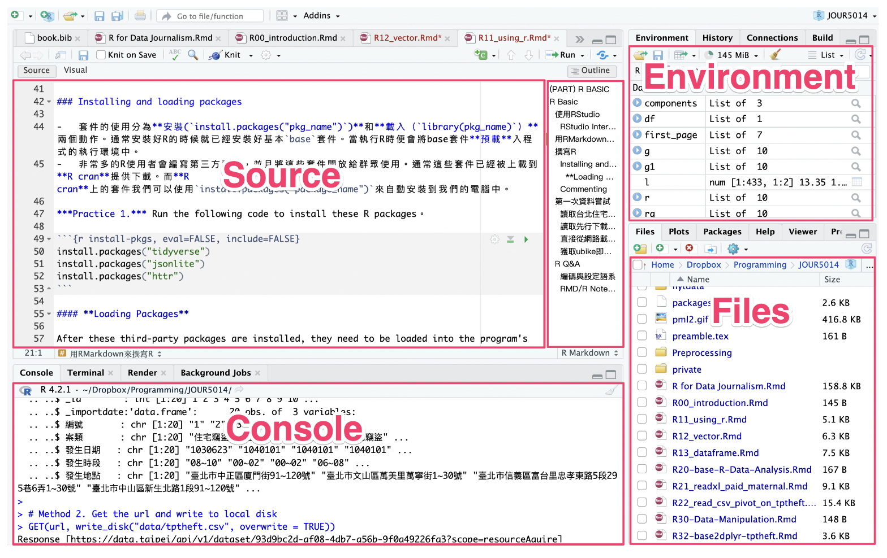

# (PART) R BASIC {.unnumbered}

# R Basic {#basic}

本章介紹如何使用 RStudio 編寫和執行 R 程式語言、R語言的基本語法、以及Vector和data.frame資料型態。

## 使用RStudio

### RStudio介面簡介

RStudio的介面主要分為四大區塊，左上的區塊是「Source」（或現在可切換至「Visual」）是撰寫程式碼與R Markdown的區塊；每行程式碼的執行和執行結果都會出現在左下「Console」的區塊；右上角區塊最常用的是「Environment」這個分頁，程式碼執行過程產生的變數／變項都會出現在這裡。右下角區塊我最常用的是「Files」這個分頁，顯示的是我自己電腦本機端的檔案目錄。右下角區塊也常常用到「Packages」，可查閱現在的程式執行環境有載入哪些套件；當用`help(some_function)`查詢某個套件或某個函式的功能是，就會自動跳到「Help」分頁。



### 用RMarkdown來撰寫R

R Markdown這種格式讓程式寫作者可以將程式碼和非程式碼的內容寫在同一份文件中。例如我想要寫作一本關於程式的書，裡面有很多的程式碼，但也要有很多說明、章節與段落。此時，這些非程式碼的區塊通常被稱為「內容區塊（Text Cell）」，而程式碼的區塊就稱為「Code Cell」。尤其是資料分析師或資料科學家很愛用這種格式，因為經常要為程式的執行結果寫很多說明，甚至利用標題一、標題二來區分章節。

**內容區塊**使用Markdown格式撰寫，顧名思義，支援用Markdown這種標記語法來快速撰寫如標題一、標題二、點列、編號等格式化文字。詳細指令可以參考[rmarkdown-cheatsheet (rstudio.com)](https://www.rstudio.com/wp-content/uploads/2015/02/rmarkdown-cheatsheet.pdf)。

**程式碼區塊**可以用下列鍵盤指令來新增和執行。

-   `Cmd(Ctrl)+Option(Alt)+i` 新增一個程式碼區塊
-   `Cmd+Enter` (`Ctrl+Enter` in Window) 執行程式碼區塊中游標所在的那一行指令。
-   `Cmd(Ctrl)+Shift+Enter` 執行游標所在的整個程式碼區塊
-   其他常用鍵盤指令 - **註解**：用滑鼠或鍵盤圈選某幾行程式碼後，可用`Cmd(Ctrl)+Shift+c`來將這幾行標記為註解或將其去除註解標記。

**練習：**用鍵盤快速鍵新增一個程式碼區塊、輸入以下程式碼並嘗試用鍵盤快速鍵執行。


```r
a <- c(1, 2, 3, 4, 5)
b <- 4
a*b
```

```{.output}
## [1]  4  8 12 16 20
```

### 安裝並載入第三方套件

-   套件的使用分為**安裝(`install.packages("pkg_name")`)**和**載入（`library(pkg_name)`）**兩個動作。通常安裝好R的時候就已經安裝好基本`base`套件。當執行R時便會將base套件**預載**入程式的執行環境中。
-   非常多的R使用者會編寫第三方套件，並且將這些套件開放給群眾使用。通常這些套件已經被上載到**R cran**提供下載。而**R cran**上的套件我們可以使用`install.packages("package_name")`來自動安裝到我們的電腦中。

***Practice 1.*** 執行以下程式碼


```r
install.packages("tidyverse")
install.packages("jsonlite")
install.packages("httr")
```

#### **載入套件**

After these third-party packages are installed, they need to be loaded into the program's runtime environment before they can be used. So you need to load them with `library(package_name)`.


```r
library(tidyverse)
library(jsonlite)
library(httr)
```

### 程式碼註解

下列程式碼中開頭有`#`符號者為註解，程式設計師用這種註解來為程式碼做說明，便於自己日後閱讀或與他人溝通。程式在執行時會自動忽略前面有`#`符號的程式碼。如果要執行以下程式碼，要把前面的`#`記號給拿掉。在RStudio中你可以用滑鼠或鍵盤圈選下三行，然後用快速鍵`command(ctrl)+shift+c`就可以開關（Comment/Un-comment)這幾行程式碼。


```r
# a <- c(1, 2, 3, 4, 5)
# b <- 4
# a*b
```

## 第一次資料嘗試

### 直接從網路載入內政部開放資料


```r
library(httr)
library(jsonlite)
url <- "https://www.ris.gov.tw/rs-opendata/api/v1/datastore/ODRP024/107?page=1"
first_page <- fromJSON(content(GET(url), "text"))
# head(first_page$responseData)
head(first_page$responseData) %>% rename(戶長=headhousehold_count)
```

```{.output}
##   statistic_yyy district_code      site_id village    edu sex 戶長
## 1           107   65000010001 新北市板橋區  留侯里   博畢  男    3
## 2           107   65000010001 新北市板橋區  留侯里   碩畢  男   26
## 3           107   65000010001 新北市板橋區  留侯里   大畢  男   71
## 4           107   65000010001 新北市板橋區  留侯里   專畢  男   52
## 5           107   65000010001 新北市板橋區  留侯里 高中畢  男  122
## 6           107   65000010001 新北市板橋區  留侯里 國中畢  男   40
```

### 獲取ubike即時資料

-   <https://taipeicity.github.io/traffic_realtime/>


```r
url <- "https://tcgbusfs.blob.core.windows.net/blobyoubike/YouBikeTP.json"
ubike.list <- fromJSON(content(GET(url),"text", encoding = "utf-8"))
ubike.v <- unlist(ubike.list$retVal)
ubike.m <- matrix(ubike.v, byrow = T, ncol = 14)
ubike.df <- as.data.frame(ubike.m)
names(ubike.df) <- names(ubike.list$retVal$`0001`)

head(ubike.df) %>% select(1:6)
```

```{.output}
##    sno                       sna tot sbi  sarea           mday
## 1 0001     捷運市政府站(3號出口)  84  72 信義區 20221030161036
## 2 0002 捷運國父紀念館站(2號出口)  16   3 大安區 20221030161031
## 3 0004                  市民廣場  32   0 信義區 20221030161017
## 4 0005                  興雅國中  10   1 信義區 20221030161041
## 5 0006              臺北南山廣場  54  12 信義區 20221030161029
## 6 0007         信義廣場(台北101)  20   2 信義區 20221030161027
```

### 讀取台北住宅竊盜點位資料

該資料網址可到[臺北市資料大平臺 (data.taipei)](https://data.taipei/)上查詢「住宅竊盜點位資訊」後，點選「API」後複製取得。


```r
url <- "https://data.taipei/api/v1/dataset/93d9bc2d-af08-4db7-a56b-9f0a49226fa3?scope=resourceAquire"
res <- read_json(url, simplifyVector = T)
df <- res$result$results
head(df)
dplyr::glimpse(df)
```

## R Q&A

### 編碼與設定語系


```r
Sys.setlocale(category = "LC_ALL", locale = "UTF-8")
Sys.setlocale(category = "LC_ALL", locale = "cht")
```

如果讀取到資料有中文的話，此時，你只需要指定locale為cht，然後重開該data.frame就可以解決該問題。


```r
Sys.setlocale(category = "LC_ALL", locale = "cht")
```

但你在寫程式剖析HTML時若使用了rvest這個套件，有可能在html_node()函式時會因為編碼而產生問題，此時你會需要把locale改為C。這個C指的是C語言的C。


```r
Sys.setlocale(category = "LC_ALL", locale = "C")
```

參考連結：<http://psmethods.postach.io/post/ru-he-geng-gai-rde-yu-she-yu-xi>

-   參考連結：<https://stat.ethz.ch/R-manual/R-devel/library/base/html/locales.html>

-   The locale describes aspects of the internationalization of a program. Initially most aspects of the locale of R are set to "C" (which is the default for the C language and reflects North-American usage)

### RMD/R Notebook無法儲存

R Notebook 要存檔的時候檔名絕對不要有空白，若有空白就用底線`_`代替，否則Notebook寫到一半會無法預覽下半部的程式並出現錯誤訊息。若仍然無法儲存或出現錯誤訊息，應該只要開另外一個R Notebook檔案，複製程式碼即可。
