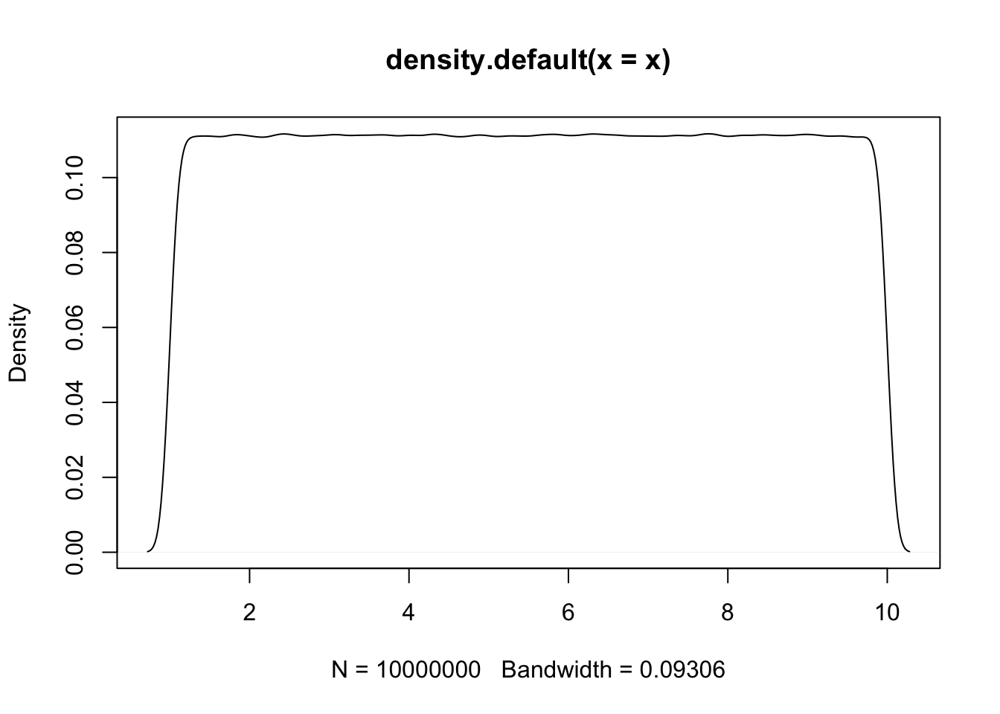
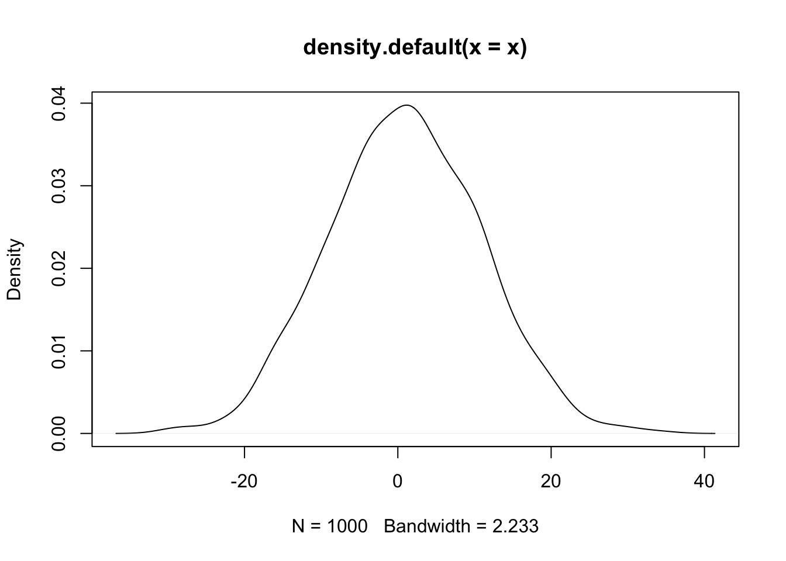
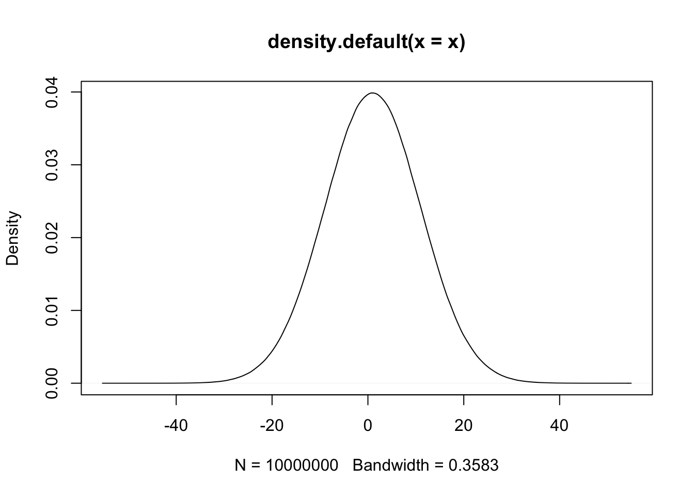

# R Basic

## R Syntax

### Assignment

-   `<-` 將右邊的算式或數值指派給左邊的變數。右邊如果是numeric，那左邊的變數就是numeric variable；右邊如果是character，左邊的變數就是character variable。
-   在幾乎所有程式語言中，單等號`=`指的是assignment，把右方的算式、值或物件指給左方的變數。而比較兩者相不相等，則用雙等號`==`，例如`1==3-2`。


```r
a <- 1
b <- c(1, 2, 3, 4)
c <- c("1", "2", "3", "4")
d <- c(b, a)
e <- "abcd"
```

### Comments 註解

-   **註解**：在程式碼區塊若前面有`#`字號後面跟著空白的話，那代表那行被標示為註解，程式執行時會自動跳過註解不執行。
-   **快速鍵**：當游標在某一行程式碼時打`cmd(ctrl)-shift-c`，就可以產生註解。


```r
# df <- data.frame(a = c(1, 2, 3), b = c(3, 4, 5))
```

## Vector

Vector是R語言最基本的

-   [各縣市平均每月薪資所得](https://www.ptt.cc/bbs/Gossiping/M.1535459575.A.54D.html)
-   [各縣市人口數](https://zh.wikipedia.org/wiki/%E8%87%BA%E7%81%A3%E8%A1%8C%E6%94%BF%E5%8D%80%E4%BA%BA%E5%8F%A3%E5%88%97%E8%A1%A8)

### Creating vectors

-   在程式碼中，只要是文字必用成對的雙引號或單引號包含其中，以區隔「變數」和「數字」。例如如果看到沒有雙引號的「英文字母」必定是變數名稱，或函式名稱。
-   如果看到有雙引號的數字，那也是文字。


```r
income <- c(70100, 51300, 51100, 48400, 47600, 43000)
county <- c("台北", "新北", "桃園", "高雄", "台中", "台南")
population <- c(2.6, 3.9, 2.2, 2.7, 2.8, 1.8)
area <- c(271.8, 2052.5, 1221, 2951.9, 2214.9, 2191.7)
income
```

```{.output}
## [1] 70100 51300 51100 48400 47600 43000
```

```r
county[c(5, 3, 1)]
```

```{.output}
## [1] "台中" "桃園" "台北"
```

```r
county <- county[c(5, 3, 1)]
county
```

```{.output}
## [1] "台中" "桃園" "台北"
```

```r
area
```

```{.output}
## [1]  271.8 2052.5 1221.0 2951.9 2214.9 2191.7
```

```r
population
```

```{.output}
## [1] 2.6 3.9 2.2 2.7 2.8 1.8
```

#### Creating a sequence


```r
a <- seq(11, 99, 11)
a
```

```{.output}
## [1] 11 22 33 44 55 66 77 88 99
```

```r
b <- 11:20
b
```

```{.output}
##  [1] 11 12 13 14 15 16 17 18 19 20
```

#### Creating sequences by distribution


```r
x <- runif(10000000, 1, 10) # uniform dist, n=1000
plot(density(x))
```



```r
x <- rnorm(1000, 1, 10) # uniform dist, n=1000
plot(density(x))
```



```r
x <- rnorm(10000000, 1, 10) # normal dist, n=1000
plot(density(x))
```



### Viewing


```r
county
```

```{.output}
## [1] "台中" "桃園" "台北"
```

```r
income
```

```{.output}
## [1] 70100 51300 51100 48400 47600 43000
```

```r
head(county)
```

```{.output}
## [1] "台中" "桃園" "台北"
```

```r
tail(county)
```

```{.output}
## [1] "台中" "桃園" "台北"
```

```r
length(county)
```

```{.output}
## [1] 3
```

```r
mode(county)
```

```{.output}
## [1] "character"
```

```r
class(county)
```

```{.output}
## [1] "character"
```

```r
# View(county)
length(county)
```

```{.output}
## [1] 3
```

```r
length(income)
```

```{.output}
## [1] 6
```

### Subsetting, filtering

It is important to know how to neglect first n or last n elements. For example, a[1:(length(a)-2)] will neglect the last two elements. Thinking why I need parentheses for `length(a)-2` here.


```r
county
```

```{.output}
## [1] "台中" "桃園" "台北"
```

```r
county[c(5, 3, 1)] # how about country[c(1, 3, 5)]
```

```{.output}
## [1] NA     "台北" "台中"
```

```r
county[3:6] # is it equal to country[c(3, 4, 5, 6)]
```

```{.output}
## [1] "台北" NA     NA     NA
```

```r
a <- 11:19
a[3:length(a)]
```

```{.output}
## [1] 13 14 15 16 17 18 19
```

```r
a[length(a):3]
```

```{.output}
## [1] 19 18 17 16 15 14 13
```

### Deleting

-   Without assignment, deletion won't change original vectors


```r
b <- 11:20
b[-(3:5)]
```

```{.output}
## [1] 11 12 16 17 18 19 20
```

```r
b[-c(1, 3, 5)]
```

```{.output}
## [1] 12 14 16 17 18 19 20
```

```r
b
```

```{.output}
##  [1] 11 12 13 14 15 16 17 18 19 20
```

-   Correct deleting operations with assignment to replace original vector


```r
b <- b[-(3:5)]
b
```

```{.output}
## [1] 11 12 16 17 18 19 20
```

```r
a <- seq(11, 99, 11)
a <- a[-c(1, 3, 5)]
a
```

```{.output}
## [1] 22 44 66 77 88 99
```

### Concatinating

-   Concatinating is quite useful for web crawling when you crawl article links page by page. You may be not sure the number of page you need to crawl. So you need to append entire new vector to old vector. It is concatinating. ("Appending" often means adding one new element at the end of data.)


```r
a <- 1:10
a <- c(a, 11)
a
```

```{.output}
##  [1]  1  2  3  4  5  6  7  8  9 10 11
```

```r
b
```

```{.output}
## [1] 11 12 16 17 18 19 20
```

```r
a <- c(a, b)
a
```

```{.output}
##  [1]  1  2  3  4  5  6  7  8  9 10 11 11 12 16 17 18 19 20
```

```r
a <- c(a, a, b)
a
```

```{.output}
##  [1]  1  2  3  4  5  6  7  8  9 10 11 11 12 16 17 18 19 20  1  2  3  4  5  6  7
## [26]  8  9 10 11 11 12 16 17 18 19 20 11 12 16 17 18 19 20
```

## Calculating with vectors

### Arithmetic operations


```r
a <- 11:19
a + 3
```

```{.output}
## [1] 14 15 16 17 18 19 20 21 22
```

```r
a / 2
```

```{.output}
## [1] 5.5 6.0 6.5 7.0 7.5 8.0 8.5 9.0 9.5
```

```r
a %% 2
```

```{.output}
## [1] 1 0 1 0 1 0 1 0 1
```

```r
a %/% 2
```

```{.output}
## [1] 5 6 6 7 7 8 8 9 9
```

```r
a %% 2== 0
```

```{.output}
## [1] FALSE  TRUE FALSE  TRUE FALSE  TRUE FALSE  TRUE FALSE
```

```r
which(a %% 2== 0)
```

```{.output}
## [1] 2 4 6 8
```

```r
a[which(a%% 2 == 0)]
```

```{.output}
## [1] 12 14 16 18
```

```r
a[c(2, 4, 6, 8)]
```

```{.output}
## [1] 12 14 16 18
```

```r
a %% 2 != 0
```

```{.output}
## [1]  TRUE FALSE  TRUE FALSE  TRUE FALSE  TRUE FALSE  TRUE
```

```r
a[a%% 2 == 0]
```

```{.output}
## [1] 12 14 16 18
```

```r
a[a%%2 != 0]
```

```{.output}
## [1] 11 13 15 17 19
```

```r
a <- a %% 2 	# modular arithmetic, get the reminder
a <- a %/% 2 	# Quotient
```

### Logic comparisons


```r
a %% 2 == 0 	# deteting odd/even number
```

```{.output}
## [1] TRUE TRUE TRUE TRUE TRUE TRUE TRUE TRUE TRUE
```

```r
a %% 2 != 0
```

```{.output}
## [1] FALSE FALSE FALSE FALSE FALSE FALSE FALSE FALSE FALSE
```

```r
a[a%%2==0]
```

```{.output}
## [1] 0 0 0 0 0 0 0 0 0
```

```r
a > b
```

```{.output}
## [1] FALSE FALSE FALSE FALSE FALSE FALSE FALSE FALSE FALSE
```

```r
income > mean(income)
```

```{.output}
## [1]  TRUE FALSE FALSE FALSE FALSE FALSE
```

```r
TRUE == T 		# == equal to,
```

```{.output}
## [1] TRUE
```

```r
TRUE != F    	# != Not equal to
```

```{.output}
## [1] TRUE
```

```r
any(a>11) # is there any element larger than 1
```

```{.output}
## [1] FALSE
```

```r
all(a>11) # are all elements larger than 1
```

```{.output}
## [1] FALSE
```

### Subsetting by logic comparisons

-   two methods to filter data from vectors, by index vector or a logical vector with equal length.


```r
a <- seq(11, 55, 11)
a[c(T, F, T, F, T)]
```

```{.output}
## [1] 11 33 55
```

```r
a[a%%2==1]
```

```{.output}
## [1] 11 33 55
```

```r
a%%2
```

```{.output}
## [1] 1 0 1 0 1
```

```r
a%%2==1
```

```{.output}
## [1]  TRUE FALSE  TRUE FALSE  TRUE
```

```r
a <- c("你好","你好棒棒","你好棒","你真的好棒")
a[nchar(a)>3]
```

```{.output}
## [1] "你好棒棒"   "你真的好棒"
```

```r
# which will return "index-of"
a <- seq(11, 55, 11)
a[which(a%%2==1)]
```

```{.output}
## [1] 11 33 55
```

```r
which(a%%2==1)
```

```{.output}
## [1] 1 3 5
```

### Sorting and ordering

-   `sort(x)`的結果必須用`<-`覆蓋原本的`x`，此時的`x`才算被排序的結果。

-   `order(x)`函式會傳回`x`數值由小到大的**索引**。這個例子的結果是`5, 4, 3, 6, 1, 2`，也就是`5`位置的那個數最小、`4`那個位置的數次小、接下來`3, 6, 1, 2`。

-   `x[order(x)]`把`order(x)`結果（也就是`c(5, 4, 3, 6, 1, 2)`）傳給原本的`x`便會使得原本的`x`重新排序。通常`order()`的用途是，我們可以將兩個等長的variables例如var1和var2，依據var2來重新排序var1，例如var1[order(var2)]。


```r
x <- c(33, 55, 22, 13, 4, 24)
mode(x)
```

```{.output}
## [1] "numeric"
```

```r
class(x)
```

```{.output}
## [1] "numeric"
```

```r
sort(x)
```

```{.output}
## [1]  4 13 22 24 33 55
```

```r
# x <- sort(x) # assign to replace original x
order(x) 
```

```{.output}
## [1] 5 4 3 6 1 2
```

```r
x[order(x)]
```

```{.output}
## [1]  4 13 22 24 33 55
```

```r
x[c(5, 4, 3, 6, 1, 2)]
```

```{.output}
## [1]  4 13 22 24 33 55
```

### Built-in math functions


```r
a <- 11:19
min(a); max(a); mean(a); median(a); sd(a)
```

```{.output}
## [1] 11
```

```{.output}
## [1] 19
```

```{.output}
## [1] 15
```

```{.output}
## [1] 15
```

```{.output}
## [1] 2.738613
```

```r
log2(a)
```

```{.output}
## [1] 3.459432 3.584963 3.700440 3.807355 3.906891 4.000000 4.087463 4.169925
## [9] 4.247928
```

```r
log1p(a)
```

```{.output}
## [1] 2.484907 2.564949 2.639057 2.708050 2.772589 2.833213 2.890372 2.944439
## [9] 2.995732
```

```r
?log1p
```

## Data types

### Checking data type


```r
mode(county)				# character
```

```{.output}
## [1] "character"
```

```r
mode(income)					# numeric
```

```{.output}
## [1] "numeric"
```

```r
mode(income > mean(income))	# logical
```

```{.output}
## [1] "logical"
```

```r
testing <- c("26.142", "12.008", "7.032", "13.646", "4.589")
mode(testing)				# character
```

```{.output}
## [1] "character"
```

### Converting data type

-   numeric vector可以用`as.character(x)`轉成`charcter`；logical vector可以用`as.numeric(x)`轉為`numeric`。概念上可以說是`character > numeric > logical`。

-   如果硬是在logical vector後附加一個numeric element的話，那就會整個vector被轉為numeric vector；相仿地，如果numeric vector後附加一個character element的話那整個vector就會被轉為character vector。

-   可以用`sum()`函式來計算logical vector有幾個`TRUE`值。例如`sum(a%%2==1)`就是計算`a`中有幾個奇數。`TRUE`可視為`1`、`FALSE`可視為`0`，所以加總起來就是`TRUE`有幾個。


```r
income.c <- as.character(income)
population.c <- as.numeric(population)

a <- seq(11, 99, 11)
a <- c(a, "100")

a <- seq(11, 99, 11)
sum(a%%2==1)
```

```{.output}
## [1] 5
```

```r
max(a)
```

```{.output}
## [1] 99
```

## Character operations


```r
a <- seq(11, 55, 11)
paste("A", a)		# concatenate
```

```{.output}
## [1] "A 11" "A 22" "A 33" "A 44" "A 55"
```

```r
paste0("A", a)		# concatenate
```

```{.output}
## [1] "A11" "A22" "A33" "A44" "A55"
```
