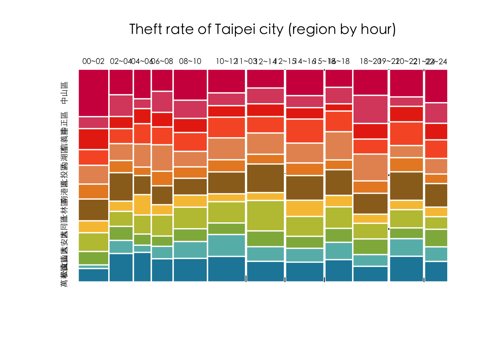

# (PART) DATA MANIPULATION {.unnumbered}

# From base R to dplyr {#base2dplyr}

**From base to tidyverse style**

相較於R base的較為傳統的R編程風格，tidyverse style的R
programming具有以下幾個特點：

1.  基於tidy data理念：tidyverse style的R programming基於tidy
    data理念，即資料應該以規律的方式組織，以方便分析和視覺化。tidyverse
    style的R程式庫提供了一些工具和函數，用於處理和轉換tidy
    data格式的資料，如dplyr、tidyr等。

2.  使用管道操作符：tidyverse style的R
    programming通常使用管道操作符（%\>%），將資料通過多個函數連接起來，形成一個清晰和易於理解的資料處理流程。使用管道操作符可以簡化程式碼並提高程式的可讀性。

3.  強調函數庫的一致性：tidyverse style的R
    programming強調函數庫之間的一致性，即不同函數庫之間使用相似的函數名稱、參數名稱和返回值等，以方便使用者的學習和使用。

4.  使用簡潔的命名方式：tidyverse style的R
    programming通常使用簡潔和易於理解的變數和函數命名方式，例如使用動詞表示操作，使用名詞表示資料，以方便使用者理解程式碼的含義。

5.  提供高級的視覺化工具：tidyverse style的R
    programming提供了一些高級的視覺化工具，如ggplot2、gganimate等，可以幫助使用者更加輕鬆地進行資料視覺化和探索。

## dplyr

dplyr是一個tidyverse風格的R程式庫，用於對資料進行快速、一致、直觀的操作和轉換。dplyr提供了一些高效能的函數和工具，如`filter`、`select`、`mutate`、`group_by`和`summarize`等，用於對資料進行選擇、篩選、轉換、分組和摘要等操作。

以下是dplyr常用的函數：

1.  `filter`：用於選擇符合特定條件的資料列。

2.  `select`：用於選擇特定的欄位。

3.  `mutate`：用於新增或修改欄位。

4.  `group_by`：用於按照特定欄位進行分組。

5.  `summarize`：用於對分組後的資料進行摘要統計。

6.  `arrange`：用於按照欄位的特定順序進行排序。

dplyr具有以下優點：

1.  簡潔而直觀的語法：dplyr的函數名稱和語法都十分簡潔而直觀，易於使用和理解，尤其對於新手來說更加友好。

2.  高效的運行速度：dplyr的設計考慮了資料處理的效率，使用C++實現了部分函數，因此dplyr在處理大型資料集時運行速度較快。

3.  與tidyverse相容：dplyr與其他tidyverse程式庫，如ggplot2和tidyr，可以很好地相容，並且能夠與其他常用的R程式庫進行集成，提供更加全面和高效的資料分析和可視化工具。

## Taipie Theft Count (base to dplyr) {#tptheft_dplyr}


```r
library(tidyverse)
# options(stringsAsFactors = F) # default options in R ver.> 4.0
```

### Reading data


```r
# Read by read_csv()
# Will raise error
# Error in make.names(x) : invalid multibyte string at '<bd>s<b8><b9>'
# df <- read_csv("data/tp_theft.csv")

# read_csv() with locale = locale(encoding = "Big5")
library(readr)
df <- read_csv("data/臺北市住宅竊盜點位資訊-UTF8-BOM-1.csv")
```

### Cleaning data I

-   Renaming variables by `select()`
-   Generating variable year
-   Generating variable month
-   Retrieving area


```r
library(stringr)
selected_df <- df %>%
    select(id = 編號, 
           cat = 案類, 
           date = `發生日期`, 
           time = `發生時段`, 
           location = `發生地點`) %>%
    mutate(year = date %/% 10000) %>%
    mutate(month = date %/% 100 %% 100) %>%
    mutate(area = str_sub(location, 4, 6)) %>%
    mutate(county = str_sub(location, 1, 3))
```

### Cleaning data II

-   Filtering out irrelevant data records


```r
# readr::guess_encoding("data/tp_theft.csv")
filtered_df <- selected_df %>%
    # count(year) %>% View
    filter(county == "臺北市") %>%
    filter(year >= 104) %>%
    # count(time) %>% View
    # count(location) %>%
    filter(!area %in% c("中和市", "板橋市"))
```

### Long to wide form

-   `count()` two variables
-   `pivot_wider()` spread one variable as columns to wide form


```r
# count() then pivot_wider()
df.wide <- filtered_df %>% 
  count(time, area) %>%
  pivot_wider(names_from = area, values_from = n, values_fill = 0)
??pivot_wider
```

### Setting time as row.name for mosaicplot


```r
row.names(df.wide) <- df.wide$time
df.wide$time <- NULL
```


```r
# Specify fonts for Chinese
# par(family=('STKaiti')) 
par(family=('Heiti TC Light')) # for mac

# Specify colors
colors <- c('#D0104C', '#DB4D6D', '#E83015',  '#F75C2F',
            '#E79460', '#E98B2A', '#9B6E23', '#F7C242',
            '#BEC23F', '#90B44B', '#66BAB7', '#1E88A8')

# mosaicplot()
mosaicplot(df.wide, color=colors, border=0, off = 3,
           main="Theft rate of Taipei city (region by hour)")
```


### Clean version


```r
library(readr)
# options(stringsAsFactors = F)
df <- read_csv("data/臺北市住宅竊盜點位資訊-UTF8-BOM-1.csv")

selected_df <- df %>%
    select(id = 編號, 
           cat = 案類,
           date = `發生日期`, 
           time = `發生時段`, 
           location = `發生地點`) %>%
    mutate(year = date %/% 10000) %>%
    mutate(month = date %/% 100 %% 100) %>%
    mutate(area = stringr::str_sub(location, 4, 6)) %>%
    mutate(county = stringr::str_sub(location, 1, 3))

selected_df %>% count(year)
```

```{.output}
## # A tibble: 9 × 2
##    year     n
##   <dbl> <int>
## 1   103     1
## 2   104   687
## 3   105   663
## 4   106   560
## 5   107   501
## 6   108   411
## 7   109   304
## 8   110   189
## 9   111    31
```

```r
selected_df %>% count(time) %>% head(10)
```

```{.output}
## # A tibble: 10 × 2
##    time      n
##    <chr> <int>
##  1 00~02   272
##  2 02~04   214
##  3 03~05     8
##  4 04~06   156
##  5 05~07    23
##  6 06~08   191
##  7 08~10   305
##  8 09~11     6
##  9 10~12   338
## 10 11~03     1
```

```r
selected_df %>% arrange(time) %>% head(10)
```

```{.output}
## # A tibble: 10 × 9
##       id cat         date time  location                 year month area  county
##    <dbl> <chr>      <dbl> <chr> <chr>                   <dbl> <dbl> <chr> <chr> 
##  1     2 住宅竊盜 1040101 00~02 臺北市文山區萬美里萬寧…   104     1 文山… 臺北市
##  2     3 住宅竊盜 1040101 00~02 臺北市信義區富台里忠孝…   104     1 信義… 臺北市
##  3     6 住宅竊盜 1040102 00~02 臺北市士林區天福里1鄰…    104     1 士林… 臺北市
##  4    12 住宅竊盜 1040105 00~02 臺北市中山區南京東路3…    104     1 中山… 臺北市
##  5    33 住宅竊盜 1040115 00~02 臺北市松山區饒河街181~…   104     1 松山… 臺北市
##  6    74 住宅竊盜 1040131 00~02 臺北市南港區重陽路57巷…   104     1 南港… 臺北市
##  7    75 住宅竊盜 1040201 00~02 臺北市北投區中心里中和…   104     2 北投… 臺北市
##  8    92 住宅竊盜 1040210 00~02 臺北市北投區大同路200…    104     2 北投… 臺北市
##  9    95 住宅竊盜 1040212 00~02 臺北市萬華區萬大路493…    104     2 萬華… 臺北市
## 10   106 住宅竊盜 1040216 00~02 臺北市信義區吳興街269…    104     2 信義… 臺北市
```

```r
filtered_df <- selected_df %>%
    # count(year) %>% View
    filter(year >= 104) %>%
    filter(!time %in% c("03~05", "05~07", "09~11", "11~13", "15~17", "17~19", "18~21", "21~23", "23~01"))
    # count(time) %>% View
    # count(location) %>%
    # filter(!area %in% c("中和市", "板橋市"))

df.wide <- filtered_df %>% 
    count(time, area) %>%
    pivot_wider(names_from = area, values_from = n, values_fill = 0) %>%
    as.data.frame()

row.names(df.wide) <- df.wide$time
df.wide$time <- NULL

par(family=('Heiti TC Light')) # for mac

# Specify colors
colors <- c('#D0104C', '#DB4D6D', '#E83015',  '#F75C2F',
            '#E79460', '#E98B2A', '#9B6E23', '#F7C242',
            '#BEC23F', '#90B44B', '#66BAB7', '#1E88A8')

# mosaicplot()
mosaicplot(df.wide, color=colors, border=0, off = 3,
           main="Theft rate of Taipei city (region by hour)")  
```


