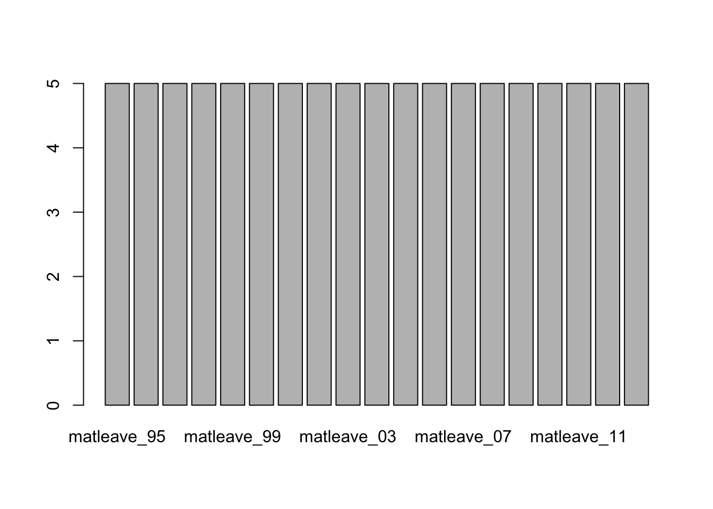
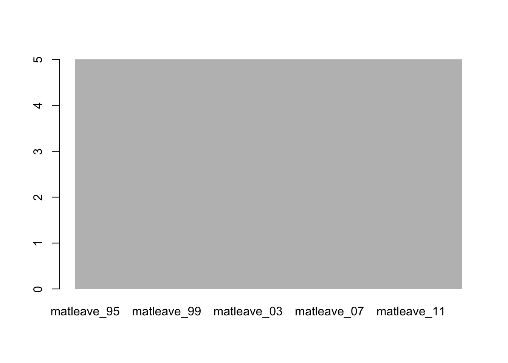

## 案例：產假支薪跨國跨時比較

-   本案例將使用R重新製作華盛頓郵報2016年8月13日的一篇報導，該報導探討了美國婦女產假支薪情況。案例中將應用data.frame和基本的繪圖與資料摘要方法。

-   原始新聞來源：[The world is getting better at paid maternity leave. The U.S. is not. - The Washington Post](https://www.washingtonpost.com/news/worldviews/wp/2016/08/13/the-world-is-getting-better-at-paid-maternity-leave-the-u-s-is-not/)

### Reading .xlsx by readxl package

-   `readxl`也包含在`tidyverse`的套件集中，所以應該已經在前次安裝過，不用特別安裝。
-   但`readxl`不會隨著`tidyverse`套件被載入R的執行環境，所以如果要用`readxl()`來讀取excel檔的話，需要用`library(readxl)`將其載入。


```r
# Import readxl package
library(readxl)
```

這段程式碼使用`read_excel()`函式從`data`資料夾中的`WORLD-MACHE_Gender_6.8.15.xls`檔案中的`Sheet1`工作表讀取資料。其中`col_names=T`為該函式的參數，表示第一列為欄位名稱。讀取後的資料會被Assign給變數`df`。


```r
# Use read_excel() to convert excel sheet to data.frame
df <- read_excel("data/WORLD-MACHE_Gender_6.8.15.xls", "Sheet1", col_names=T)
```

### Previewing data by `View()`, `class()`, `dim()`, `str()`, `summary()` and `names()`


```r
# View(df)
class(df)		# [1] "tbl_df"     "tbl"        "data.frame"
```

```{.output}
## [1] "tbl_df"     "tbl"        "data.frame"
```

```r
dim(df)
```

```{.output}
## [1] 197 156
```

```r
# Show names of variables (vectors, columns) by names()
names(df)
```

```{.output}
##   [1] "country"           "iso2"              "iso3"             
##   [4] "region"            "wb_econ"           "matleave_95"      
##   [7] "matleave_96"       "matleave_97"       "matleave_98"      
##  [10] "matleave_99"       "matleave_00"       "matleave_01"      
##  [13] "matleave_02"       "matleave_03"       "matleave_04"      
##  [16] "matleave_05"       "matleave_06"       "matleave_07"      
##  [19] "matleave_08"       "matleave_09"       "matleave_10"      
##  [22] "matleave_11"       "matleave_12"       "matleave_13"      
##  [25] "matleave_wrr_95"   "matleave_wrr_96"   "matleave_wrr_97"  
##  [28] "matleave_wrr_98"   "matleave_wrr_99"   "matleave_wrr_00"  
##  [31] "matleave_wrr_01"   "matleave_wrr_02"   "matleave_wrr_03"  
##  [34] "matleave_wrr_04"   "matleave_wrr_05"   "matleave_wrr_06"  
##  [37] "matleave_wrr_07"   "matleave_wrr_08"   "matleave_wrr_09"  
##  [40] "matleave_wrr_10"   "matleave_wrr_11"   "matleave_wrr_12"  
##  [43] "matleave_wrr_13"   "bf_dur_95"         "bf_dur_96"        
##  [46] "bf_dur_97"         "bf_dur_98"         "bf_dur_99"        
##  [49] "bf_dur_00"         "bf_dur_01"         "bf_dur_02"        
##  [52] "bf_dur_03"         "bf_dur_04"         "bf_dur_05"        
##  [55] "bf_dur_06"         "bf_dur_07"         "bf_dur_08"        
##  [58] "bf_dur_09"         "bf_dur_10"         "bf_dur_11"        
##  [61] "bf_dur_12"         "bf_dur_13"         "mat_bfeed_6mon_95"
##  [64] "mat_bfeed_6mon_96" "mat_bfeed_6mon_97" "mat_bfeed_6mon_98"
##  [67] "mat_bfeed_6mon_99" "mat_bfeed_6mon_00" "mat_bfeed_6mon_01"
##  [70] "mat_bfeed_6mon_02" "mat_bfeed_6mon_03" "mat_bfeed_6mon_04"
##  [73] "mat_bfeed_6mon_05" "mat_bfeed_6mon_06" "mat_bfeed_6mon_07"
##  [76] "mat_bfeed_6mon_08" "mat_bfeed_6mon_09" "mat_bfeed_6mon_10"
##  [79] "mat_bfeed_6mon_11" "mat_bfeed_6mon_12" "mat_bfeed_6mon_13"
##  [82] "minage_fem_leg_95" "minage_fem_leg_96" "minage_fem_leg_97"
##  [85] "minage_fem_leg_98" "minage_fem_leg_99" "minage_fem_leg_00"
##  [88] "minage_fem_leg_01" "minage_fem_leg_02" "minage_fem_leg_03"
##  [91] "minage_fem_leg_04" "minage_fem_leg_05" "minage_fem_leg_06"
##  [94] "minage_fem_leg_07" "minage_fem_leg_08" "minage_fem_leg_09"
##  [97] "minage_fem_leg_10" "minage_fem_leg_11" "minage_fem_leg_12"
## [100] "legal_diff_leg_95" "legal_diff_leg_96" "legal_diff_leg_97"
## [103] "legal_diff_leg_98" "legal_diff_leg_99" "legal_diff_leg_00"
## [106] "legal_diff_leg_01" "legal_diff_leg_02" "legal_diff_leg_03"
## [109] "legal_diff_leg_04" "legal_diff_leg_05" "legal_diff_leg_06"
## [112] "legal_diff_leg_07" "legal_diff_leg_08" "legal_diff_leg_09"
## [115] "legal_diff_leg_10" "legal_diff_leg_11" "legal_diff_leg_12"
## [118] "minage_fem_pc_95"  "minage_fem_pc_96"  "minage_fem_pc_97" 
## [121] "minage_fem_pc_98"  "minage_fem_pc_99"  "minage_fem_pc_00" 
## [124] "minage_fem_pc_01"  "minage_fem_pc_02"  "minage_fem_pc_03" 
## [127] "minage_fem_pc_04"  "minage_fem_pc_05"  "minage_fem_pc_06" 
## [130] "minage_fem_pc_07"  "minage_fem_pc_08"  "minage_fem_pc_09" 
## [133] "minage_fem_pc_10"  "minage_fem_pc_11"  "minage_fem_pc_12" 
## [136] "legal_diff_pc_95"  "legal_diff_pc_96"  "legal_diff_pc_97" 
## [139] "legal_diff_pc_98"  "legal_diff_pc_99"  "legal_diff_pc_00" 
## [142] "legal_diff_pc_01"  "legal_diff_pc_02"  "legal_diff_pc_03" 
## [145] "legal_diff_pc_04"  "legal_diff_pc_05"  "legal_diff_pc_06" 
## [148] "legal_diff_pc_07"  "legal_diff_pc_08"  "legal_diff_pc_09" 
## [151] "legal_diff_pc_10"  "legal_diff_pc_11"  "legal_diff_pc_12" 
## [154] "minwage_ppp_2013"  "mw_overtime"       "oecd"
```

### Select variables

由於所需要的資料為第三欄的變數`iso3`（為國家代碼）和第六至24欄的`matleave95`\~`matleave13`共29年的資料，所以需要在`df[ , ]`中選出這幾欄。只要把所要取的欄以vector的型態放在`df[row,col]`之`col`的位置，便可以選出所要的欄。


```r
# Select the 3rd and 6th to 24th columns
matleave <- df[ , c(3, 6:24)]

# Use class(), dim(), and str() to inspect the data
class(matleave)
```

```{.output}
## [1] "tbl_df"     "tbl"        "data.frame"
```

```r
dim(matleave)
```

```{.output}
## [1] 197  20
```

```r
str(matleave)
```

```{.output}
## tibble [197 × 20] (S3: tbl_df/tbl/data.frame)
##  $ iso3       : chr [1:197] "AFG" "ALB" "DZA" "AND" ...
##  $ matleave_95: num [1:197] 2 5 3 2 2 2 2 3 1 5 ...
##  $ matleave_96: num [1:197] 2 5 3 2 2 2 2 3 1 5 ...
##  $ matleave_97: num [1:197] 2 5 3 2 2 2 2 3 1 5 ...
##  $ matleave_98: num [1:197] 2 5 3 2 2 2 2 3 1 5 ...
##  $ matleave_99: num [1:197] 2 5 3 2 2 2 2 3 1 5 ...
##  $ matleave_00: num [1:197] 2 5 3 3 2 2 2 3 1 5 ...
##  $ matleave_01: num [1:197] 2 5 3 3 2 2 2 3 1 5 ...
##  $ matleave_02: num [1:197] 2 5 3 3 2 2 2 3 1 5 ...
##  $ matleave_03: num [1:197] 2 5 3 3 2 2 2 3 1 5 ...
##  $ matleave_04: num [1:197] 2 5 3 3 2 2 2 5 1 5 ...
##  $ matleave_05: num [1:197] 2 5 3 3 2 2 2 5 1 5 ...
##  $ matleave_06: num [1:197] 2 5 3 3 2 2 2 5 1 5 ...
##  $ matleave_07: num [1:197] 2 5 3 3 2 2 2 5 1 5 ...
##  $ matleave_08: num [1:197] 2 5 3 3 2 2 2 5 1 5 ...
##  $ matleave_09: num [1:197] 2 5 3 3 2 2 2 5 1 5 ...
##  $ matleave_10: num [1:197] 2 5 3 3 2 2 2 5 NA 5 ...
##  $ matleave_11: num [1:197] 2 5 3 3 2 2 2 5 3 5 ...
##  $ matleave_12: num [1:197] 2 5 3 3 2 2 2 5 3 5 ...
##  $ matleave_13: num [1:197] 2 5 3 3 2 2 2 5 3 5 ...
```

### Check & Replace NAs

-   `NA: Not Available`
-   `v[is.na(v)]` will select all NA cells
-   以0取代NA的資料格。避免繪圖產生錯誤
-   `sum(is.na(matleave))`的目的是檢測還有沒有NA值。如果有的話`is.na()`就會是`TRUE`，那麼加總後，如果不是0，那就代表還有NA。


```r
# is.na() to indicate each element is NA or NOT(TRUE/FALSE)
head(is.na(matleave), n=20)
```

```{.output}
##        iso3 matleave_95 matleave_96 matleave_97 matleave_98 matleave_99
##  [1,] FALSE       FALSE       FALSE       FALSE       FALSE       FALSE
##  [2,] FALSE       FALSE       FALSE       FALSE       FALSE       FALSE
##  [3,] FALSE       FALSE       FALSE       FALSE       FALSE       FALSE
##  [4,] FALSE       FALSE       FALSE       FALSE       FALSE       FALSE
##  [5,] FALSE       FALSE       FALSE       FALSE       FALSE       FALSE
##  [6,] FALSE       FALSE       FALSE       FALSE       FALSE       FALSE
##  [7,] FALSE       FALSE       FALSE       FALSE       FALSE       FALSE
##  [8,] FALSE       FALSE       FALSE       FALSE       FALSE       FALSE
##  [9,] FALSE       FALSE       FALSE       FALSE       FALSE       FALSE
## [10,] FALSE       FALSE       FALSE       FALSE       FALSE       FALSE
## [11,] FALSE       FALSE       FALSE       FALSE       FALSE       FALSE
## [12,] FALSE       FALSE       FALSE       FALSE       FALSE       FALSE
## [13,] FALSE       FALSE       FALSE       FALSE       FALSE       FALSE
## [14,] FALSE       FALSE       FALSE       FALSE       FALSE       FALSE
## [15,] FALSE       FALSE       FALSE       FALSE       FALSE       FALSE
## [16,] FALSE       FALSE       FALSE       FALSE       FALSE       FALSE
## [17,] FALSE       FALSE       FALSE       FALSE       FALSE       FALSE
## [18,] FALSE       FALSE       FALSE       FALSE       FALSE       FALSE
## [19,] FALSE       FALSE       FALSE       FALSE       FALSE       FALSE
## [20,] FALSE       FALSE       FALSE       FALSE       FALSE       FALSE
##       matleave_00 matleave_01 matleave_02 matleave_03 matleave_04 matleave_05
##  [1,]       FALSE       FALSE       FALSE       FALSE       FALSE       FALSE
##  [2,]       FALSE       FALSE       FALSE       FALSE       FALSE       FALSE
##  [3,]       FALSE       FALSE       FALSE       FALSE       FALSE       FALSE
##  [4,]       FALSE       FALSE       FALSE       FALSE       FALSE       FALSE
##  [5,]       FALSE       FALSE       FALSE       FALSE       FALSE       FALSE
##  [6,]       FALSE       FALSE       FALSE       FALSE       FALSE       FALSE
##  [7,]       FALSE       FALSE       FALSE       FALSE       FALSE       FALSE
##  [8,]       FALSE       FALSE       FALSE       FALSE       FALSE       FALSE
##  [9,]       FALSE       FALSE       FALSE       FALSE       FALSE       FALSE
## [10,]       FALSE       FALSE       FALSE       FALSE       FALSE       FALSE
## [11,]       FALSE       FALSE       FALSE       FALSE       FALSE       FALSE
## [12,]       FALSE       FALSE       FALSE       FALSE       FALSE       FALSE
## [13,]       FALSE       FALSE       FALSE       FALSE       FALSE       FALSE
## [14,]       FALSE       FALSE       FALSE       FALSE       FALSE       FALSE
## [15,]       FALSE       FALSE       FALSE       FALSE       FALSE       FALSE
## [16,]       FALSE       FALSE       FALSE       FALSE       FALSE       FALSE
## [17,]       FALSE       FALSE       FALSE       FALSE       FALSE       FALSE
## [18,]       FALSE       FALSE       FALSE       FALSE       FALSE       FALSE
## [19,]       FALSE       FALSE       FALSE       FALSE       FALSE       FALSE
## [20,]       FALSE       FALSE       FALSE       FALSE       FALSE       FALSE
##       matleave_06 matleave_07 matleave_08 matleave_09 matleave_10 matleave_11
##  [1,]       FALSE       FALSE       FALSE       FALSE       FALSE       FALSE
##  [2,]       FALSE       FALSE       FALSE       FALSE       FALSE       FALSE
##  [3,]       FALSE       FALSE       FALSE       FALSE       FALSE       FALSE
##  [4,]       FALSE       FALSE       FALSE       FALSE       FALSE       FALSE
##  [5,]       FALSE       FALSE       FALSE       FALSE       FALSE       FALSE
##  [6,]       FALSE       FALSE       FALSE       FALSE       FALSE       FALSE
##  [7,]       FALSE       FALSE       FALSE       FALSE       FALSE       FALSE
##  [8,]       FALSE       FALSE       FALSE       FALSE       FALSE       FALSE
##  [9,]       FALSE       FALSE       FALSE       FALSE        TRUE       FALSE
## [10,]       FALSE       FALSE       FALSE       FALSE       FALSE       FALSE
## [11,]       FALSE       FALSE       FALSE       FALSE       FALSE       FALSE
## [12,]       FALSE       FALSE       FALSE       FALSE       FALSE       FALSE
## [13,]       FALSE       FALSE       FALSE       FALSE       FALSE       FALSE
## [14,]       FALSE       FALSE       FALSE       FALSE       FALSE       FALSE
## [15,]       FALSE       FALSE       FALSE       FALSE       FALSE       FALSE
## [16,]       FALSE       FALSE       FALSE       FALSE       FALSE       FALSE
## [17,]       FALSE       FALSE       FALSE       FALSE       FALSE       FALSE
## [18,]       FALSE       FALSE       FALSE       FALSE       FALSE       FALSE
## [19,]       FALSE       FALSE       FALSE       FALSE       FALSE       FALSE
## [20,]       FALSE        TRUE        TRUE       FALSE       FALSE       FALSE
##       matleave_12 matleave_13
##  [1,]       FALSE       FALSE
##  [2,]       FALSE       FALSE
##  [3,]       FALSE       FALSE
##  [4,]       FALSE       FALSE
##  [5,]       FALSE       FALSE
##  [6,]       FALSE       FALSE
##  [7,]       FALSE       FALSE
##  [8,]       FALSE       FALSE
##  [9,]       FALSE       FALSE
## [10,]       FALSE       FALSE
## [11,]       FALSE       FALSE
## [12,]       FALSE       FALSE
## [13,]       FALSE       FALSE
## [14,]       FALSE       FALSE
## [15,]       FALSE       FALSE
## [16,]       FALSE       FALSE
## [17,]       FALSE       FALSE
## [18,]       FALSE       FALSE
## [19,]       FALSE       FALSE
## [20,]       FALSE       FALSE
```

```r
# Assign 0 to those NA data
matleave[is.na(matleave)] <- 0

# anyNA() to check if there are still NA cells.
anyNA(matleave)
```

```{.output}
## [1] FALSE
```

```r
# sum(is.na()) to count the number of NA
sum(is.na(matleave))
```

```{.output}
## [1] 0
```

### Filtering data

#### Filtered by the last year value


```r
# Use logical comparison to see if the last year equals to 5
# Assign matching data to var m5
m5 <- matleave[matleave$'matleave_13'==5, ]

# nrow() to count matching data
nrow(m5)
```

```{.output}
## [1] 34
```

```r
# Is it possible to use length() to check the data length?
# matleave$'matleave_13'
# matleave$'matleave_13'==5
# length(matleave$'matleave_13'==5)
```

#### Filtered data by the first year value


```r
# filter rows whose 'matleave_95' is 5, and assign to var m55
m55<- m5[m5$'matleave_95'==5,]

# filter rows whose 'matleave_95' is not 5, and assign to var m05
m05<- m5[m5$'matleave_95'!=5,]
```

### Plotting

-   Plotting the second rows and all columns except 1st column
-   **Question** 為何要`unlist()`？請試著執行`barplot(matleave[2, -1])`這個沒有`unlist()`的版本，看看會有什麼錯誤訊息。資料結構有何差異呢？
-   嘗試用`class()`或`str()`嘗試觀察沒有`unlist()`版本的資料，看看資料型態和有`unlist()`的會有何不同？

#### Plotting one line


```r
# barplot() the second row of m55
# barplot(m55[2, ])       # raise error

# barplot() the second row when neglecting the first column
# barplot(m55[2, -1])     # raise error

# Take a look at the data type of matleave[2, ]
class(matleave[2, -1])
```

```{.output}
## [1] "tbl_df"     "tbl"        "data.frame"
```

```r
class(unlist(matleave[2, -1]))
```

```{.output}
## [1] "numeric"
```

```r
# unlist() to convert a single row data.frame to a vector for barplot()
barplot(unlist(m55[2, -1]))
```


-   Testing


```r
# View(matleave[1]) # select the 1st variable
# View(matleave[ ,1]) # select the 1st column
# View(matleave[1, ]) # select the 1st row

class(m55[1])		# "tbl_df"     "tbl"        "data.frame"
```

```{.output}
## [1] "tbl_df"     "tbl"        "data.frame"
```

```r
class(m55[ ,1])	# "tbl_df"     "tbl"        "data.frame"
```

```{.output}
## [1] "tbl_df"     "tbl"        "data.frame"
```

```r
class(m55[1, ])	# "tbl_df"     "tbl"        "data.frame"
```

```{.output}
## [1] "tbl_df"     "tbl"        "data.frame"
```

```r
class(m55$iso3)	# character (vector)
```

```{.output}
## [1] "character"
```

#### More arguments (args)


```r
# barplot() the unlisted second row (neglecting the first col)
barplot(unlist(m55[2, -1]))
```


```r
# use ?barplot to know more argument of the function.
?barplot

# Add arguments ylim, space, border, and axat/yaxt one by one to barplot()
barplot(unlist(m55[2, -1]), ylim=c(0, 5))
```



```r
barplot(unlist(m55[2, -1]), ylim=c(0, 5), space=0)
```


```r
barplot(unlist(m55[2, -1]), ylim=c(0, 5), space=0, border=NA)
```



```r
barplot(unlist(m55[2, -1]), ylim=c(0, 5), space=0, border=NA, xaxt="n", yaxt="n")
```


#### Plotting multiple lines

-   底下可以看見每一行非常相似且一致的特徵，僅有`matleave`內的索引由1被列出至6。因此，最好的方法是用迴圈（for-loop）的方式將相同的程式碼，從1\~6之間做六次。


```r
# plot the first row
barplot(unlist(m55[1, -1]), ylim=c(0, 5), space=0, border=NA, xaxt="n", yaxt="n")

# plot the second to 6th rows
barplot(unlist(m55[2, -1]), ylim=c(0, 5), space=0, border=NA, xaxt="n", yaxt="n")
```


```r
barplot(unlist(m55[3, -1]), ylim=c(0, 5), space=0, border=NA, xaxt="n", yaxt="n")
barplot(unlist(m55[4, -1]), ylim=c(0, 5), space=0, border=NA, xaxt="n", yaxt="n")
barplot(unlist(m55[5, -1]), ylim=c(0, 5), space=0, border=NA, xaxt="n", yaxt="n")
barplot(unlist(m55[6, -1]), ylim=c(0, 5), space=0, border=NA, xaxt="n", yaxt="n")
```

#### for-loop to plot multiple lines


```r
# use for loop and use i as index to barplot multiple subgraphs
for(i in 1:6){
  barplot(unlist(m55[i, -1]), ylim=c(0, 5), space=0, border=NA, xaxt="n", yaxt="n")
}
```


#### Sub-plots

-   Check `?par` to get paremeters of plotting

-   `**mai**`: A numerical vector of the form c(bottom, left, top, right) which gives the margin size specified in inches.

-   `**mfcol, mfrow**`:A vector of the form c(nr, nc). Subsequent figures will be drawn in an nr-by-nc array on the device by columns (mfcol), or rows (mfrow), respectively.


```r
# use ?par to get more plotting parameters
?par

# use par() to set-up the layout of subgraphs
# use the parameter main=c(0.2, 0.2, 0.2, 0.2) to thrink the padding of figures.
par(mfrow=c(3,2), mai= c(0.2, 0.2, 0.2, 0.2))
for(i in 1:6){
  barplot(unlist(m55[i, -1]), ylim=c(0, 5), space=0, border=NA, xaxt="n", yaxt="n")
}
```


```r
# plot more rows to see what happens
par(mfrow=c(3,2), mai= c(0.2, 0.2, 0.2, 0.2))
for(i in 1:10){
    barplot(unlist(m55[i, -1]), ylim=c(0, 5), space=0, border=NA, xaxt="n", yaxt="n")
}
```


```r
# plot all subplots in a figure
```


```r
# nrow() to check number of row of m55.
nrow(m55)
```

```{.output}
## [1] 18
```

```r
# use par() to set-up plotting parameters.
par(mfrow=c(4, 6), mai= c(0.2, 0.2, 0.2, 0.2))

# use for-loop to plot all graph as subgraph
for (i in 1:nrow(m55)){
  barplot(unlist(m55[i, -1]), border=NA, space=0, xaxt="n", yaxt="n", ylim = c(0,5))
}
```


```r
par(mfrow=c(4,6), mai= c(0.2, 0.2, 0.2, 0.2))
for (i in 1:nrow(m55)){
    barplot(unlist(m55[i, -1]), border=NA, space=0,xaxt="n", yaxt="n", ylim = c(0,5))
	title(m55[i,1], line = -4, cex.main=3)
}
```


### Practice02_1\_1 Plotting more


```r
# plotting matleave_95 != 5 but matleve_13 == 5

# plotting for matleave_13 == 4
```

### Practice02_2\_2 selecting and filtering by dplyr I


```r
df <- read_excel("data/WORLD-MACHE_Gender_6.8.15.xls", "Sheet1", col_names=T)

# select columns by index
# matleave <- df[ , c(3, 6:24)]

# select all NA cells and assign 0 to them
# matleave[is.na(matleave)] <- 0

# filter rows by condition
# m5 <- matleave[matleave$'matleave_13' == 5, ]

# filter rows by condition
# m55<- m5[m5$'matleave_95' == 5,]

# plot
par(mfrow=c(4,6), mai= c(0.2, 0.2, 0.2, 0.2))
for (i in c(1:nrow(m55))){
	barplot(unlist(m55[i,-1]),
			border=NA, space=0,xaxt="n", yaxt="n", ylim = c(0,5))
	title(m55[i,1], line = -4, cex.main=3)
}
```


### (More) Clean version


```r
# readxl::read_excel() to import the xls file
df <- read_excel("data/WORLD-MACHE_Gender_6.8.15.xls", "Sheet1", col_names=T)

# select iso3, and matleave columns by index
matleave <- df[ , c(3, 6:24)]

# str() to inspect the data structure of 
str(matleave)
```

```{.output}
## tibble [197 × 20] (S3: tbl_df/tbl/data.frame)
##  $ iso3       : chr [1:197] "AFG" "ALB" "DZA" "AND" ...
##  $ matleave_95: num [1:197] 2 5 3 2 2 2 2 3 1 5 ...
##  $ matleave_96: num [1:197] 2 5 3 2 2 2 2 3 1 5 ...
##  $ matleave_97: num [1:197] 2 5 3 2 2 2 2 3 1 5 ...
##  $ matleave_98: num [1:197] 2 5 3 2 2 2 2 3 1 5 ...
##  $ matleave_99: num [1:197] 2 5 3 2 2 2 2 3 1 5 ...
##  $ matleave_00: num [1:197] 2 5 3 3 2 2 2 3 1 5 ...
##  $ matleave_01: num [1:197] 2 5 3 3 2 2 2 3 1 5 ...
##  $ matleave_02: num [1:197] 2 5 3 3 2 2 2 3 1 5 ...
##  $ matleave_03: num [1:197] 2 5 3 3 2 2 2 3 1 5 ...
##  $ matleave_04: num [1:197] 2 5 3 3 2 2 2 5 1 5 ...
##  $ matleave_05: num [1:197] 2 5 3 3 2 2 2 5 1 5 ...
##  $ matleave_06: num [1:197] 2 5 3 3 2 2 2 5 1 5 ...
##  $ matleave_07: num [1:197] 2 5 3 3 2 2 2 5 1 5 ...
##  $ matleave_08: num [1:197] 2 5 3 3 2 2 2 5 1 5 ...
##  $ matleave_09: num [1:197] 2 5 3 3 2 2 2 5 1 5 ...
##  $ matleave_10: num [1:197] 2 5 3 3 2 2 2 5 NA 5 ...
##  $ matleave_11: num [1:197] 2 5 3 3 2 2 2 5 3 5 ...
##  $ matleave_12: num [1:197] 2 5 3 3 2 2 2 5 3 5 ...
##  $ matleave_13: num [1:197] 2 5 3 3 2 2 2 5 3 5 ...
```

```r
# select all NA cells and assign 0 to them
matleave[is.na(matleave)] <- 0

# filter rows by condition
m5 <- matleave[matleave$'matleave_13' == 5, ]

# filter rows by condition
m55<- m5[m5$'matleave_95' == 5,]

# plot
par(mfrow=c(4,6), mai= c(0.2, 0.2, 0.2, 0.2))
for (i in c(1:nrow(m55))){
	barplot(unlist(m55[i,-1]),
			border=NA, space=0,xaxt="n", yaxt="n", ylim = c(0,5))
	title(m55[i,1], line = -4, cex.main=3)
}
```


### (More) The fittest version to compute staySame


```r
# staySame version
# staySame <- apply(m5[,2:20], 1, function(x) length(unique(x[!is.na(x)]))) 
# m55 <- m5[staySame, ]
# m50 <- m5[!staySame, ]
```
