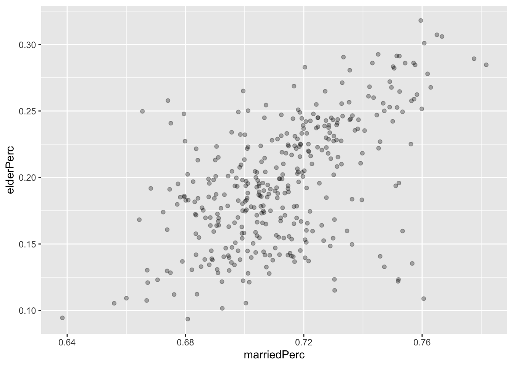
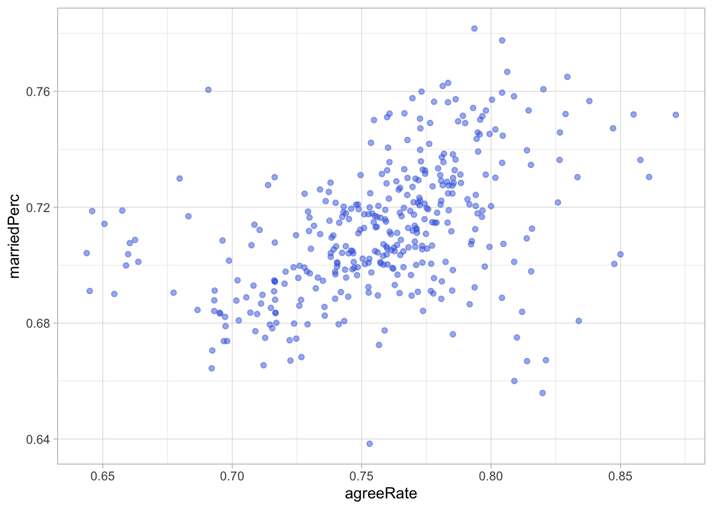

# Data manipultaiton: Join data {#joindata}

## 讀取內政部人口統計資料 {#moi}

先使用`slice(-1)`減去第一行中文欄位名稱。再來，目前縣市鄉鎮市區（`site_id`）和村里（`village`）分別是兩個變項，由於不同的鄉鎮市可能會有相同的村里名，所以把`site_id`與`village`粘接起來成為完整的村里名`vname`。

這邊我多加了一行程式碼讓`vname`可以排到前面一點的變項欄，可以用`select()`達到這個目的，我之後的變項欄的還要寶劉，所以我多打一個`everything()`就可以把剩下的變項欄都擺放在後面。因此這個重排變項欄的完整程式碼為`select(vname, everything())`。


```r
raw <- read_csv("data/opendata107Y030.csv") %>%
    slice(-1) %>%
    mutate(vname = str_c(site_id, village)) %>%
    select(vname, everything())

raw %>% head
```

```{.output}
## # A tibble: 6 × 157
##   vname         statistic_yyy district_code site_id village single_age_15down_m
##   <chr>         <chr>         <chr>         <chr>   <chr>   <chr>              
## 1 新北市板橋區… 107           65000010001   新北市… 留侯里  118                
## 2 新北市板橋區… 107           65000010002   新北市… 流芳里  119                
## 3 新北市板橋區… 107           65000010003   新北市… 赤松里  60                 
## 4 新北市板橋區… 107           65000010004   新北市… 黃石里  113                
## 5 新北市板橋區… 107           65000010005   新北市… 挹秀里  123                
## 6 新北市板橋區… 107           65000010006   新北市… 湳興里  351                
## # ℹ 151 more variables: single_age_15_19_m <chr>, single_age_20_24_m <chr>,
## #   single_age_25_29_m <chr>, single_age_30_34_m <chr>,
## #   single_age_35_39_m <chr>, single_age_40_44_m <chr>,
## #   single_age_45_49_m <chr>, single_age_50_54_m <chr>,
## #   single_age_55_59_m <chr>, single_age_60_64_m <chr>,
## #   single_age_65_69_m <chr>, single_age_70_74_m <chr>,
## #   single_age_75_79_m <chr>, single_age_80_84_m <chr>, …
```

```r
# raw %>% glimpse()
```

### 分析規劃 {#moi_plan}

1.  建立各鄉鎮市區的老年人口比例
2.  建立各鄉鎮市區的年齡中位數
3.  讀取所有（某一）公投案的結果
4.  視覺化年齡與公投結果間的相關性

### 清理資料 {#moi_clean}

我們之前在談資料的「觀察、統計、和二維表格」三種型態時，曾經談到統計型態和二維表格型態間的差異。當時所提到的「統計型態」，也就是每個變項欄恰好是我們所認知的單一變項（如每一個變項欄恰是人口統計變項的年齡、性別、教育程度、數量），會有助於進行統計分析，也就是tidy型態的資料。相較之下，上述的表格是把資料攤成二維的型態，每一個變項是某個年齡層的某種性別的某種婚姻狀況，包含了三個人口統計變項，是方便一般大眾讀的，但不是適合進行統計的tidy型態。
這類的資料tidyverse的相關套件把它稱為tidy form。遵守tidy
form形式的資料是，每一個欄恰好一個變項。例如在內政部開放資料「15歲以上現住人口按性別、年齡、婚姻狀況及教育程度分」中，每個變數（年齡、婚姻狀況、教育程度、人口數等等）均各自為一個欄上的變項。

-   [15歲以上現住人口按性別、年齡、婚姻狀況及教育程度分 \|
    政府資料開放平臺 (data.gov.tw)](https://data.gov.tw/dataset/32944)

接下來，我要把表格型態的資料轉為tidy型態資料。原本的資料是這樣的型態。


我要將後方的數值變項欄（`single_age_15down_m`等）轉為單一變項key的值，再把其所對應到的資料值，也轉為單一變項value。請注意看上圖和程式碼後方結果圖的顏色區塊。南投縣中寮鄉中寮村（綠色）被複製且展開為多列。而原本多個年齡層和資料的變數項（紅色）變成一個變項欄的資料，分別對應到其原本對應的數值（藍色）。


```r
tidy_data <- raw %>%
    pivot_longer(names_to = "key", values_to = "value", cols = 6:ncol(.))
```

相對於`pivot_wider()`把變項展開成欄，`pivot_longer()`函式可以收合被展開的變項，在此將要收合的變數名稱統一稱為`key`，並將該變數所對應到的數值稱為`value`。並且我用`6:ncol(.)`來指定我要收合哪些變項欄。

-   `ncol(.)`的「`.`」代表從前面`%>%` pipe進來的那個data.frame。
-   `pivot_longer()`後資料列從7760增加至1,179,520列。（灰底部分用來觀察結果用）

由於每一列恰好是一種婚姻狀態、一個年齡層和一個性別，所以，我們可以把`key`中的婚姻狀態、年齡層和性別切割出來做為變數。觀察`key`欄位發現其格式有一些規律性，主要是婚姻狀態_年齡下界_年齡上界_性別的形式。標準的範例如`married_15_10_m或widowed_25_29_f`，但有一些並非這種形式，例如：

-   `single_age_15_19_m`：其中`single_age`之間多了一個底線，所以把`single_age`取代為`single`就好。

-   `married_15down_m`：因為是`15down`少了一個底線，所以取代為`0_14`。

-   `married_100up_f`：因為`100up`少了一個底線，所以取代為`100_105`。

之後，我使用`tidyr::separate()`函式將`key`切成四個變項，分別為`married`、`ageLower`、`ageUpper`、`gender`。

-   `separate()`有一個參數是`remove=T`（預設值），意思是說，當把`key`變項切割為四個變項後，預設把key變項給丟棄；但如果未來你還會用到`key`變項的話，你可以把`remove`改為`FALSE`，代表切割完後，還保留`key`變項。
-   `tidyr::separate()`：Given either regular expression or a vector of
    character positions, separate() turns a single character column into
    multiple columns.

此時我清理出來的資料大致如下：


最後就剩零星的操作，包含轉換資料為數值型態、或者你也可以在這裡建立新的指標（例如年齡平均）。最後加上一個`arrange(vname)`讓他按照村里的全名排序。


```r
tidy_data <- raw %>%
    pivot_longer(names_to = "key", values_to = "value", cols = 6:ncol(.)) %>% 
    mutate(key = str_replace(key, "_age", "")) %>%
    mutate(key = str_replace(key, "100up", "100_110")) %>%
    mutate(key = str_replace(key, "15down", "0_15")) %>%
    separate(key, c("married", "ageLower", "ageUpper", "gender")) %>%
    mutate(ageLower = as.numeric(ageLower),
           # age = str(ageLower, ageUpper), 
           ageUpper = as.numeric(ageUpper),
           value = as.numeric(value)) %>%
    select(-statistic_yyy) %>%
    arrange(vname)
```

### 進階：運用`rowwise()` {#moi_rowwise}


```r
raw %>% 
    mutate_at(vars(6:157), as.numeric) %>%
    replace(is.na(.), 0) %>%
    rowwise() %>% 
    mutate(married = sum(c_across(matches("widowed|divorced|married")), na.rm = T)) %>%
    mutate(lt65 = sum(c_across(matches("65|70|75|80|85|90|95|100")), na.rm = T)) %>%
    select(vname, married, lt65) %>% head
```

```{.output}
## # A tibble: 6 × 3
## # Rowwise: 
##   vname              married  lt65
##   <chr>                <dbl> <dbl>
## 1 新北市板橋區留侯里     920   272
## 2 新北市板橋區流芳里     826   280
## 3 新北市板橋區赤松里     463   149
## 4 新北市板橋區黃石里     632   210
## 5 新北市板橋區挹秀里    1061   365
## 6 新北市板橋區湳興里    3157   838
```

### 建立鄉鎮市區與村里指標 {#moi_vil}

#### 使用group_by()建立村里指標 {#moi_vil_groupby}

將資料轉換為tidy型態後，接下來要做的事情是建立村里、鄉鎮市區、縣市的分級指標。針對每個村里，我希望計算出總人口數`people`（原本依據年齡與性別、婚姻情形分割）、老年人總數`elderSum`、曾結婚人口總數`marriedSum`。之後再分別除以該村里的總人口數`people`，老年人的人口比例`elderPerc`以及結婚的人口比例`marriedPerc`。

因為一個村里的資料會根據不同性別、不同婚姻情形、不同年齡層被切割為不同的資料列，共2X4X19個資料列。因此，如果我想知道一個村里的總人口數或相關統計資料，就不需彙整這些資料列。`dplyr`有非常強大的`group_by()`可以根據群組來進行運算，我用村里代號（`district_code`）來做群組運算，所以是`group_by(district_code)`或用我們所產生的`vname`作為群組基準來運算`group_by(vname)`。

語法上，通常`group_by()`之後經常會跟著`summarise()`，跟`mutate()`的語法有點像，都會產生新變數，但因為這邊用`group_by()`針對某個或某幾個變數做彙整，相當於`base`套件的`apply()`函式，因此會根據每個不同的群組做組內的數值彙整運算。比方說，在以下的程式碼中，我用`sum(num)`計算了該群組內的總人數，然後同樣累計了年齡大於等於65歲的總人數，以及婚姻狀態不為single的總人數。

簡單地說，相當於按照不同的村里（`district_code`）各別做`value`的加總（該村里的總人口數）、篩選出年齡65歲以上的人口組別進行加總、篩選出不是單身者的人口組別進行加總。之後會加一個`ungroup()`解開群組。

最後一行`left_join(raw %>% select(vname, site_id), by = "vname")`是由於`group_by()`後會讓其他變數消失（例如鄉鎮市區名`site_id`），所以我希望將原本資料`raw`中的`site_id`給併回來。我可以抽取出`raw`中的`vname`和`site_id`兩個變項，然後以`vname`為key，用`left_join()`將`site_id`給併回來。

筆記：當`group_by()`、`summarize()`後不參與的變項會消失，但可以透過`left_join()`的方式將原有的變項併回來。


```r
village_stat <- tidy_data %>%
    filter(ageLower >= 20) %>%
    group_by(vname) %>%
    summarise(legalPopulation = sum(value),
              elderSum = sum(value[ageLower >= 65]),
              marriedSum = sum(value[married %in% c("married", "divorced", "widowed")]),
              womenSum = sum(value[gender == "f"])) %>%
    ungroup() %>%
    left_join(raw %>% select(vname, site_id), by = "vname")
```

測試


#### 將村里指標匯總為鄉鎮市區指標 {#moi_town_groupby}

剛剛是根據村里（village）來建立指標，現在要根據鄉鎮市區來建立指標。走過前方的邏輯後，我們只需要把原本用來做`group_by()`的村里變項`vname`改為鄉鎮市區的變項`site_id`，就可以完成這件事，其他都一樣，你發現沒？

不過這邊我要多做一件事。因為三民區和鳳山區兩個區非常的大（我猜），所以內政資料中的鄉鎮市區資料有分「三民一」、「三民二」、「鳳山一」、「鳳山二」。我們只要在彙整資料前，將`site_id`的這四類值取代好，便可以在鄉鎮市區的指標中一併彙整。以下我一共彙整出四種資料，分別為該區人口數（`legalPopulation`）、老年人口數（`elderSum`）、曾婚人口數（`marriedSum`）、女性人口數（`womenSum`）。不難想像接下來可以計算出各鄉鎮市區的老年人口比例、曾婚比例、女性比例等。


```r
town_stat <- village_stat %>%
    # mutate(site_id = str_sub(vname, 1, 6)) %>%
    mutate(site_id = str_replace(site_id, "三民一|三民二", "三民區")) %>%
    mutate(site_id = str_replace(site_id, "鳳山一|鳳山二", "鳳山區")) %>%
    group_by(site_id) %>%
    summarize(legalPopulation =  sum(legalPopulation),
              elderSum = sum(elderSum),
              marriedSum = sum(marriedSum),
              womenSum = sum(womenSum)
              )%>%
    ungroup()
```

### 視覺化測試（老年人口數 x 曾婚人口數） {#moi_visual_popul}


```r
town_stat %>%
    mutate(marriedPerc = marriedSum / legalPopulation) %>%
    mutate(womenPerc = womenSum / legalPopulation) %>%
    mutate(elderPerc = elderSum / legalPopulation) %>% 
    ggplot() +
    aes(marriedPerc, elderPerc) + 
    geom_point(alpha = 0.3)
```



```r
    # geom_jitter(alpha = 0.3)
```

## 讀取公投資料 {#referendum}

首先，先讀取資料並重新命名每個變項。由於我們要連結公投資料和前面的內政部人口統計資料，所以要注意兩筆資料間是否有共通的key（資料庫稱為鍵值）。`town_stat`的是以`site_id`鄉鎮市區名為主鍵，所以公投資料這邊也產生一個同名的鄉鎮市區變項`site_id`。


```r
ref10 <- read_csv("data/ref10.csv") %>%
    select(county = 縣市, town = 鄉鎮市區,
           agree = 同意票數, disagree = 不同意票數,
           legalVote = 有效票數, illegalVote = 無效票數, 
           vote = 投票數, legalPopulation =  投票權人數)  %>%
    mutate(site_id = str_c(county, town)) %>%
    drop_na(site_id)

names(ref10)
```

```{.output}
## [1] "county"          "town"            "agree"           "disagree"       
## [5] "legalVote"       "illegalVote"     "vote"            "legalPopulation"
## [9] "site_id"
```

合併資料測試，注意，由於兩邊都有`legalPopulation`，所以`town_stat`中的`legalPopulation`增生為`legalPopulation.x`，而`ref10`中的`legalPopulation`則重新命名為`legalPopulation.y`。


```r
town_stat %>% left_join(ref10, by = "site_id")
```

```{.output}
## # A tibble: 368 × 13
##    site_id     legalPopulation.x elderSum marriedSum womenSum county town  agree
##    <chr>                   <dbl>    <dbl>      <dbl>    <dbl> <chr>  <chr> <dbl>
##  1 南投縣中寮…             12791     3272       9553     5824 南投縣 中寮…  5748
##  2 南投縣仁愛…             12172     1713       9078     5899 南投縣 仁愛…  5702
##  3 南投縣信義…             12860     1847       9050     5938 南投縣 信義…  6891
##  4 南投縣南投…             81874    15855      57042    41343 南投縣 南投… 37547
##  5 南投縣名間…             32388     7106      23375    15304 南投縣 名間… 14533
##  6 南投縣國姓…             16196     3744      11826     7434 南投縣 國姓…  7089
##  7 南投縣埔里…             66699    13411      46316    33718 南投縣 埔里… 29571
##  8 南投縣水里…             15023     3644      10850     7106 南投縣 水里…  6392
##  9 南投縣竹山…             45629    10154      33201    22244 南投縣 竹山… 19254
## 10 南投縣草屯…             80426    15141      56384    40008 南投縣 草屯… 35215
## # ℹ 358 more rows
## # ℹ 5 more variables: disagree <dbl>, legalVote <dbl>, illegalVote <dbl>,
## #   vote <dbl>, legalPopulation.y <dbl>
```

### 合併公投資料並視覺化 {#moi_join_ref}

由於人口統計資料中的鄉鎮市區若只有兩個字如「東區」中間有一全形空白「東　區」，但公投資料中並沒有這樣的空白，所以為了兩者要能夠正確合併，需要先做好取代。可以逐一取代，或者，直接取代掉該全形空白為空字串即可。


```r
town_stat %>%
    mutate(site_id = str_replace(site_id, "　", "")) %>%
    # mutate(site_id = str_replace(site_id, "東　區", "東區"),
    #        site_id = str_replace(site_id, "西　區", "西區"),
    #        site_id = str_replace(site_id, "南　區", "南區"),
    #        site_id = str_replace(site_id, "北　區", "北區"),
    #        site_id = str_replace(site_id, "中　區", "中區")) %>%
    left_join(ref10, by = "site_id") %>%
    mutate(agreeRate = agree / legalVote,
           marriedPerc = marriedSum / legalPopulation.x) %>%
    # select(site_id, agree, legalVote, marriedSum, legalPopulation.x) %>%
    ggplot() + 
    aes(agreeRate, marriedPerc) + 
    geom_point(alpha = 0.5, color = "royalblue") + 
    theme_light()
```


