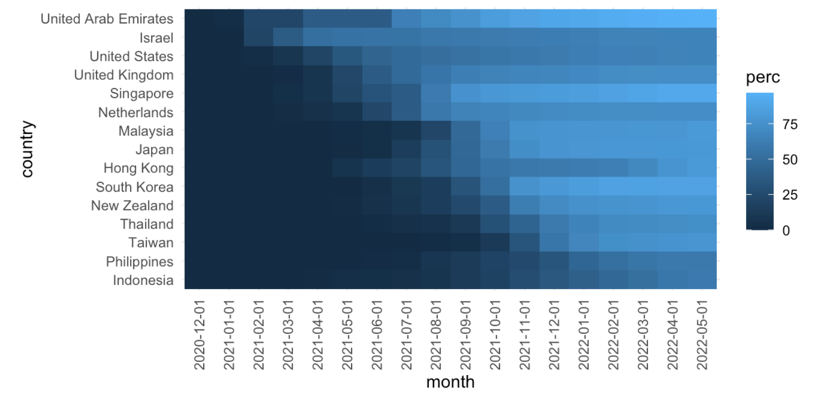

# NA Processing {#na}

許多統計資料都會有不同程度的`NA`（缺失值、遺漏值）。缺失值產生的原因不一，可能有以下原因：

1.  資料運算的時候產生的填缺失值。例如`spread()`和`pivot_wider()`經常會產生`NA`，也經常會指定值（例如0）來取代可能產生的`NA`。
2.  資料紀錄的時候遺漏某些時間點的資料。
3.  開放資料在開放時已經被整理成階層化、易於展示、一般人易懂的表格型態。此時，若將其讀入也會產生非常大量的`NA`。例如本章節所要提到的政府各部會預算比例。
4.  紀錄資料筆數非常龐大、來源眾多、紀錄時間不一時，雖然有很多紀錄，但這些紀錄必須要被對齊、刪減，才能夠獲得有意義的可計算資料。例如本章節會提到的世界各國疫苗注射資料。

## Cleaning Gov Annual Budget

這個範例將清理中央政府111年度的歲出預算表。由於政府預算有款、科、目、節與機構，會呈現一個大部會到小布會的樹狀階層，因此非常適合用Treemap來做視覺化，預期視覺化的結果如下（視覺化的部分可參考章節\@ref(treemap-nested-proportion)）：


在讀入資料後，由於資料具有階層性、從最大的科款、項、目，由於是給一般讀者所閱讀的資料，在原本的EXCEL表格中，比較大的階層可能會合併數個資料格來表示，這會使得較大的階層會有相當多的缺失值。此時，我們會需要依據其他列的值，來回填這些NA值，所用的函式為`zoo::na.locf()`。


```r
raw <- readxl::read_excel("data/111B歲出政事別預算表.xls", skip=3, col_names = F)
raw %>% head(10)
```

```{.output}
## # A tibble: 10 × 9
##    ...1                          ...2  ...3  ...4  ...5  ...6  ...7  ...8  ...9 
##    <chr>                         <chr> <chr> <chr> <chr> <chr> <chr> <chr> <chr>
##  1 科                          … <NA>  <NA>  <NA>   <NA> 本年… 上年… 前年… "本… 
##  2 款                            項    目    節    "名 … <NA>  <NA>  <NA>   <NA>
##  3 <NA>                          <NA>  <NA>  <NA>  "\n…  2262… 2135… 2039… "126…
##  4 <NA>                          <NA>  <NA>  <NA>  "\n(… 2101… 2026… 1907… "750…
##  5 1                             <NA>  <NA>  <NA>  "310… 1210… 1186… 1176… "233…
##  6 <NA>                          1     <NA>  <NA>  "310… 1004… 9789… 9973… "258…
##  7 <NA>                          <NA>  1     <NA>  "310… 9205… 8963… 8821… "241…
##  8 <NA>                          <NA>  2     <NA>  "310… 30000 30000 2999… "-"  
##  9 <NA>                          <NA>  3     <NA>  "310… 15760 15760 4557… "-"  
## 10 <NA>                          <NA>  4     <NA>  "310… 5332  5332  6720… "-"
```

### Basic Cleaning

1.  重新命名欄位名稱
2.  刪去被當成表格標題的多於列（通常是前兩三列）`slice(-(1:2))`。
3.  觀察資料，「款」可以說是支出大類的代號，例如總統府、行政支出、立法支出、軍事支出、教育支出等。「科」為該單位底下的部門或者項目，例如「行政支出」下有行政院、主計總處支出等。更底下的細類「目」並非本例的分析對象，所以可以刪除。所以，如果款、科均為缺失值的話，代表其為更細的「目」。因此篩去款科為缺失值的所有項目。`filter(!is.na(款) | !is.na(科))`
4.  將機構id和機構名稱切分開來，視覺化的時候只會用到機構名稱。`separate(機構, c("oid", "org"), sep="\n")`


```r
names(raw) <- c("款", "科", "目", "節", "機構", "本年度預算", "上年度預算", "上年度決算", "預算差")

cleaned <- raw %>%
    slice(-(1:2)) %>%
    filter(!is.na(款) | !is.na(科)) %>%
    select(-目, -節) %>%
    separate(機構, c("oid", "org"), sep="\n")
cleaned %>% head(10)
```

```{.output}
## # A tibble: 10 × 8
##    款    科    oid        org              本年度預算 上年度預算 上年度…¹ 預算差
##    <chr> <chr> <chr>      <chr>            <chr>      <chr>      <chr>    <chr> 
##  1 1     <NA>  3100000000 國務支出         1210301    1186955    1176955… 23346 
##  2 <NA>  1     3102010000 總統府           1004797    978916     997305.… 25881 
##  3 <NA>  2     3102100000 國家安全會議     205504     208039     179649.… -2535 
##  4 2     <NA>  3200000000 行政支出         6134276    5836481    5477154… 297795
##  5 <NA>  1     3203010000 行政院           1256043    1286646    1268295… -30603
##  6 <NA>  2     3203100000 主計總處         1604967    1478173    1578781… 126794
##  7 <NA>  3     3203300000 人事行政總處     555363     573447     489516.… -18084
##  8 <NA>  4     3203340000 公務人力發展學院 244346     239453     229852.… 4893  
##  9 <NA>  5     3203420000 檔案管理局       787429     646081     443133.… 141348
## 10 <NA>  6     3203900000 大陸委員會       900896     900866     792491.… 30    
## # … with abbreviated variable name ¹​上年度決算
```

### Processing NA

觀察一下現在的資料，發現，行政院、主計總處等均屬於行政支出，但行政支出卻自有一列。依照長表格的格式來說，應嘗試把「款」作為機構的變項。所以將款的數字取代為「行政支出」等支出類別的名稱。


```r
cleaned %>% mutate(款 = ifelse(!is.na(款), org, 款)) %>%
    head(10)
```

```{.output}
## # A tibble: 10 × 8
##    款       科    oid        org              本年度預算 上年度…¹ 上年…²  預算差
##    <chr>    <chr> <chr>      <chr>            <chr>      <chr>    <chr>   <chr> 
##  1 國務支出 <NA>  3100000000 國務支出         1210301    1186955  117695… 23346 
##  2 <NA>     1     3102010000 總統府           1004797    978916   997305… 25881 
##  3 <NA>     2     3102100000 國家安全會議     205504     208039   179649… -2535 
##  4 行政支出 <NA>  3200000000 行政支出         6134276    5836481  547715… 297795
##  5 <NA>     1     3203010000 行政院           1256043    1286646  126829… -30603
##  6 <NA>     2     3203100000 主計總處         1604967    1478173  157878… 126794
##  7 <NA>     3     3203300000 人事行政總處     555363     573447   489516… -18084
##  8 <NA>     4     3203340000 公務人力發展學院 244346     239453   229852… 4893  
##  9 <NA>     5     3203420000 檔案管理局       787429     646081   443133… 141348
## 10 <NA>     6     3203900000 大陸委員會       900896     900866   792491… 30    
## # … with abbreviated variable names ¹​上年度預算, ²​上年度決算
```

接下來，希望能夠在「款==`NA`」的地方填入該欄的「前一個值」例如行政支出。查詢一下（關鍵字如「Fill in NA column values with the last value that was not NA」）還真的有這樣的函式可以操作：

::: notes
**`zoo::na.locf()`**：**`zoo::na.locf()`** 是 R 語言中 **`zoo`** 套件提供的函式，其作用是將缺失值（NA）用最後一個非缺失值（non-missing value）填充。具體而言，**`na.locf()`** 函式將會從第一個非缺失值開始向下填充，直到下一個非缺失值出現為止。這種方法稱為 "last observation carried forward"（LOCF），意思是最後觀測值向前填充。
:::


```r
library(zoo)
cleaned %>% 
    mutate(款 = ifelse(!is.na(款), org, 款)) %>%
    mutate(款 = zoo::na.locf(款)) %>%
    head(10)
```

```{.output}
## # A tibble: 10 × 8
##    款       科    oid        org              本年度預算 上年度…¹ 上年…²  預算差
##    <chr>    <chr> <chr>      <chr>            <chr>      <chr>    <chr>   <chr> 
##  1 國務支出 <NA>  3100000000 國務支出         1210301    1186955  117695… 23346 
##  2 國務支出 1     3102010000 總統府           1004797    978916   997305… 25881 
##  3 國務支出 2     3102100000 國家安全會議     205504     208039   179649… -2535 
##  4 行政支出 <NA>  3200000000 行政支出         6134276    5836481  547715… 297795
##  5 行政支出 1     3203010000 行政院           1256043    1286646  126829… -30603
##  6 行政支出 2     3203100000 主計總處         1604967    1478173  157878… 126794
##  7 行政支出 3     3203300000 人事行政總處     555363     573447   489516… -18084
##  8 行政支出 4     3203340000 公務人力發展學院 244346     239453   229852… 4893  
##  9 行政支出 5     3203420000 檔案管理局       787429     646081   443133… 141348
## 10 行政支出 6     3203900000 大陸委員會       900896     900866   792491… 30    
## # … with abbreviated variable names ¹​上年度預算, ²​上年度決算
```

太神奇了！看見沒！接下來只要把「科 is `NA`」的那些該大類支出總數的紀錄給刪除，資料就乾淨了。最後就只會剩下一些資料清理的功伕。完整程式碼可以看下一節。

### Complete Code


```r
library(zoo)
# raw <- readxl::read_excel("data/111B歲出政事別預算總表.xls")
raw <- readxl::read_excel("data/111B歲出政事別預算表.xls", skip=3, col_names = F) 

names(raw) <- c("款", "科", "目", "節", "機構", "本年度預算", "上年度預算", "上年度決算", "預算差")
# raw$款 <- na.locf(raw$款)

cleaned <- raw %>%
  filter(!is.na(款) | !is.na(科)) %>%
  slice(-(1:2)) %>%
  select(-目, -節) %>%
  separate(機構, c("oid", "org"), sep="\n") %>%
  mutate(款 = ifelse(!is.na(款), org, 款)) %>%
  mutate(款 = zoo::na.locf(款)) %>%
  filter(!is.na(科)) %>%
  select(-科) %>% type_convert()  %>%
  mutate(上年度預算 = as.numeric(上年度預算), 
              上年度決算 = as.integer(上年度決算),
              預算差 = as.numeric(預算差)) %>%
  replace_na(list(上年度預算 = 0, 上年度決算 = 0)) %>%
  mutate(預算差 = 本年度預算 - 上年度預算)

cleaned %>% head()
```

```{.output}
## # A tibble: 6 × 7
##   款              oid org              本年度預算 上年度預算 上年度決算 預算差
##   <chr>         <dbl> <chr>                 <dbl>      <dbl>      <int>  <dbl>
## 1 國務支出 3102010000 總統府              1004797     978916     997305  25881
## 2 國務支出 3102100000 國家安全會議         205504     208039     179649  -2535
## 3 行政支出 3203010000 行政院              1256043    1286646    1268295 -30603
## 4 行政支出 3203100000 主計總處            1604967    1478173    1578781 126794
## 5 行政支出 3203300000 人事行政總處         555363     573447     489516 -18084
## 6 行政支出 3203340000 公務人力發展學院     244346     239453     229852   4893
```

## Cleaning Covid Vaccinating data

這個案例是希望視覺化不同國家（Y）在不同時間點（X）的疫苗施打涵蓋率（將使用熱區圖，所以將用顏色來表示涵蓋率）。涵蓋率的表示法在該資料中為每百萬人施打疫苗數，但也可以轉為百分比，有多少比例的人已經施打過第一劑、第二劑或第三劑等。

資料來源為：

-   <https://ourworldindata.org/covid-vaccinations>

-   <https://github.com/owid/covid-19-data/tree/master/public/data/vaccinations>

預期希望看見的結果如下，如何將這份疫苗施打比例的資料做視覺化，請見視覺化的章節\@ref(heatmap-vaccination)：



### 觀察並評估資料概況

**這是一份資料缺失相當多的資料**。評估資料概況後可發現這個資料集每一列就是某一個國家某一天所上傳的紀錄。所以，一個國家會有很多列。乍聽之下不難處理，但事實上每個國家不會每天上傳、也不會固定某一天上傳、哪一週、哪一個月開始上傳也不一定，也有可能會漏掉一些月份或週次。所以，制定出一個時間單位（例如週、月）、然後延著時間軸將資料「對齊」，讓每個國家在每個時間單位都有資料。但每個國家疫情發展程度不一，所以也不可能有一個完美的對齊，所以通常會建議就所要觀察的國家進行對齊即可。至於想刪除的那些資料列，幾乎都可以當成是所謂的缺失值。


```r
raw <- read_csv("data/vaccinations.csv")
dim(raw)
```

```{.output}
## [1] 99442    16
```

```r
raw %>% head(20)
```

```{.output}
## # A tibble: 20 × 16
##    location   iso_c…¹ date       total…² peopl…³ peopl…⁴ total…⁵ daily…⁶ daily…⁷
##    <chr>      <chr>   <date>       <dbl>   <dbl>   <dbl>   <dbl>   <dbl>   <dbl>
##  1 Afghanist… AFG     2021-02-22       0       0      NA      NA      NA      NA
##  2 Afghanist… AFG     2021-02-23      NA      NA      NA      NA      NA    1367
##  3 Afghanist… AFG     2021-02-24      NA      NA      NA      NA      NA    1367
##  4 Afghanist… AFG     2021-02-25      NA      NA      NA      NA      NA    1367
##  5 Afghanist… AFG     2021-02-26      NA      NA      NA      NA      NA    1367
##  6 Afghanist… AFG     2021-02-27      NA      NA      NA      NA      NA    1367
##  7 Afghanist… AFG     2021-02-28    8200    8200      NA      NA      NA    1367
##  8 Afghanist… AFG     2021-03-01      NA      NA      NA      NA      NA    1580
##  9 Afghanist… AFG     2021-03-02      NA      NA      NA      NA      NA    1794
## 10 Afghanist… AFG     2021-03-03      NA      NA      NA      NA      NA    2008
## 11 Afghanist… AFG     2021-03-04      NA      NA      NA      NA      NA    2221
## 12 Afghanist… AFG     2021-03-05      NA      NA      NA      NA      NA    2435
## 13 Afghanist… AFG     2021-03-06      NA      NA      NA      NA      NA    2649
## 14 Afghanist… AFG     2021-03-07      NA      NA      NA      NA      NA    2862
## 15 Afghanist… AFG     2021-03-08      NA      NA      NA      NA      NA    2862
## 16 Afghanist… AFG     2021-03-09      NA      NA      NA      NA      NA    2862
## 17 Afghanist… AFG     2021-03-10      NA      NA      NA      NA      NA    2862
## 18 Afghanist… AFG     2021-03-11      NA      NA      NA      NA      NA    2862
## 19 Afghanist… AFG     2021-03-12      NA      NA      NA      NA      NA    2862
## 20 Afghanist… AFG     2021-03-13      NA      NA      NA      NA      NA    2862
## # … with 7 more variables: total_vaccinations_per_hundred <dbl>,
## #   people_vaccinated_per_hundred <dbl>,
## #   people_fully_vaccinated_per_hundred <dbl>,
## #   total_boosters_per_hundred <dbl>, daily_vaccinations_per_million <dbl>,
## #   daily_people_vaccinated <dbl>, daily_people_vaccinated_per_hundred <dbl>,
## #   and abbreviated variable names ¹​iso_code, ²​total_vaccinations,
## #   ³​people_vaccinated, ⁴​people_fully_vaccinated, ⁵​total_boosters, …
```

### 按月對齊資料

首先要挑選要拿來做視覺化的資料欄位。這邊所選擇的是`people_fully_vaccinated_per_hundred`，也就是每百人接種二劑疫苗的人數，相當於接種二劑疫苗的百分比。

接下來便是缺失值處理，如果這個欄位沒有數值的就直接用`drop_na()`篩除即可。

這個範例希望把該資料視覺化為Y軸為年、X軸為時間的熱區圖。但整個疫情資料橫亙二年多，如果以週為彙整單位的話，那勢必X軸會有近百個資料點。所以打算以「月」為單位來彙整這些資料，因為且資料中也有不少國家缺數週的資料，所以以月為彙整單位是一個權衡後的選擇（仍可以嘗試用週作為彙整單位試試看）。所以，運用了`lubridate::floor_date()`來將日期資料轉換為月，例如2022-03-12和2022-03-14都會被轉換為2022-03-01。

依照國家與時間群組彙整資料。接下來就依照各國的月份來做彙整（注意，此時會有不少資料同屬於某個月的資料）。彙整的方法是，經過對「日期」（不是對月）做排序後，僅留下第一筆資料，也就是僅留下最接近月份開頭的資料。經由這樣的操作，會使得各國在每個月剛好留下一筆資料，如下面程式的範例輸出。


```r
library(lubridate)
fullvaccinated <- raw %>% select(country = location, date, 
                                people_fully_vaccinated_per_hundred) %>%
  drop_na(people_fully_vaccinated_per_hundred) %>%
  mutate(m = floor_date(date, unit = "month")) %>%
  group_by(country, m) %>%
  arrange(date) %>%
  slice(1) %>%
  ungroup() %>%
  select(-date)

fullvaccinated %>% head(10)
```

```{.output}
## # A tibble: 10 × 3
##    country     people_fully_vaccinated_per_hundred m         
##    <chr>                                     <dbl> <date>    
##  1 Afghanistan                                0.14 2021-05-01
##  2 Afghanistan                                0.36 2021-06-01
##  3 Afghanistan                                0.48 2021-07-01
##  4 Afghanistan                                1.08 2021-08-01
##  5 Afghanistan                                8    2021-11-01
##  6 Afghanistan                                9.42 2021-12-01
##  7 Afghanistan                                9.56 2022-01-01
##  8 Afghanistan                                9.82 2022-02-01
##  9 Afghanistan                               10.8  2022-03-01
## 10 Afghanistan                               11.4  2022-04-01
```

### 處理遺漏資料的月份

接下來要處理的是資料紀錄的缺漏值。每個國家登錄資料的時間是很不一致的，某些國家會缺某些月份，或者某些國家是在某年某月以後才開始登記，或者最近沒在登記。但這個範例所要視覺化的資料是接種疫苗的比例，所以即使是現在沒在登記了，但接種比例應列計最後一次資料紀錄的接種比例。

首先我要讓每個國家都有所有月份，這裡應會有某個函式可以做到這件事，但我沒查到這個函式。不過我可以很技巧性地用`pivot_wider()`（`spread()`）和`pivot_longer()`（`gather()`）來完成這件事。`spread()`在展開時對於缺少的資料項可以自動補`NA`。所以我就只要把資料的月份展開後再`gather()`回來後，就可以自動讓每個國家所擁有的月份資料一致。以下為`spread()`後的結果，可以觀察到每一列是一個國家，每一欄是個月份，如果當月都沒資料紀錄，那該月的值就會是缺失值。可以看見缺失值是相當多的，也就是在那段時間都沒有資料紀錄。


```r
fullvaccinated %>%
  spread(m, people_fully_vaccinated_per_hundred, fill=NA) %>%
    head(10)
```

```{.output}
## # A tibble: 10 × 19
##    country       2020-…¹ 2021-…² 2021-…³ 2021-…⁴ 2021-…⁵ 2021-…⁶ 2021-…⁷ 2021-…⁸
##    <chr>           <dbl>   <dbl>   <dbl>   <dbl>   <dbl>   <dbl>   <dbl>   <dbl>
##  1 Afghanistan        NA      NA   NA      NA      NA       0.14    0.36    0.48
##  2 Africa             NA      NA    0       0.02    0.3     0.36    0.63    1.15
##  3 Albania            NA      NA    0      NA      NA       6.32   10.2    14.2 
##  4 Algeria            NA      NA   NA      NA      NA      NA      NA      NA   
##  5 Andorra            NA      NA   NA       1.52    5.8     6.07   14.1    34.9 
##  6 Angola             NA      NA   NA      NA      NA       0.12    1.11    1.66
##  7 Anguilla           NA      NA   NA      NA       5.18   29.2    36.4    47.3 
##  8 Antigua and …      NA      NA   NA      NA      NA       2.61   18.4    28.2 
##  9 Argentina           0       0    0.26    0.69    1.56    2.24    6.68    9.71
## 10 Armenia            NA      NA   NA      NA      NA      NA       0.4     1.03
## # … with 10 more variables: `2021-08-01` <dbl>, `2021-09-01` <dbl>,
## #   `2021-10-01` <dbl>, `2021-11-01` <dbl>, `2021-12-01` <dbl>,
## #   `2022-01-01` <dbl>, `2022-02-01` <dbl>, `2022-03-01` <dbl>,
## #   `2022-04-01` <dbl>, `2022-05-01` <dbl>, and abbreviated variable names
## #   ¹​`2020-12-01`, ²​`2021-01-01`, ³​`2021-02-01`, ⁴​`2021-03-01`, ⁵​`2021-04-01`,
## #   ⁶​`2021-05-01`, ⁷​`2021-06-01`, ⁸​`2021-07-01`
```

在以下的範例輸出可以看到`gather()`後的結果。注意，需要照國家和月份來排序後才便於觀察。


```r
fullvaccinated %>%
    spread(m, people_fully_vaccinated_per_hundred, fill=NA) %>%
    gather(month, perc, -country) %>% 
    arrange(country, month) %>% head(20)
```

```{.output}
## # A tibble: 20 × 3
##    country     month       perc
##    <chr>       <chr>      <dbl>
##  1 Afghanistan 2020-12-01 NA   
##  2 Afghanistan 2021-01-01 NA   
##  3 Afghanistan 2021-02-01 NA   
##  4 Afghanistan 2021-03-01 NA   
##  5 Afghanistan 2021-04-01 NA   
##  6 Afghanistan 2021-05-01  0.14
##  7 Afghanistan 2021-06-01  0.36
##  8 Afghanistan 2021-07-01  0.48
##  9 Afghanistan 2021-08-01  1.08
## 10 Afghanistan 2021-09-01 NA   
## 11 Afghanistan 2021-10-01 NA   
## 12 Afghanistan 2021-11-01  8   
## 13 Afghanistan 2021-12-01  9.42
## 14 Afghanistan 2022-01-01  9.56
## 15 Afghanistan 2022-02-01  9.82
## 16 Afghanistan 2022-03-01 10.8 
## 17 Afghanistan 2022-04-01 11.4 
## 18 Afghanistan 2022-05-01 NA   
## 19 Africa      2020-12-01 NA   
## 20 Africa      2021-01-01 NA
```

接下來是最技巧性的部分。就接種比例而言是個遞增數列，所以如果這個月有紀錄，但下個月沒紀錄（`NA`），那下個月的資料應以這個月的資料來替代。此時可以用`zoo`套件的`na.locf()`來填`NA`值，其填`NA`值的規則是用最後一筆非`NA`值的資料來替代`NA`值。但要注意的是，因為資料紀錄可能到第六個月或第七個月才開始紀錄，但在前面的月份都沒資料紀錄，也就是說那些`NA`值沒有更早的資料紀錄權充填充值。原本`na.locf()`會把這些找不到參考對象的`NA`值直接刪除，但我們可以在裡面加一個參數使其不會被刪除（`na.locf(perc, na.rm = F)`）。

最後，就把這些沒被刪除也沒得參考的早期資料項，用`replace_na()`填上0即可。


```r
fullvaccinated %>%
    spread(m, people_fully_vaccinated_per_hundred, fill=NA) %>%
    gather(month, perc, -country) %>%
    arrange(country, month) %>%
    group_by(country) %>%
    arrange(month) %>%
    mutate(perc = zoo::na.locf(perc, na.rm = F)) %>%
    ungroup() %>%
    arrange(country, month) %>% head(10)
```

```{.output}
## # A tibble: 10 × 3
##    country     month       perc
##    <chr>       <chr>      <dbl>
##  1 Afghanistan 2020-12-01 NA   
##  2 Afghanistan 2021-01-01 NA   
##  3 Afghanistan 2021-02-01 NA   
##  4 Afghanistan 2021-03-01 NA   
##  5 Afghanistan 2021-04-01 NA   
##  6 Afghanistan 2021-05-01  0.14
##  7 Afghanistan 2021-06-01  0.36
##  8 Afghanistan 2021-07-01  0.48
##  9 Afghanistan 2021-08-01  1.08
## 10 Afghanistan 2021-09-01  1.08
```

最後，就把這些沒被刪除也沒得參考的早期資料項，用`replace_na()`填上0即可。大功告成。


```r
fullvaccinated %>%
    spread(m, people_fully_vaccinated_per_hundred, fill=NA) %>%
    gather(month, perc, -country) %>%
    arrange(country, month) %>%
    group_by(country) %>%
    arrange(month) %>%
    mutate(perc = zoo::na.locf(perc, na.rm = F)) %>%
    ungroup() %>%
    arrange(country, month) %>%
    replace_na(list(perc=0)) %>%
    arrange(country, month) %>% head(10)
```

```{.output}
## # A tibble: 10 × 3
##    country     month       perc
##    <chr>       <chr>      <dbl>
##  1 Afghanistan 2020-12-01  0   
##  2 Afghanistan 2021-01-01  0   
##  3 Afghanistan 2021-02-01  0   
##  4 Afghanistan 2021-03-01  0   
##  5 Afghanistan 2021-04-01  0   
##  6 Afghanistan 2021-05-01  0.14
##  7 Afghanistan 2021-06-01  0.36
##  8 Afghanistan 2021-07-01  0.48
##  9 Afghanistan 2021-08-01  1.08
## 10 Afghanistan 2021-09-01  1.08
```

### 完整程式碼


```r
library(lubridate)
raw <- read_csv("data/vaccinations.csv")

fullvaccinated <- raw %>% select(country = location, date, 
                                people_fully_vaccinated_per_hundred) %>%
  drop_na(people_fully_vaccinated_per_hundred) %>%
  mutate(m = floor_date(date, unit = "month")) %>%
  group_by(country, m) %>%
  arrange(date) %>%
  slice(1) %>%
  ungroup() %>%
  select(-date)

vperc_by_month <- fullvaccinated %>%
  spread(m, people_fully_vaccinated_per_hundred, fill=NA) %>%
  gather(month, perc, -country) %>%
  arrange(country, month) %>%
  group_by(country) %>%
  arrange(month) %>%
  mutate(perc = zoo::na.locf(perc, na.rm = F)) %>%
  ungroup() %>%
  arrange(country, month) %>%
  replace_na(list(perc=0))
```

如何將這份疫苗施打比例的資料做視覺化，請見視覺化的章節\@ref(heatmap-vaccination)
