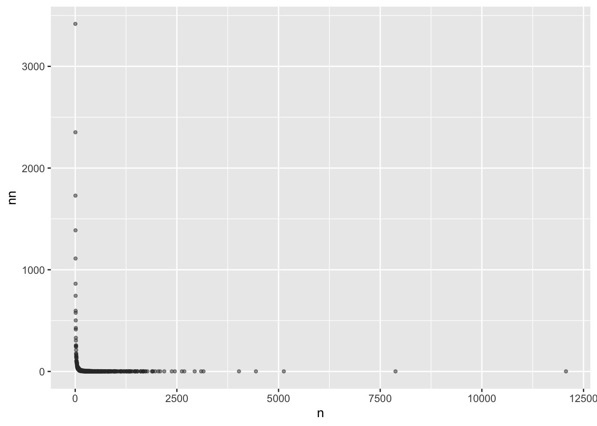
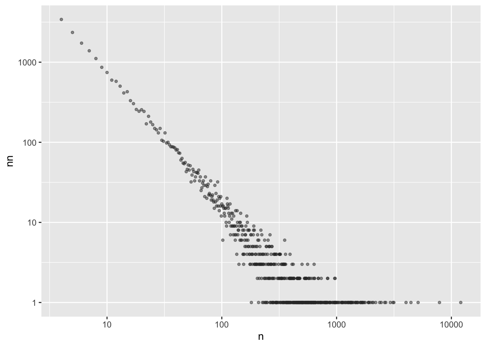
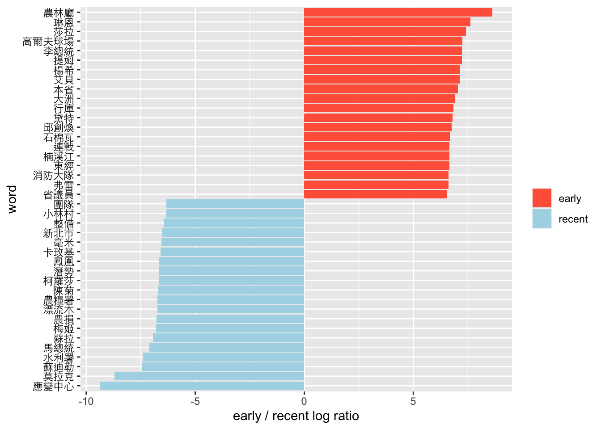
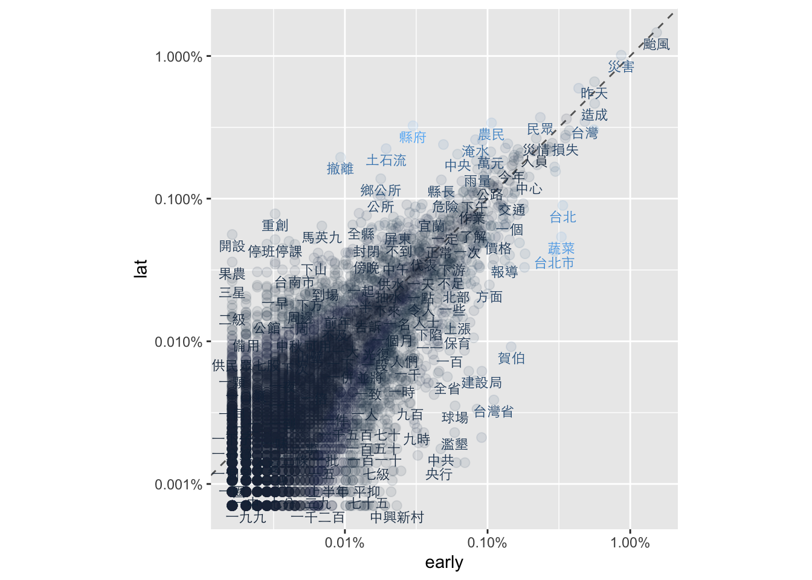
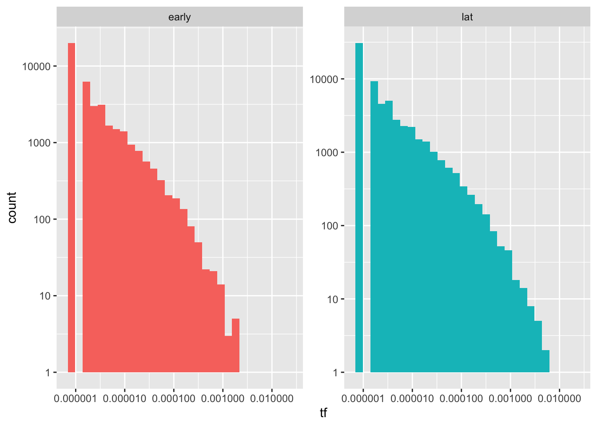
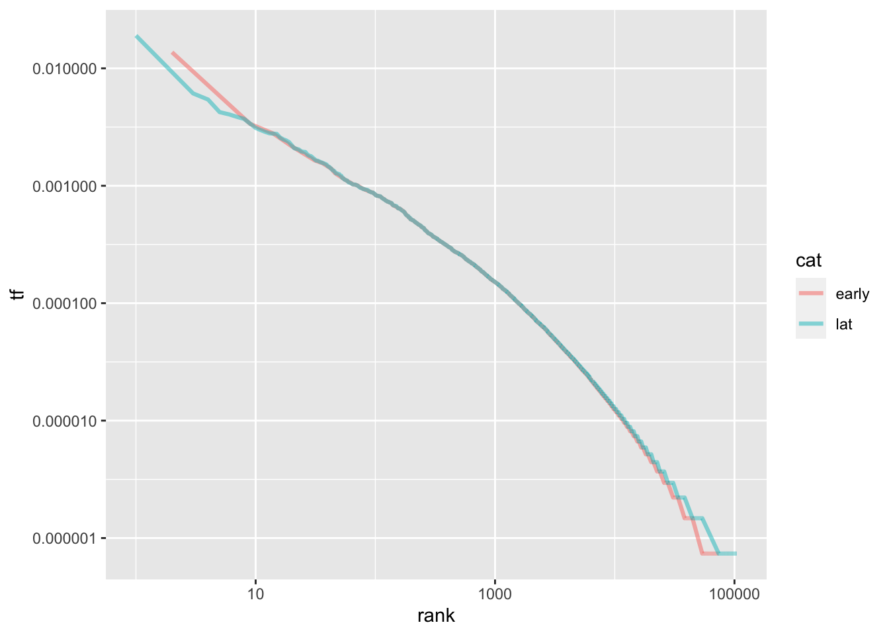
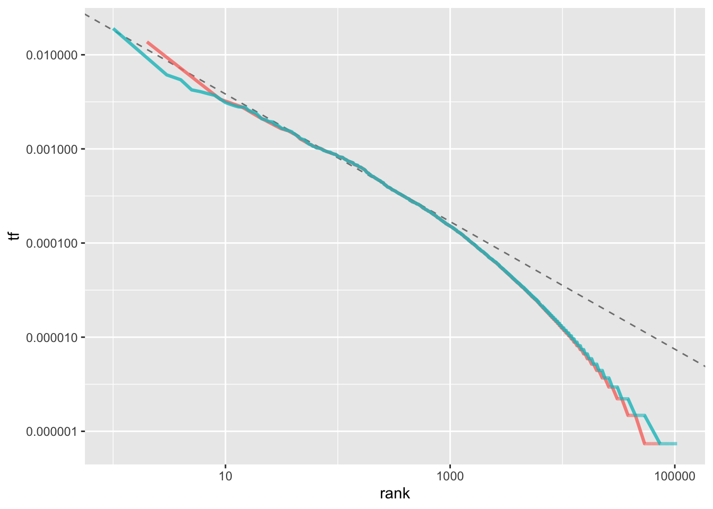
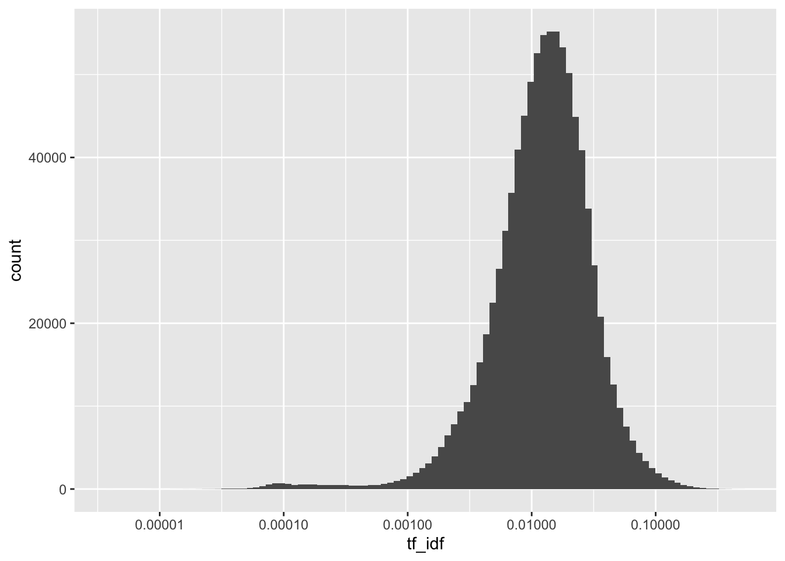
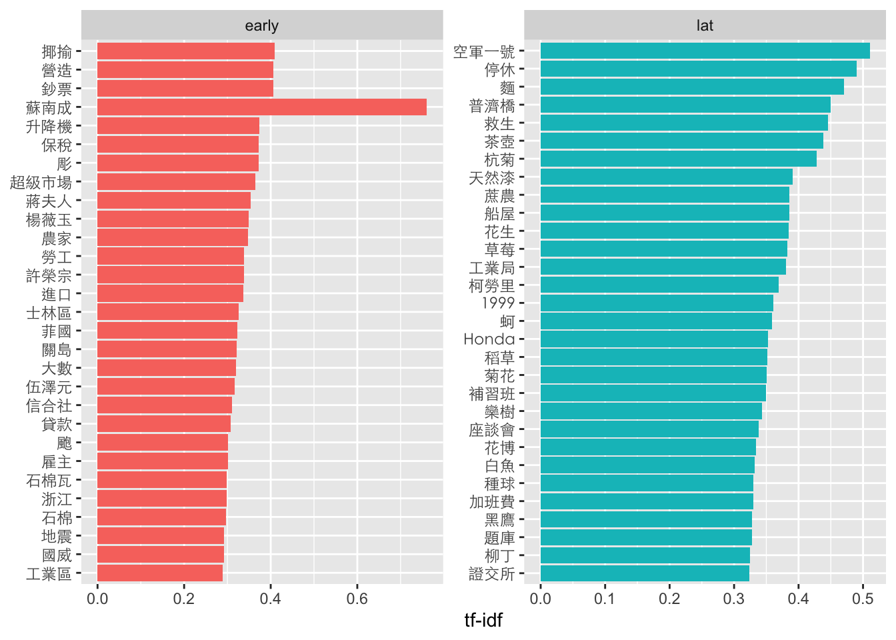

# Text processing in Chinese {#tmchi}

1.  tidyverse內涵繪圖和操作資料所需要的ggplot2和dplyr
2.  stringr雖然隨著tidyverse被安裝了，但不會隨著tidyverse被載入，要另外載入。
3.  在中文斷詞的時候要用到tidytext和jiebaR。
4.  處理時間時要用到lubridate。

## Preprocessing

### Assigning unique id to each doc

-   為了便於後續建立Document-Term-Matrix，這時候若Document自身沒有編號的話，就得把整個Document內容當成該篇文章的id，但也有（極小）可能有兩篇Document內容相同，那就會被視為同一篇文章或發生錯誤。所以必須要編id。
-   `row_number()`產生每列的編號，所以這邊就直接把每列的編號視為每篇文章的id，可以保持該id的唯一性。當你在進行文本探勘或資料分析時，為每篇文章分配一個唯一的ID是非常重要的。唯一的ID確保每篇文章都有獨一無二的標識符號。這對於跟踪和識別特定文章非常重要，特別是當你處理大量的文本資料時。在進行資料合併時，唯一的ID可用於將不同來源的資料準確地匹配和合併在一起。這是非常實用的，尤其當你需要整合來自多個來源的文本資料時，例如合併多個資料集或者在不同時間點上進行的數據採集。


```r
news.df <- readRDS("data/typhoon.rds") %>%
    mutate(doc_id = row_number()) %>%
  drop_na(title)
```

## Tokenization

### Initializer tokenizer

1.  **`cutter <- worker()`**這行程式碼使用**`worker()`**函式來初始化jieba分詞器，將其指派給名為**`cutter`**的變數。jieba是一個常用的中文分詞套件，用於將漢字序列分割成詞彙。初始化分詞器後，可以使用它來對中文文本進行分詞操作。
2.  斷詞的時候不見能把我們要的字詞斷出來，比方說你可能希望台北市不會被斷開，偏偏被斷成台北+市。最簡單的辦法就是把他窮舉舉完。**`new_user_word(cutter, segment_not)`**這行程式碼使用**`new_user_word()`**函式將`segment_not`這個vector中的詞彙加入使用者自定義詞典。這樣做的目的是防止該詞彙被分詞器切分成不同的部分。使用者可以根據需要將自定義詞彙加入詞典，以確保這些詞彙在分詞過程中被正確處理。
3.  載入中文停用詞：**`stopWords <- readRDS("data/stopWords.rds")`** 這行程式碼載入中文停用詞（stop words）的資料，並將其讀取到名為**`stopWords`**的變數中。停用詞是在文本分析中被視為無意義或不重要的詞彙，例如連接詞、介詞、助詞等。載入停用詞列表後，可以在文本處理過程中使用它來過濾掉這些不需要的詞彙，以提高分析的效果。常見的中文停用詞包含
    1.  助詞：的、了、着、地、得、之等。
    2.  連詞：和、與、或、及、還、而等。
    3.  代詞：我、你、他、她、它、們、這、那等。
    4.  冠詞：一、個、些、這、那等。
    5.  介詞：在、從、到、以、為、因、應、對等。
    6.  虛詞：的、地、得、過、過去等。
    7.  數詞：一、二、三、十、百、千、萬等。
    8.  副詞：很、非常、太、真、已經、還、就等。
    9.  連接詞：而、並、所以、因此、然而、只是等。
    10. 感嘆詞：嗯、哦、啊、呀、吧、喔等。


```r
# segment_not to avoid to be segmented by jeiba cutter
segment_not <- c("第卅六條", "第卅八條", "蘇南成", "災前", "災後", "莫拉克", "颱風", "應變中心", "停班停課", "停課", "停班", "停駛", "路樹", "里長", "賀伯", "採收", "菜價", "蘇迪", "受災戶", "颱風警報", "韋恩", "台東縣", "馬總統", "豪大雨", "梅姬", "台東", "台北市政府", "工務段", "漂流木", "陳菊", "台南縣", "卡玫基", "魚塭", "救助金", "陳情", "全省", "強颱", "中颱", "輕颱", "小林村", "野溪", "蚵民", "農委會", "來襲", "中油公司", "蔣總統經國", "颱風天", "土石流", "蘇迪勒", "水利署", "陳說", "颱風假", "颱風地區", "台灣", "臺灣", "柯羅莎", "八八風災", "紓困","傅崑萁", "傅崐萁","台中", "文旦柚", "鄉鎮市公所", "鄉鎮市", "房屋稅", "高雄", "未達", "台灣省", "台北市")

# Initialize jieba cutter
cutter <- worker()

# Add segment_not into user defined dictionary to avoid being cutted
new_user_word(cutter, segment_not)
```

```{.output}
## [1] TRUE
```

```r
# loading Chinese stop words
stopWords <- readRDS("data/stopWords.rds")

# load("../segment_not.R")
```

### Tokenization

Tokenization（分詞）在文本探勘的過程中是將文本轉換為更小單位的步驟。它將連續的文本序列（例如句子或段落）分割成一系列被稱為「詞彙」或「tokens」的個別單位。在文本探勘中，進行分詞的目的是將文本轉換為可以進一步處理和分析的基本單位。每個詞彙代表著文本中的一個有意義的單詞、詞組或符號，例如一個英文單詞、一個漢字、一個數字等等。這些詞彙可以作為後續分析的基礎，用於進行文本處理、特徵提取、語義分析、情感分析等各種任務。

分詞的過程可以包括以下步驟：

1.  斷句：如果文本是一個段落或一個文檔，首先需要將其分成句子。這可以使用標點符號（如句號、問號、驚嘆號等）作為分隔符號來實現。

2.  分詞：將每個句子進一步分成詞彙或tokens。具體的分詞方法取決於文本的語言和特定的工具或套件。對於中文，常用的分詞工具包括jieba、SnowNLP等；而對於英文，常用的分詞方法是基於空格或標點符號進行切分。

3.  去除停用詞：在分詞過程中，通常會過濾掉停用詞，這些詞彙被認為對文本分析沒有太大的意義。停用詞可以是常用的連接詞、介詞、助詞、冠詞等。

4.  正規化：進行詞彙的正規化，例如將詞彙轉換成小寫，移除標點符號，處理詞彙的變體形式（如單數、複數、時態等）。

5.  建立詞彙表：將所有詞彙收集到一個詞彙表或詞彙索引中，該詞彙表可以用於後續的文本處理和分析。

例如一個句子「`今天天氣真好，我打算去公園散步。`」可以被斷成「`今天 天氣 真好 ， 我 打算 去 公園 散步 。`」

實際上中文斷詞相當不容易，常見的問題包括：

1.  歧義詞彙：中文中存在許多具有歧義性的詞彙，例如「打開」可以是「開啟」的意思，也可以是「打碎」的意思。在分詞時，選擇正確的分詞方式對於確定詞彙的真正含義非常重要。

2.  新詞辨識：中文是一個活躍的語言，新詞彙的產生非常頻繁。在分詞過程中，如果遇到未在詞典中出現的新詞彙，可能會無法正確切分，導致語義的失真或信息的丟失。

3.  縮略詞和缺詞：中文中常使用縮略詞，例如「國際象棋」可以縮寫為「國象」。在分詞時，需要考慮這些縮略詞的存在，並確保正確切分。另外，有些中文詞彙存在缺詞現象，例如「下雨了」可以簡化為「下雨」，需要根據上下文來識別和處理這些情況。

4.  斷詞歧異：「台北市／長」或「台北／市長」

5.  外文詞彙和混合語言：中文文本中常包含外文詞彙或混合語言的情況。在分詞時，需要考慮如何處理這些詞彙，例如是否將其當作一個整體進行切分，或者保留其原有的形式。

6.  未知詞彙和低頻詞彙：分詞工具常基於詞典來進行切分，因此對於一些罕見或專有名詞、專術詞彙可能無法進行正確的切分。這些未知詞彙和低頻詞彙的處理需要特殊的處理策略，例如使用統計方法或自定義詞彙表。

在`segment(x, cutter)`後會產生一個多詞的向量。亦即每一格就是一個向量，你可以把它印出來看看。可以用`unnest()`將**`word`**列中的字詞向量展開，使每個單詞成為一列。這樣可以將每個單詞視為一個觀察值，方便後續的處理。


```r
# news.df$time %>% summary

tokenized.df <- news.df %>% 
  slice(-3069) %>%
  mutate(timestamp=ymd(time)) %>% 
    # filter(timestamp > as.Date("2009-01-01")) %>%
  select(-time) %>%
  select(title, text, cat, timestamp, everything()) %>%
  mutate(word = purrr::map(text, function(x)segment(x, cutter)))

tokenized.df %>% select(title, word) %>% head()
```

```{.output}
## # A tibble: 6 × 2
##   title                                                                   word  
##   <chr>                                                                   <list>
## 1 "昨天上班的人沒加班費也不補假\n依法 員工無權利要求•體恤 雇主可酌情嘉惠" <chr> 
## 2 "走過桑梓千田\n東台水保之旅"                                            <chr> 
## 3 "走過桑梓千田\n東台水保之旅"                                            <chr> 
## 4 "總統祝福大家新春如意\n期勉迎接挑戰贏得勝利"                            <chr> 
## 5 "總統至為關切颱風災害\n電囑儘速展開救災重建"                            <chr> 
## 6 "總統關懷澎湖災情 俞揆冒雨巡視災區\n指示搶修道路•優先供應水電 復建資金… <chr>
```

```r
# unnest() to spread character into a new word variable
# filter out stop words
# filter out alphabetical and numeric characters

unnested.df <- tokenized.df %>%
    select(doc_id, text, word) %>%
    unnest(word) %>%
    filter(!(word %in% stopWords$word)) %>%
    filter(!str_detect(word, "[a-zA-Z0-9]+"))

unnested.df %>% head
```

```{.output}
## # A tibble: 6 × 3
##   doc_id text                                                              word 
##    <int> <chr>                                                             <chr>
## 1      1 昨天颱風天，北部各地區機關、學校經主管機關宣佈放假一天。民營事業… 昨天 
## 2      1 昨天颱風天，北部各地區機關、學校經主管機關宣佈放假一天。民營事業… 颱風…
## 3      1 昨天颱風天，北部各地區機關、學校經主管機關宣佈放假一天。民營事業… 北部 
## 4      1 昨天颱風天，北部各地區機關、學校經主管機關宣佈放假一天。民營事業… 地區 
## 5      1 昨天颱風天，北部各地區機關、學校經主管機關宣佈放假一天。民營事業… 機關 
## 6      1 昨天颱風天，北部各地區機關、學校經主管機關宣佈放假一天。民營事業… 學校
```

## Exploring wording features

### Word frequency distribution

這兩個函式是用於對X軸和Y軸進行對數轉換。對數轉換可以將原始數據的數值範圍較大的部分進行壓縮，使其在視覺化時更易於比較和理解。對數尺度的使用有助於呈現數據的相對變化和細節，尤其是當數據範圍跨度較大時。

對X軸和Y軸進行對數轉換的目的是為了更好地觀察數據的分佈特徵，尤其是在存在長尾分佈（power-law distribution）或Zipf's law的情況下。

1.  長尾分佈（Power-law distribution）： 在長尾分佈中，少數的頻繁發生事件和大量的不太頻繁發生事件形成了一個長尾（即數量較小但頻率較高的事件非常稀有）。對於長尾分佈的數據，採取對數轉換可以將較大的數值範圍縮小，使得長尾部分的細節更容易被觀察和比較。這樣做可以更好地呈現數據的細微變化和分佈的特性。

2.  Zipf's law： Zipf's law是一種描述詞彙頻率與詞彙排名之間關係的統計定律。根據Zipf's law，詞彙的頻率與其在排序中的排名成反比。當觀察和分析詞彙頻率時，對X軸和Y軸進行對數轉換有助於更好地呈現Zipf's law的特性。對數尺度轉換使我們能夠更清楚地觀察到詞彙頻率的排名和分佈情況。

在power-law distribution的情況下，如果對X軸和Y軸進行對數轉換，我們通常會看到以下情形：

1.  直線關係：在對數尺度下，如果數據符合power-law distribution，我們會看到一條近似線性的直線關係。這表示在對數尺度下，數據點的分佈大致呈現線性趨勢，表示一種指數衰減或增長的規律。

2.  長尾尾部：power-law distribution的特點是長尾尾部的存在，即少數極端值或稀有事件的出現頻率相對較高。在對數尺度下，我們能夠更清楚地看到這些極端值或稀有事件在數據分佈中的位置，因為它們在對數尺度下會呈現較為明顯的特徵。

3.  分佈斜率：對數尺度下的power-law distribution，通常可以通過斜率來描述分佈的特性。斜率表示每個X單位變化對應的Y單位變化，或者說在對數尺度下，表示對數Y值相對於對數X值的變化率。如果數據點遵循power-law distribution，斜率會呈現相對恆定的特性。


```r
word.count <- tokenized.df %>%
    unnest(word) %>%
    count(word, sort=T) %>%
    filter(!(word %in% stopWords$word)) %>%
    filter(nchar(word) > 1) %>%
    filter(!str_detect(word, "[a-zA-Z0-9]+")) %>%
    filter(n > 3)


word.count %>%
    count(n, sort=T) %>%
    ggplot(aes(n, nn)) + 
    geom_point(alpha=0.5, size = 1, color="#333333")
```



```r
word.count %>%
    count(n, sort=T) %>%
    ggplot(aes(n, nn)) + 
    geom_point(alpha=0.5, size = 1, color="#333333")  + 
    scale_x_log10() + 
    scale_y_log10()
```



### Keyness by logratio

早、近期用字差異


```r
cat_word.tf <- tokenized.df %>%
  unnest(word) %>%
  count(cat, word) %>%
  ungroup() %>%
  filter(!str_detect(word, "[a-zA-Z0-9]+")) %>%
	filter(!(word %in% stopWords$word)) %>%
  filter(nchar(word)>1)
```


```r
early_lat_ratio <- cat_word.tf %>%
	filter(n>1) %>%
  pivot_wider(names_from = cat, values_from = n, values_fill = 0) %>%
	# spread(cat, n, fill = 0) %>%
	ungroup() %>%
  mutate_if(is.numeric, funs((. + 1) / sum(. + 1))) %>%
	mutate(logratio = log2(early / lat)) %>%
	arrange(desc(logratio))
```


```r
early_lat_ratio %>%
	group_by(logratio > 0) %>%
	top_n(20, abs(logratio)) %>%
	ungroup() %>%
	mutate(word = reorder(word, logratio)) %>%
	ggplot(aes(word, logratio, fill = logratio < 0)) +
	geom_bar(stat = "identity") +
	coord_flip() +
	ylab("early / recent log ratio") +
	scale_fill_manual(name = "", labels = c("early", "recent"),
		values = c("tomato", "lightblue")) +
	theme(axis.text.y=element_text(colour="black", family="Heiti TC Light"))
```



### Keyness by scatter


```r
frequency <- cat_word.tf %>%
    filter(n>3) %>%
    group_by(cat) %>%
    mutate(proportion = n/sum(n)) %>%
    select(-n) %>%
    spread(cat, proportion) %>%
    na.omit()

# datatable(frequency)
```


```r
library(scales)
frequency %>%
ggplot(aes(x = early, y = lat, color = abs(early - lat))) + 
    geom_abline(color = "gray40", lty = 2) + 
    geom_point(alpha = 0.1, size = 2.5, width = 0.3, height = 0.3) + 
    geom_text(aes(label = word), check_overlap = TRUE, vjust = 1.5, family="Heiti TC Light", size = 3) +
    scale_x_log10(labels = percent_format()) +
    scale_y_log10(labels = percent_format()) +
    theme(legend.position="none") + 
    coord_fixed(1)
```



## TF-IDF

TF-IDF (Term Frequency-Inverse Document Frequency) 是一種用於衡量一個詞彙在文本集合中重要性的統計方法。它結合了詞頻 (Term Frequency, TF) 和逆文檔頻率 (Inverse Document Frequency, IDF) 兩個指標。

-   詞頻 (Term Frequency, TF)：衡量一個詞彙在單篇文檔中出現的頻率。詞頻可以通過計算詞彙在文檔中出現的次數，或者使用歸一化的詞頻計算公式來得到。

-   逆文檔頻率 (Inverse Document Frequency, IDF)：衡量一個詞彙在整個文本集合中的普遍重要性。逆文檔頻率通過計算詞彙在文本集合中出現的文檔數量的倒數，並取對數來得到。這樣做的目的是對常見詞彙的重要性進行降低，並提高罕見詞彙的重要性。

TF-IDF 的計算公式如下：TF-IDF = TF \* IDF

其中，TF表示詞頻，IDF表示逆文檔頻率。

TF-IDF 的應用主要有兩個方面：

1.  文本檢索 (Information Retrieval)：在文本檢索中，使用TF-IDF來計算詞彙對於給定查詢的相關性。詞彙的TF-IDF值越高，表示該詞彙在文檔中的重要性越高，並且與查詢的相關性越大。

2.  文本特徵表示 (Text Feature Representation)：在文本分析和機器學習中，使用TF-IDF來表示文本的特徵向量。將文本轉換為TF-IDF向量表示可以捕捉詞彙在文本中的重要性，並且有助於機器學習模型更好地理解和區分不同的文本。

### Term-frequency


```r
word.tf <- tokenized.df %>%
    unnest(word) %>%
    count(cat, word, sort=T) %>%
    # mutate(total_words=sum(n)) %>%
    mutate(rank=row_number(), tf= n/sum(n))
```

-   如果是跑histrogram因為不是常態分佈而是power-law分佈，通常會看不出什麼來


```r
ggplot(word.tf, aes(tf, fill=cat)) + 
    geom_histogram(show.legend = F) + 
    xlim(NA, 0.0009) + 
    scale_x_log10() +
    scale_y_log10() +
    facet_wrap(~cat, ncol=2, scales="free_y")
```



-   加上rank後可以看出最高rank到最後的差異，中段差不多，但是，相較於晚近的文章，早期文章用過很少次的字比較多，但用過很多次的字比較少。（是否可推論用字越來越貧乏？）


```r
word.tf %>%
    ggplot(aes(rank, tf, color=cat)) + 
    geom_line(size=1.1, alpha=0.5) + 
    scale_x_log10() + 
    scale_y_log10()
```




```r
rank_subset <- word.tf %>%
    filter(rank < 500,
           rank > 10)

lm_result <- lm(log10(tf) ~ log10(rank), data = rank_subset)
lm_result$coefficients[[1]]
```

```{.output}
## [1] -1.739581
```


```r
word.tf %>% 
  ggplot(aes(rank, tf, color = cat)) + 
  geom_abline(intercept = lm_result$coefficients[[1]], 
              slope = lm_result$coefficients[[2]], 
              color = "gray50", linetype = 2) +
  geom_line(size = 1.1, alpha = 0.8, show.legend = FALSE) + 
  scale_x_log10() +
  scale_y_log10()
```



### TF-IDF to filter significant words

TF-IDF計算結果可以將原本的詞頻（TF）分布從一個長尾分佈轉變為一個呈現鐘形曲線的分佈。這種轉變使得我們能夠去除尾部，即刪除TF-IDF值很低的詞彙，從而重新優化我們要處理的詞彙集合。這樣的處理方式有兩個主要目的。

首先，透過刪除TF-IDF值很低的詞彙，我們可以去除那些在文本中出現頻率較低且普遍性較高的詞彙，這些詞彙對於區分不同文本的能力相對較低，因此可以忽略不計。

其次，我們可以僅保留大於平均值加上一個或兩個標準差的TF-IDF值較高的詞彙，這些詞彙可以作為有效辨識文章的關鍵字。這是因為這些詞彙在文本中出現的頻率較高，同時其與該文本的關聯性也相對較強。

透過這樣的過濾和選擇，我們可以得到一個更精簡且具有代表性的詞彙集合，這些詞彙能夠更好地描述和區分不同的文章。因此，使用TF-IDF計算結果進行這樣的處理，可以在文本分析和信息檢索等領域中提供更有價值的結果。


```r
news_count <- tokenized.df %>%
    unnest(word) %>%
    count(doc_id, word) %>%
    bind_tf_idf(word, doc_id, n) %>%
    arrange(desc(tf_idf))

news_count %>%
    ggplot(aes(tf_idf)) +
    geom_histogram(bins = 100) + 
    scale_x_log10()
```




```r
news_count %>% 
    left_join(news.df, by="doc_id") %>%
    filter(!(word %in% c("NA"))) %>%
    group_by(cat) %>%
    arrange(desc(tf_idf)) %>%
    top_n(30, tf_idf) %>%
    ungroup() %>%
    mutate(word = reorder(word, tf_idf)) %>%
    ggplot(aes(word, tf_idf, fill = cat)) +
    geom_col(show.legend = FALSE) +
    labs(x = NULL, y = "tf-idf") +
    facet_wrap(~cat, ncol = 2, scales = "free") +
    coord_flip() + 
    theme(axis.text.y=element_text(family="Heiti TC Light"))
```



::: practice
### Practice. Understanding TF-IDF

TF-IDF也並非沒缺點，首先是會受到詞頻影響：TF-IDF主要依賴於詞頻作為計算的一部分，詞頻較高的詞彙往往具有較高的權重。這可能會導致在辨識關鍵字時，偏向於選擇出現頻率高的常見詞彙作為關鍵字，而忽略了一些在文本中出現頻率較低但具有重要性的詞彙。其次是長文本帶來的影響，在長文本中，由於詞彙的多樣性和詞彙數量的增加，TF-IDF計算可能導致高度稀疏的向量表示。這可能導致計算效率降低，並且在後續的處理和分析中增加了計算和存儲的負擔。

請就我們給的上述資料，選幾篇文章來觀察TF-IDF所抽出來的關鍵字，有哪一些真的是關鍵字？有哪一些不是呢？從TF和TF-IDF的數值來看，明明不是關鍵詞，但TF-IDF卻很高的誤判原因為何呢？
:::
