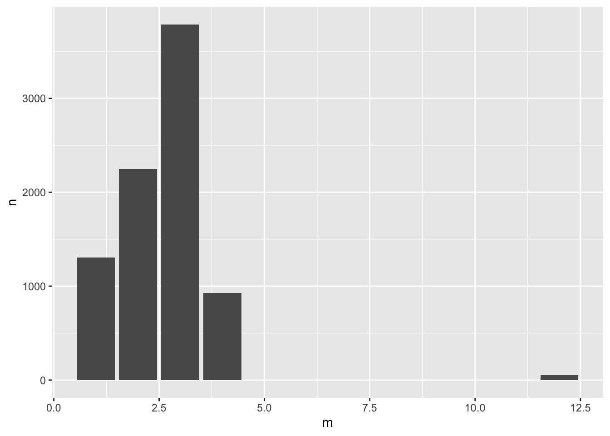

## 時間軸的視覺化


```r
library(tidyverse)
library(lubridate)
# options(stringsAsFactors = F) # default option in R > 4.0
```

### 文字轉時間
- Convert "character time"  to R date.time object (POSIXct)


```r
ptturl <- "https://github.com/P4CSS/R4CSSData/raw/main/ptt_hang_posts.csv"
raw <- read.csv(url(ptturl))
clean <- raw %>%
        mutate(ptime = as.POSIXct(strptime(ptime, "%Y-%m-%dT%H:%M:%SZ", tz = "ASIA/Taipeiw")))

raw <- read_csv(url(ptturl))
?read_csv
```


```r
t <- "2019-04-12T00:48:19Z"
class(t)
```

```{.output}
## [1] "character"
```

```r
?strptime
t1 <- strptime(t, "%Y-%m-%dT%H:%M:%SZ")
raw %>% glimpse()
```

```{.output}
## Rows: 8,317
## Columns: 7
## $ plink    <chr> "https://www.ptt.cc/bbs/HatePolitics/M.1555035677.A.24B.html"…
## $ board    <chr> "HatePolitics", "HatePolitics", "HatePolitics", "HatePolitics…
## $ pcontent <chr> "\n\n韓國瑜赴哈佛大學前受訪表示，就是「keeping practice」，盡…
## $ poster   <chr> "lovebxcx", "ikr3699654", "sunyeah", "rock720429", "btm978952…
## $ ptitle   <chr> "Re: [新聞] 重申反對一國兩制　韓國瑜：看著我靈魂深", "Re: [討…
## $ ptime    <dttm> 2019-04-12 02:21:14, 2019-04-12 02:13:45, 2019-04-12 02:10:1…
## $ ipaddr   <chr> "83.221.204.163", "114.43.176.110", "118.163.130.181", "118.1…
```


### 時間作為機率分佈X軸

```r
raw %>%
    ggplot() + aes(ptime) + 
    geom_density()
```


### 逐月統計資料

```r
?lubridate
raw %>%
    mutate(m = month(ptime)) %>% 
    count(m) %>%
    ggplot() + aes(m, n) + 
    geom_col()
```




### 逐日統計資料（佳）

```r
raw %>%
    filter(ptime >= as_date("2019-03-18") & ptime < as_date("2019-04-01")) %>%
    mutate(m = floor_date(ptime, unit = "day")) %>% 
    count(m) %>%
    ggplot() + aes(m, n) + 
    geom_col()
```


### 每日逐時資料

```r
clean %>%
    filter(ptime >= as_datetime("2019-03-25") & ptime < as_datetime("2019-04-01")) %>%
    mutate(d = floor_date(ptime, unit = "day")) %>%
    mutate(h = hour(ptime)) %>%
    count(d, h) %>%
    mutate(wd = wday(d, label = F, locale = Sys.getlocale("LC_TIME"))) %>%
    mutate(isweekend = ifelse(wd >= 6, "weekend", "weekday")) %>%
    ggplot() + aes(h, n, color = as.character(d)) + 
    geom_line() + 
    facet_wrap(~isweekend)
```


```r
?ifelse
```


