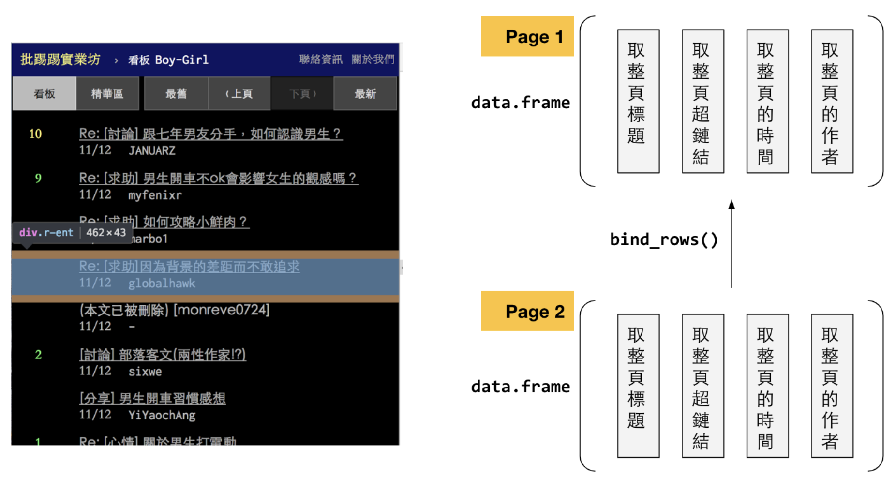
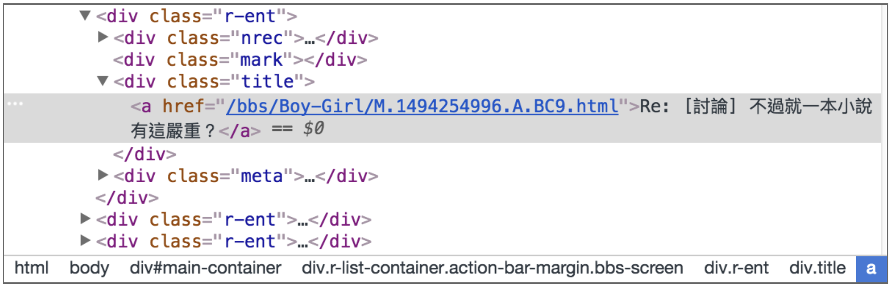
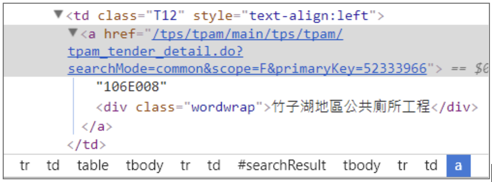
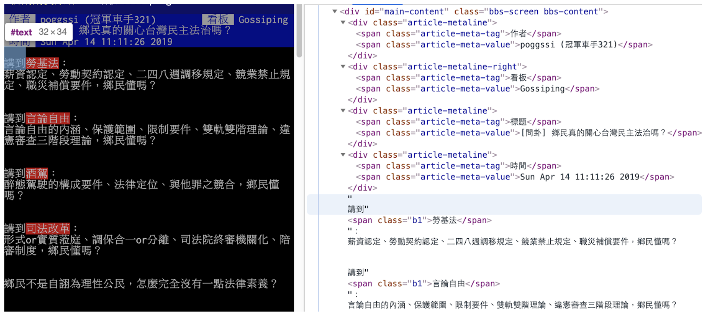
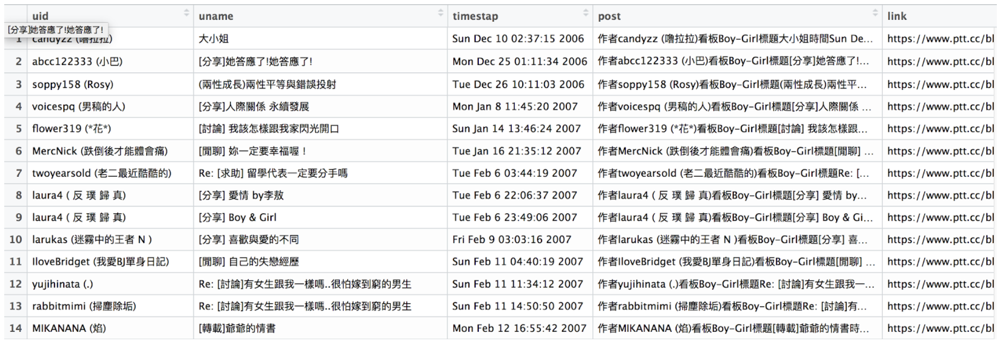

# Scraping PTT {#ptt-scrape}

在爬取HTML之前，你要先知道的是，資料如何被放在巢套元素的HTML檔案中，而Attribute（尤其是`id`和`class`和`<a>`的`href`）又如何提供線索給CSS Selector或XPath來選取我們所要的元素，最後要知道XPath和CSS Selector的用途是用來選取你所需要的HTML中的資料。

以下以ptt boy-girl版為例，展示如何以爬蟲擷取網頁上的資料，並整理成DataFrame。PTT的網頁分為兩種主要類型，

-   其一稱為鏈結頁或索引頁，為文章的超鏈結，例如[https://www.ptt.cc/bbs/Boy-Girl/index.html](https://www.ptt.cc/bbs/Boy-Girl/index.html%EF%BC%89%E3%80%82)。

-   其二為每一篇文章的內容頁[https://www.ptt.cc/bbs/Boy-Girl/M.1523994970.A.71C.html。](https://www.ptt.cc/bbs/Boy-Girl/M.1523994970.A.71C.html。)

對於這種網頁，要設計兩階段的爬蟲，第一階段是把所有所需鏈結撈回來，第二階段是根據撈回來的鏈結去打撈文章，並把裡面的內文整理出來。對於第一階段而言，概念大概如下面的示意圖，其實爬取HTML的概念都差不多是這樣，但以下示意圖說明了用XPath或CSS Selector「分別」選取出整個頁面中的標題、超鏈結、時間、和作者，然後用`data.frame()`組合成一個`DataFrame`；Page 2也如此炮製，然後把Page 2的`DataFrame`用`bind_rows()`附加在Page 1的`DataFrame`後面。



## Step 1. 載入所需套件 {#ptt_load_pkgs}

在這個例子中，不僅要用`httr`來取得網頁頁面，還要用`rvest`套件（其實是呼叫`xml2`）來剖析網頁。網頁內容並不像json一樣可以直接轉為`DataFrame`或`list`。網頁內容可以是資料、視覺化元素、也可以是架構元素，相對於json而言複雜也冗贅許多。因此需要一個套件能夠剖析HTML標籤例如`xml2`，而`rvest`內則應用了`xml2`套件的內容來剖析網頁，另外，我會用`bind_rows()`將過程中所抓取的資料進行合併。


```r
library(tidyverse)
library(rvest)
library(httr)
```

## Step 2. 取回並剖析HTML檔案 {#ptt_parsehtml}

在從HTML檔案中打撈出我們所要的資料有三個重要的`rvest`函式（步驟），分別為：

1.  **`read_html()`**依照網址將網頁取回並轉為xml_document。

2.  **`html_nodes()`** 用CSS Selector或XPath選擇所需的資料節點，另外html_node()是只取滿足條件的第一個節點。

3.  **`html_text()`**或html_attr()或html_table()、html_tags()取出所要抓的節點的目標資料，可能是一個表格、一個標籤內容、或者是一個屬性值。

### **Step 2-1. `read_html()` 將網頁取回並轉為xml_document** {#ptt_read_html}

-   `read_html()`內部包含了`GET()`與`content()`等的實作，其主要的功能是將取回來的回應（response）轉為`xml_document`。若以`class(doc)`觀察其型態，會是`xml_document xml_node`。

-   使用`browseURL(url)`可以用瀏覽器打開該網址並瀏覽。


```r
url <- "https://www.ptt.cc/bbs/Boy-Girl/index.html"
doc   <- read_html(url)
class(doc)
## [1] "xml_document" "xml_node"   
browseURL(url)
```

### **Step 2-2 以`html_nodes()` 以選擇所需的資料節點** {#ptt_html_nodes}

html的檔案還包含了相當多其他視覺、互動、排版的標籤，因此通常只有少部分是資料，且存在層層的html元素中。因此，獲取到該網頁並轉為xml_document後，便要用`html_nodes()`或`html_node()`根據所給的CSS Selector或XPath來選擇所要取出的節點中的資料。要獲取該元素的CSS Selector可以利用Chrome DevTool或者是Firefox。用法是對著該網頁空白處按右鍵選擇檢查（insepect）。

以下用CSS Selector抽取：

-   `#`指的是`id`、.指的是`class`。

-   `#main-container`意思是，某個`id`為`main-container`的元素。

-   `.title`指的是某個`class`為`title`的元素。

-   `div.title`指的是`class`為`title`的`div`（排版元素）。

-   `Div.r-list-container.action-bar-margin.bbs-screen`指的是同時具有`r-list-container`、`action-bar-margin`、`bbs-scree`三個`class`的`div`元素。


```r
css <- "#main-container > div.r-list-container.action-bar-margin.bbs-screen > div > div.title > a"

node.a <- html_nodes(doc, css)
class(node.a) # "xml_nodeset"
length(node.a)
```

用XPath抽取：


```r
path <- '//*[@id="main-container"]/div[2]//div/div[3]/a'
node.a <- html_nodes(doc, xpath = path)
links <- html_attr(node.a, "href")
```

### **Step 2-2 補充說明與XPath、CSS Selector的最佳化** {#ptt_xpath_css}

用CSS Selector和XPath抽取有一些經驗法則，以PTT為案例來說的話，原本複製得來的CSS Selector和XPath分別為

-   CSS Selector：`#main-container > div.r-list-container.action-bar-margin.bbs-screen > div:nth-child(3) > div.title > a`

-   XPath：`//*[@id="main-container"]/div[2]/div[3]/div[2]/a`



到html之間，有一個`id`為`#main-container`的`div`。所以從`div#main-container`開始取即可。通常確定有`id`後，我就會開始找重複項，這邊的重複項是class為r-ent的div，找到重複項後，我就會去找重複項後面到我要的資料的路徑，而我們要的`<a>`就在`class`為`title`的`div`中。所以一個簡化的路徑是`div#main-container div.r-ent div.title a`。

但在這邊，既然有`id`，就不在乎是什麼元素會有`id`，所以可以只寫`#main-container`，而也只有資料在的`div`才有`.r-ent`的`class`，所以也不用強調前面的`div`，至於`.title`前面一定是搭`div`的`元素`，所以我可以簡化到寫為`#main-container .r-ent .title a`。甚至，由於`.r-ent`一定在`#main-container`裡面，所以連前面的`id`我都可以省略掉。

如果用XPath來寫的話，照上面的邏輯應該要寫成`//*[@id="main-container"]//div[@class="r-ent"]/div[@class="title"]/a`。注意到第二個div前有兩個斜線`//`，原因是`#main-container`和`.r-ent`之間還有一層`div`，兩個斜線代表前後兩者間還有其他層，如果沒有兩個斜線而只有一個斜線的話，那就是代表`#main-container`下面一層馬上就要是`.r-ent`，若你把它改成單斜線的話，就會發現取不到資料。

以政府招標為範例來解釋

1.  最終要抓的資料節點為何？主要為`<a href="...">`的`href`屬性值和`<a>`底下`<div>`中的內容。

2.  觀察資料在哪個節點「逐筆」出現?這邊是`<tr>`（table row），`<td>`則是資料欄位

3.  利用`id`和`class`來辨識：遇到有id就從id開始取就好，例如`#searchResult`。

4.  中間的節點多可以忽略：例如這個CSS selector可省略寫為`#searchResult tr a`

{width="549"}

### **Step 2-3 `html_text()`或`html_attr()`轉出所要的資料** {#ptt_html_text}

我們所要的資料為`<a href="/bbs/Boy-Girl/M.1523983903.A.71E.html">[心情] 看到自己喜歡女生跟別的男生走很近好難過</a>`中的超鏈結和標題文字。

-   `html_text()`: 在`<a>`與`</a>`之間的[心情] 看到自己喜歡女生跟別的男生走很近好難過稱為`<a>`的元素內容，要用`html_text(node.a)`來抽取。

-   `html_attr()`: 在`<a>`內的`href="/bbs/Boy-Girl/M.1523983903.A.71E.html"`稱為`<a>`的屬性，該屬性名稱為`href`(Hyper Reference的意思)，屬性值為`/bbs/Boy-Girl/M.1523983903.A.71E.html`。要用`html_attr(node.a, "href")`來抽取（相當於指定某個元素的`href`屬性的內容）。

-   取出元素節點的內容，相當於取出`<a></a>`間所夾的內容。


```r
texts <- html_text(node.a)
length(texts)
```

取出元素節點某個屬性的值，這邊是取出`href`這個屬性的值，也就是超鏈結。


```r
links <- html_attr(node.a, "href")
class(links) 
# character
links[1]
# "/bbs/Boy-Girl/M.1555188846.A.D5F.html"
```

但這些超鏈結只有後半段，點開一篇文章觀察其網址，發現我們所抓到的網址少了前面那一段，因此用`paste0()`黏上前綴的網址前段，便可得到完整網址，可用`browseURL(links[1])`觀察。


```r
pre <- "https://www.ptt.cc"
links <- paste0(pre, links)
links[1]
# [1] "https://www.ptt.cc/bbs/Boy-Girl/M.1555188846.A.D5F.html"
```

重組上列程式碼如下：


```r
pre <- "https://www.ptt.cc"
url <- "https://www.ptt.cc/bbs/Boy-Girl/index.html"
doc   <- read_html(url)
css <- "#main-container div.r-ent div.title a"
node.a <- html_nodes(doc, css)
```

題外話，因為`rvest`與`httr`均支援tidyverse的程式寫作，因此可改為以下pipeline的形式。但我不見得會這麼寫，比如說`<a>`這個元素我可能不僅會取出其超鏈結，還打算取出標題文字，為了避免重複操作，我不見得會用tidyverse來寫。


```r
pre <- "https://www.ptt.cc"
url <- "https://www.ptt.cc/bbs/Boy-Girl/index.html"
links <- url %>% read_html %>% 
    html_nodes("#main-container div.r-ent div.title a") %>%
    html_attr("href") %>%
    paste0(pre, .)
```

## Step 3. 用for迴圈打撈多頁的連結 {#ptt_for}

我們可以觀察到PTT該版的鏈結頁的網址規則如下

-   最新頁：<https://www.ptt.cc/bbs/Boy-Girl/index.html>

-   倒數第二頁：<https://www.ptt.cc/bbs/Boy-Girl/index3902.html>

-   倒數第三頁：<https://www.ptt.cc/bbs/Boy-Girl/index3901.html>

-   倒數第四頁：<https://www.ptt.cc/bbs/Boy-Girl/index3900.html>

-   最新一頁因此可類推出為<https://www.ptt.cc/bbs/Boy-Girl/index3903.html>

因此，我打算寫一個for迴圈，讓他幫我（先）抓最後10頁，那就是3894到3903頁。並且，把頁數當成網址的參數，用`sprintf()`或`paste0()`組合出網址，以下分別提供兩種版本。你可以把它印出來且點選看看是否是你所要的網頁。


```r
for(p in 3894:3903){
    url <- sprintf("https://www.ptt.cc/bbs/Boy-Girl/index%s.html", p)
    # url <- paste0("https://www.ptt.cc/bbs/Boy-Girl/index", p, ".html")
}
```

接下來，我要用一個`all_links`變數來存放所有的網址，並且把每一個頁面抓到的網址們都用`vector`的`concatenation`，也就是`c()`黏在一起 `all_links <- c(all_links, links)`。


```r
all_links <- c()
for(p in 3894:3903){
    url <- sprintf("https://www.ptt.cc/bbs/Boy-Girl/index%s.html", p)
    all_links <- c(all_links, links)
}
```

最後，我就將上述抓到網址的方法填入這個for迴圈中，並把抓到的網址存為links，就會隨著每回合的for迴圈逐漸把抓到的網址整理在一起。


```r
pre <- "https://www.ptt.cc"
all_links <- c()
for(p in 3894:3903){
	url <- sprintf("https://www.ptt.cc/bbs/Boy-Girl/index%s.html", p)
	print(url)
	doc   <- read_html(url) # Get and parse the url
	css <- "#main-container div.r-ent div.title a"
	node.a <- html_nodes(doc, css)
	links <- html_attr(node.a, "href")
	links <- paste0(pre, links) # Recover links
	all_links <- c(all_links, links)
}
length(all_links)
```

## Step 4. 根據連結取回所有貼文 {#ptt_scrape_post}

前面是針對每一個頁面的網址取回該頁面中所有的貼文鏈結，所以我現在all_links中是所有的貼文鏈結。我可以仿照前面的做法，就每一個貼文鏈結，取回貼文內容，貼文內容可能包含作者、時間、標題、版別、內文等資料欄位

不失一般性地，用第一篇貼文的鏈結來做資料抓取實驗，之後再抓第二篇、第三篇即可。

首先，對於這每篇文章，我要爬取作者（author）、標題（title）、時間（time）、看板（board）和內容（content）五個欄位，包含原本文章的連結url一共六個欄位。

從以下的圖發現，每篇文章的內容放置在div#main-content中，之後一連跟著四個div.article-metaline，裡面分別有作者、看板、標題與時間，但從class名稱看不出來哪個，但我們要的值會是在span.article-meta-value中。所以我的規劃是，一次把所有的.article-meta-value給抓回來，然後再去分別指定哪個是作者、看板、標題或時間。所以我用


```r
link <- all_links[1]
doc <- read_html(link)
meta.css <- "#main-content div.article-metaline  span.article-meta-value"
metadata <- html_text(html_nodes(doc, meta.css))
```



另外，從上面的文字中可發現，主文的部分被包含在div#main-content中，但在上述的作者、標題等後面，若這時候我們用CSS Selector搭配html_node()和html_text()把div#main-content的內容都給取出來，會連上述的作者、標題等都一起取出來。最好的方法是用XPath的text()來只取出文字的部分，而不取出有tag的部分。

而且這樣取出來會是每個paragraph都是一個character vector中的值，所以要把他們合併成一篇文章，此時要用paste()指令，paste()指令可以指定把一個character vector給串接成一個string，輸入的變數是一個character vector，然後設定參數collapse = ""，代表串接起這些character時中間不要有空白。


```r
post.xpath <- '//*[@id="main-content"]/text()'
post.paragraph <- html_text(html_nodes(doc, xpath = post.xpath))
post <- paste(post.paragraph, collapse = "")
```

最後，我們知道metadata變數的第一個是作者、第二個是標題、第三個是時間、便依序指派給個別的變數後，組成DataFrame如下，這樣所組成的DataFrame是為只有一筆資料的DataFrame，但有五個變項。


```r
link <- all_links[1]
doc <- read_html(link)
meta.css <- "#main-content div.article-metaline  span.article-meta-value"
metadata <- html_text(html_nodes(doc, meta.css))
post.xpath <- '//*[@id="main-content"]/text()'
post.paragraph <- html_text(html_nodes(doc, xpath = post.xpath))
post <- paste(post.paragraph, collapse = "")
post.df <- data.frame(post, 
                      uid = metadata[1],
                      title = metadata[2],
                      timestamp = metadata[3],
                      url = link
                     )
```

這樣我們取得的第一篇文章存放在post.df中，之後，我稍微修改一下上述的程式，就可以用for迴圈抓取第2至n篇文章，每一篇都存在名為temp.df的DataFrame中，然後用`bind_rows()`依序和`post.df`銜接在一起，除了黃色的部分是新增的之外，都跟前面的程式幾乎一模一樣。


```r
for(link in all_links[2:10]){
    doc <- read_html(link)
    meta.css <- "#main-content .article-metaline .article-meta-value"
    metadata <- html_text(html_nodes(doc, meta.css))
    post.xpath <- '//*[@id="main-content"]/text()'
    post.paragraph <- html_text(html_nodes(doc, xpath = post.xpath))
    post <- paste(post.paragraph, collapse = "")
    
    temp.df <- data.frame(post, 
                          uid = metadata[1],
                          title = metadata[2],
                          timestamp = metadata[3],
                          url = link
                          )
    post.df <- bind_rows(post.df, temp.df)
}
```



## 補充(1) 較好的寫法 {#ptt_method2}

一個比較好的寫法是，不用先讀第一篇文章，而是用`data.frame()`初始化一個空的DataFrame，之後可以利用`bind_rows()`可自動增添缺少的變數的特性，自然就會補上所需要的變數。因此，只要改寫黃色的部分。

但這樣的寫法仍會有一個缺點，也就是當文章數越來越多時會越跑越慢。原因是，假設現在你已經抓了9999篇文章，你這次的for迴圈要抓第10000篇，然後用`bind_rows()`合併第10000篇，此時，`post.df`已經有9999篇非常肥大，等號右邊的`bind_rows()`跑完後會變成10000篇，此時又要把原本很肥大的post.df覆蓋掉，所以會非常費時。


```r
post.df <- data.frame()
for(link in all_links[1:10]){
    doc <- read_html(link)
    meta.css <- "#main-content .article-metaline .article-meta-value"
    metadata <- html_text(html_nodes(doc, meta.css))
    post.xpath <- '//*[@id="main-content"]/text()'
    post.paragraph <- html_text(html_nodes(doc, xpath = post.xpath))
    post <- paste(post.paragraph, collapse = "")
    
    temp.df <- data.frame(post, 
                          uid = metadata[1],
                          title = metadata[2],
                          timestamp = metadata[3],
                          url = link
                          )
    post.df <- bind_rows(post.df, temp.df)
}
```

## 補充(2) 最佳的寫法 {#ptt_best}

採用`list`先將每一個`DataFrame`存放起來，然後跑完所有的for迴圈後才用`bind_rows()`將所有資料合併為`DataFrame`。此時，`p`指的是第幾個連結，而前例的`link`就相當於下方的`all_link[p]`。


```r
post.list <- list()
for(p in 1:length(all_links)){
    doc <- read_html(all_links[p])
    meta.css <- "#main-content .article-metaline .article-meta-value"
    metadata <- html_text(html_nodes(doc, meta.css))
    post.xpath <- '//*[@id="main-content"]/text()'
    post.paragraph <- html_text(html_nodes(doc, xpath = post.xpath))
    post <- paste(post.paragraph, collapse = "")
    
    post.list[[p]] <- data.frame(post, 
                          uid = metadata[1],
                          title = metadata[2],
                          timestamp = metadata[3],
                          url = all_links[p]
                          )
}
post.df <- bind_rows(post.list)
```
