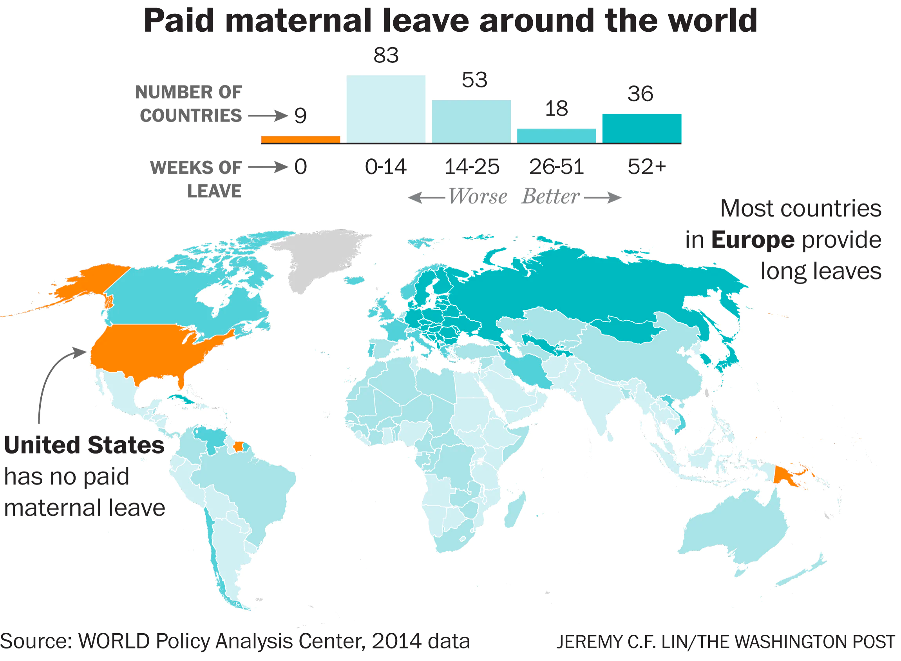
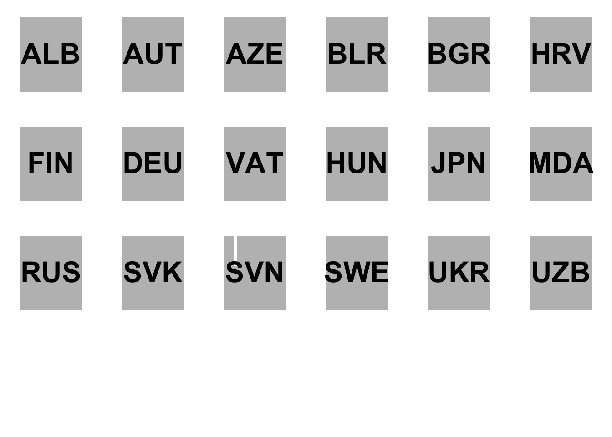
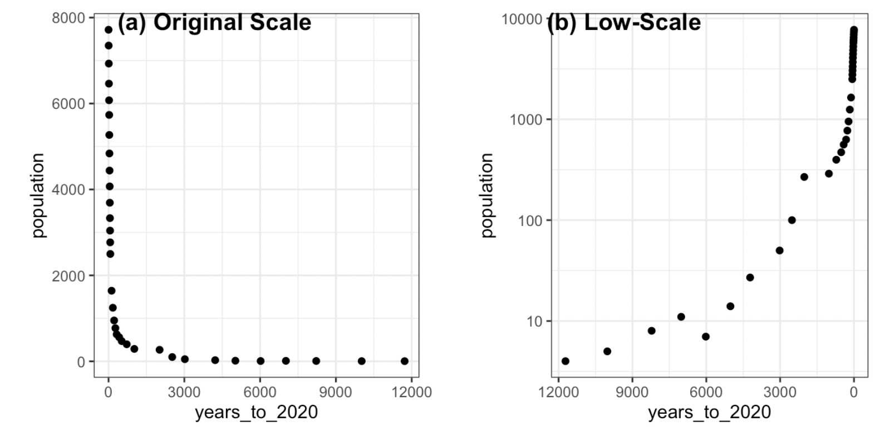
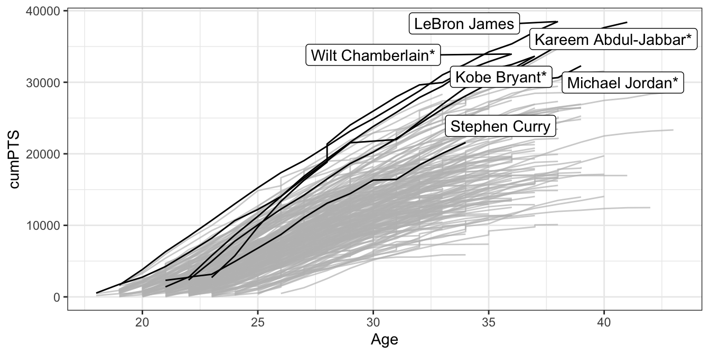
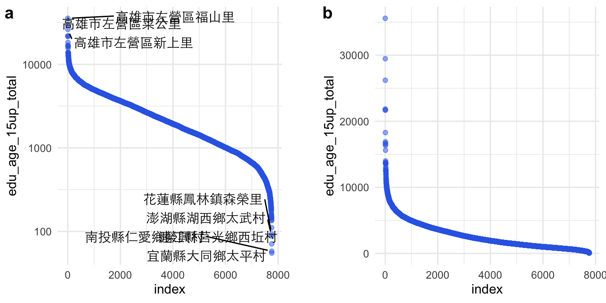
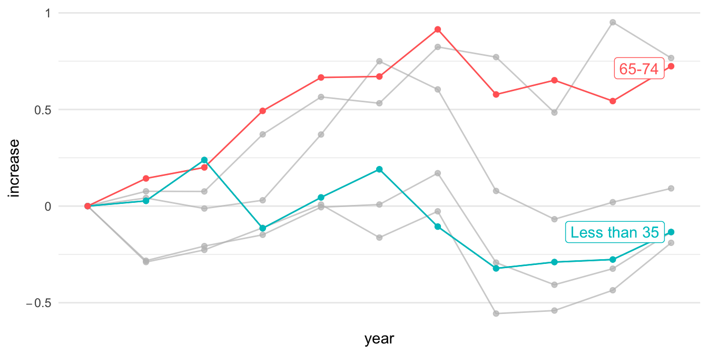
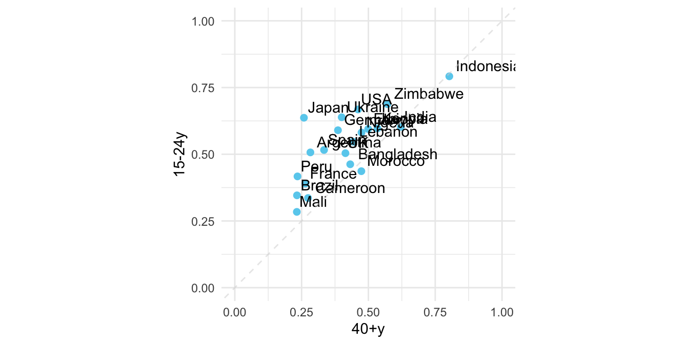
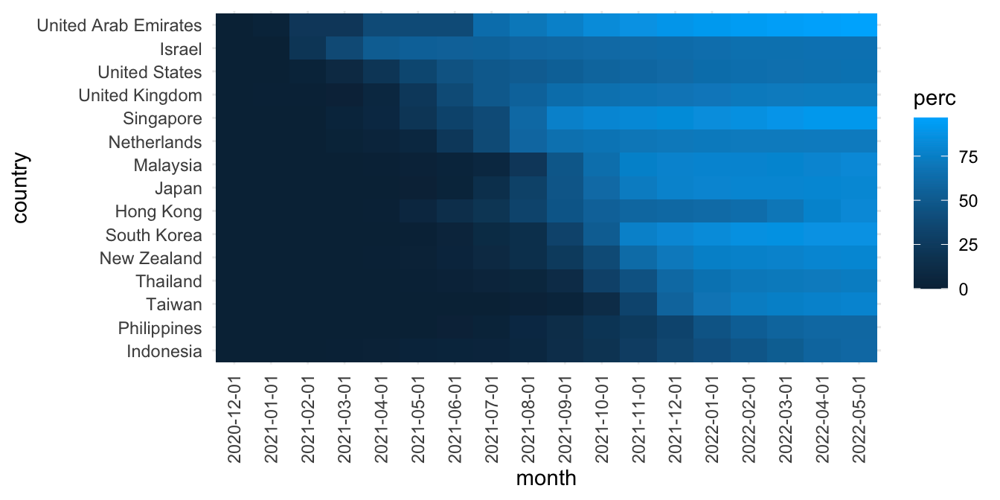
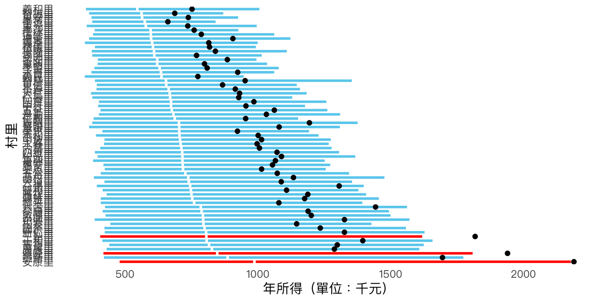
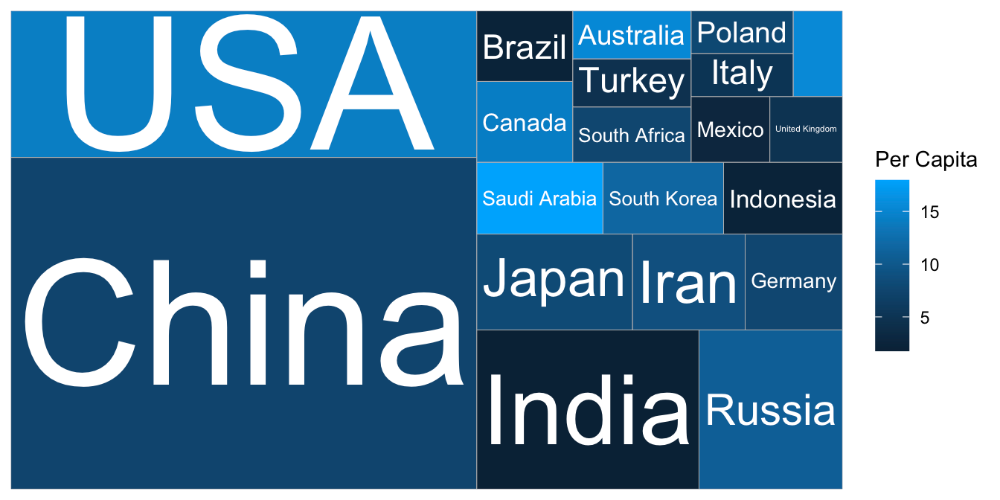

# (PART) VISUALIZATION {.unnumbered}

# Visualization

## ggplot2

ggplot2和Python的matplotlib都是常用的視覺化套件，但在設計上有一些主要的差異。首先，ggplot2是基於grammar of graphics的設計原則，而matplotlib則是基於pyplot-style的設計風格。這意味著ggplot2更加著重於資料和視覺化之間的關係，並且提供了一個統一的語法來描述這些關係，而matplotlib則更加注重對於底層圖形物件的控制。其次，ggplot2支持更多的圖形屬性，例如數值變數、類別變數、時間序列等等，並且可以輕鬆地進行層疊圖、面積圖等高級視覺化技巧，而matplotlib則需要手動設置較多的屬性來達到類似的效果。此外，ggplot2在設計上更加注重美學和可讀性，因此預設的圖形風格更加美觀且易於閱讀，而matplotlib的預設風格則比較簡單，需要進行額外的設置才能達到類似的效果。

## VIS packages

除了ggplot2本身之外，尚有相當多基於ggplot或tidyverse風格的視覺化套件，如：

1.  ggraph：ggraph是一個基於ggplot2的視覺化套件，專門用於網絡和關係圖的繪製，提供了多種佈局和美學風格的選擇。
2.  ggmap：ggmap是一個基於ggplot2的地圖繪製套件，可以將Google Maps、OpenStreetMap等地圖數據與ggplot2圖形整合起來，方便進行地理位置相關的資料視覺化。
3.  ggridge：ggridge是一個基於ggplot2的視覺化套件，專門用於繪製ridge plots，也就是密度圖的一種變形。它可以幫助使用者更好地展示數據的分佈和趨勢。[Introduction to ggridges (r-project.org)](https://cran.r-project.org/web/packages/ggridges/vignettes/introduction.html)
4.  ggthemes：ggthemes是一個基於ggplot2的視覺化套件，提供了多種高質量的主題風格和顏色調色板，可以讓使用者快速改善圖表的外觀和可讀性。
5.  ggnatimate：ggnatimate用於將ggplot所產製的圖表多增加一個變量以轉製為動態圖表，支持多種動畫效果。
6.  ggally：ggally是一個基於ggplot2的視覺化套件，提供了多種高級散點圖和數據矩陣的繪製方式，方便使用者進行多變量分析和資料探索。
7.  ggrepel：ggrepel是一個基於ggplot2的視覺化套件，用於解決文字標籤重疊的問題，可以自動調整文字標籤的位置，使其更加易讀和美觀。

## Case Gallery

### [WP: Paid Maternity Leave (產假支薪)](#maternity): barplot

原始新聞來源：[The world is getting better at paid maternity leave. The U.S. is not. - The Washington Post](https://www.washingtonpost.com/news/worldviews/wp/2016/08/13/the-world-is-getting-better-at-paid-maternity-leave-the-u-s-is-not/)。該篇報導提及，美國因為目前的政策不保障帶薪產假，許多女性感到必須在工作和照顧家庭之間做出選擇，這種性別不平等破壞了她們在工作機會上的平等機會。同時，世界各地的婦女待遇正在逐漸改善。至少190個國家對嬰兒的母親規定了某種形式的帶薪假期，產假待遇在56個國家有所提高。專家表示，現在美國城市和州正通過不同形式的帶薪家庭假法案，這顯示美國雇主正在展示有競爭力的福利不會影響員工表現。特別是科技公司，如Twitter、Facebook和Google等，處於提供員工帶薪產假福利的前沿，美國可能有望追趕其他國家。

{width="548"}

### [NYT: Population Changes Over More Than 20,000 Years](#population_growth): Coordinate, lineplot

紐時這篇報導「[When Did the Anthropocene Start? Scientists Closer to Saying When. - The New York Times (nytimes.com)](https://www.nytimes.com/2022/12/17/climate/anthropocene-age-geology.html)」討論了人類活動對地球所產生的深遠影響，並探討人類是否已經進入了一個新的地質時期，被稱為「人新世」。報導指出，人類的經濟活動、能源消耗和人口增長是人新世的主要因素，並且這些因素已經在地球上留下了不可磨滅的痕跡。報導也提到，地質學家已經發現了人新世的證據，包括核爆炸中的鈽同位素、肥料中的氮和發電廠的灰燼等。然而，報導也問道，人新世是否真的已經開始，以及它的開始點是否應該是農業革命、工業革命、核彈（77年前）或其他發展。

### [NYT: LeBron James' Achievement](#lebron): Coordinate, lineplot

這個案例的靈感來自於紐約時報於2023年2月7日所發布的一篇新聞「[How LeBron James Outscored Kareem Abdul-Jabbar and All the N.B.A. Greats](https://www.nytimes.com/interactive/2023/02/07/sports/basketball/lebron-james-kareem-abdul-jabbar-points.html)」。該篇新聞的破題點在於LeBron James 打破 Kareem Abdul-Jabbar 的紀錄，成為 NBA 歷史上得分王，這是許多人認為無法達成的成就。今年 38 歲的 James，本季平均每場比賽可以攻下 30.2 分，以 38,390 分超越了 Abdul-Jabbar 的 38,387 分。Abdul-Jabbar 以 sky hook 聞名，而 James 則透過多種得分方式積累分數，包括近年來在聯盟中日益盛行的三分球。James 的長壽、創意、天賦和能力讓他達成了這個成就。但實際上，這篇新聞同時也凸顯了 NBA 在過去50年的演變。

### [Taiwan Village Population Distribution](#vilpopulation): Coordinate, lineplot

以下我打算繪製出每個村里在15歲以上的人口數，來呈現台灣有些村里人口相當稀少，尤其是花蓮縣、澎湖縣、南投縣和宜蘭縣的幾個聚落。並標記出幾個人口數最高的里。如果我的目的是呈現村里人口數的統計分佈，我會用geom_density()來繪圖（如下），但實際上沒辦法從這樣的密度函式圖來說故事，指出那些人口數過高或過低的村里。

### [NYT: Net Worth by Age Group](#networth): Coordinate, barplot

這個教學案例來自紐約時報的「What's going on in this gragh」系列資料視覺化教學之[Teach About Inequality With These 28 New York Times Graphs - The New York Times (nytimes.com)](https://www.nytimes.com/2021/05/11/learning/lesson-plans/teach-about-inequality-with-these-28-new-york-times-graphs.html) 。該圖表呈現在不同年代、不同年齡層的人所擁有的淨資產（包含土地、存款、投資等減去債務）。該圖表的結果指出，在不同年代的老年人是越來越有錢，但年輕人卻越來越窮

### [NYT: Optimistic of different generation](#optimistic): Association, scatter

這個練習為紐約時報的一則報導「[Where Are Young People Most Optimistic? In Poorer Nations. - The New York Times (nytimes.com)](https://www.nytimes.com/2021/11/17/upshot/global-survey-optimism.html%20https://changingchildhood.unicef.org/about)」。該報導乃根據一項涵蓋 21 個國家的大型調查，這項調查比較了不同國家和年齡層（年輕人對成年人）對於下一代的生活是否會比現在更好的看法。該調查還比較了不同國家（富裕與貧窮）和年齡層（年輕人對成年人）對於當今兒童在基本方面的狀況，以及對於社會和環境問題的看法。此外，調查還比較了不同國家和年齡層對於現代科技對年輕人生活的影響看法，以及對於焦慮和壓力等方面的看法。

### [Vaccinating Proportion by countries](#vaccinating): Amount, heatmap

這個例子參考[@wilke2019fundamentals]在視覺化[數量（Amount）](https://clauswilke.com/dataviz/visualizing-amounts.html)時的熱圖範例（Heatmap），但改用為視覺化各國每百人完整注射COVID-19疫苗人數歷時資料。

### [Taiwan salary distribution](#twsalary): Distribution, boxmap

箱形圖（Box plot）是一種用於展示數據分佈情況的統計圖表。它通常顯示數據的中位數、四分位數、極值和異常值等統計量。箱形圖的中間線表示數據的中位數，箱子的上下邊界則分別表示數據的上四分位數和下四分位數。箱子的高度表示數據的變異程度，而箱子外的線段則表示數據的最大值和最小值。如果數據中存在異常值，則通常使用圓圈或星號等符號來標記。箱形圖可以用來比較不同數據集之間的分佈情況，以及檢查數據是否存在異常值。

Inspired by [Six Myths About Choosing a College Major - The New York Times (nytimes.com)](https://www.nytimes.com/2017/11/03/education/edlife/choosing-a-college-major.html) and [What's Going On in This Graph? \| Jan. 9, 2018 - The New York Times (nytimes.com)](https://www.nytimes.com/2018/01/04/learning/whats-going-on-in-this-graph-jan-9-2018.html)

### [Taiwan income distribution by each town](#twincome): Distribution, boxmap

本案例用BoxPlot來呈現某個行政區（鄉鎮市區）各村里的所得中位數、平均數、四分位數的分佈。如果在箱型圖中，平均數高於第三分位數，這代表數據集呈現右偏分佈。也就是說，數據中的大部分觀測值都分佈在第一、二分位數之間，但存在一些較大的極端值，使平均值被往右偏移。從這樣的分佈中可以察覺某些里因為有少數極端高收入住戶，而使得平均高於四分位數。

### [NYT: Carbon by countries](#carbon): Proportion, Treemap

本案例取自紐時所報導之[Who Has The Most Historical Responsibility for Climate Change? - The New York Times (nytimes.com)](https://www.nytimes.com/interactive/2021/11/12/climate/cop26-emissions-compensation.html?campaign_id=29&emc=edit_up_20211112&instance_id=45236&nl=the-upshot&regi_id=52022771&segment_id=74222&te=1&user_id=7cc6d9cd8f523e256ae41958ee8a9cb5)。該新聞報導了聯合國氣候峰會在格拉斯哥舉行期間的一個重要議題：世界上最富裕的國家，即那些對全球暖化負責任的不成比例的國家，應如何賠償因全球氣溫上升所造成的貧困國家的損失。報導指出，現今全球人口中，包括美國、加拿大、日本以及西歐大部分國家在內的富裕國家僅佔12％，但是在過去的170年中，這些國家卻負責了50％的溫室氣體排放。

### [Taiwan Annual Expenditure](#twbudget): Proportion, Treemap

本案例將就台灣中央預算的資料，以TreeMap階層化地顯示不同機構層級（大類、一級部會）等的預算佔比。例如衛福部、財政部與勞動部的預算均屬於社會福利支出。

