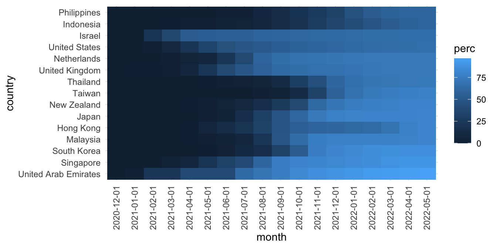
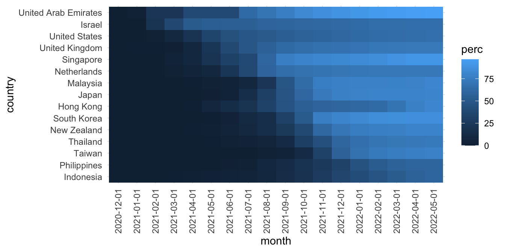

# AMOUNT {#amount}

## Bar chart


## Heatmap: Vaccination {#vaccinating}

這個例子參考[@wilke2019fundamentals]在視覺化[數量（Amount）](https://clauswilke.com/dataviz/visualizing-amounts.html)時的熱圖範例（Heatmap），但改用為視覺化各國每百人完整注射COVID-19疫苗人數歷時資料。 - <https://ourworldindata.org/covid-vaccinations> - <https://github.com/owid/covid-19-data/tree/master/public/data/vaccinations>

在R語言中，我們可以使用ggplot2套件來創建熱圖。熱圖通常使用顏色來表示數據的強度或值，通常是從淺色到深色或從冷色到暖色的漸變。ggplot2套件提供了`geom_tile()`函數來繪製熱圖。熱圖主要有以下幾個作用：

1.  顯示數據的分布情況：熱圖可以將數據的分布情況一目了然地呈現出來，讓觀察者可以快速了解數據的分布情況。

2.  發現數據之間的相關性：熱圖可以將數據之間的相關性直觀地呈現出來，這對於探索數據之間的關係非常有用。

3.  篩選數據：熱圖可以幫助我們快速地篩選出數據中的關鍵部分，從而更好地理解數據。

使用ggplot2繪製熱圖的過程中，我們可以使用`scale_fill_gradient()`函數設置顏色的漸變方式和範圍，使用`coord_equal()`函數使x和y軸的尺度相同，從而保持正方形。

### The case: Vaccinating coverage by month

::: {.notes style="color: Crimson;"}
本例子的資料前處理難度較高（OS：惡魔級）。困難來自於每個國家登記資料的時間不同，因此會產生大量`NA`值。但在這樣的狀況下，又要找到以月為時間單位的共同數值，就會更挑戰程式編寫者的資料清理技術。除此之外，如何偵測「每個國家超過每百人有二十人完整注射疫苗的時間點」，更是技巧中的技巧。是個磨練`NA`值處理和高難度資料前處理的好例子。這個例子同時也是大量在長表格、寬表格間轉換，多次運用`spread()`/`pivot_wider()`與`gather()`/`pivot_longer()`，搭配`group_by()`來達到資料整理目的的困難例子。
:::


### Data cleaning


```r
library(lubridate)
raw <- read_csv("data/vaccinations.csv")

fullvaccinated <- raw %>% select(country = location, date, 
                                people_fully_vaccinated_per_hundred) %>%
  drop_na(people_fully_vaccinated_per_hundred) %>%
  mutate(m = floor_date(date, unit = "month")) %>%
  group_by(country, m) %>%
  arrange(date) %>%
  slice(1) %>%
  ungroup() %>%
  select(-date)

vperc_by_month <- fullvaccinated %>%
  spread(m, people_fully_vaccinated_per_hundred, fill=NA) %>%
  gather(month, perc, -country) %>%
  arrange(country, month) %>%
  group_by(country) %>%
  arrange(month) %>%
  mutate(perc = zoo::na.locf(perc, na.rm = F)) %>%
  ungroup() %>%
  arrange(country, month) %>%
  replace_na(list(perc=0))
```

### Visualization

<https://clauswilke.com/dataviz/visualizing-amounts.html>

這個案例使用了三個維度的資料，分別為X軸的時間（月）、Y軸的國家、以及用顏色來呈現各國疫苗注射量（每百人）。並使用`geom_tile()`來製作熱圖。然而，Y軸的排序卻會影響讀圖。例如，在第一個例子中，Y軸的順序是用最後一個時間點的疫苗注射比例來排序。但每個國家政策和疫苗可獲量均不同，故開始注射和覆蓋速度也差很多，最終覆蓋量也會差很多。所以如果以最終覆蓋量來排序的話，反而不易觀察過程的變化，且「顏色」並不容易用來比較最終覆蓋量的大小，因而會產生很多讀圖上的困擾。

另一種繪圖策略是該書上的做法，其Y軸的排序是依照疫苗覆蓋率達到某個數值（例如每百人中有20人完整注射二劑疫苗）的時間早晚來排序。有此作為基準，每個國家在後續時間點的覆蓋速度的比較便比較容易。

另外需要注意到，顏色的取捨、以及相對於尺度的漸層設計也會影響讀圖。

#### Heatmap 01: Sorted by coverage of the last month


```r
watched <- c("United Arab Emirates", "Japan", "Singapore", 
             "South Korea", "Taiwan", "Malaysia", 
             "Hong Kong", "New Zealand", "Thailand", 
             "Netherlands", "United States", "Israel", 
             "United Kingdom", "Indonesia", "Thailand", "Philippines")

vperc_by_month %>% 
  spread(month, perc) %>%
  filter(country %in% watched) %>%
  mutate(country = reorder(country, -`2022-05-01`)) %>%
  gather(month, perc, -country) %>%
  ggplot() + aes(month, country, fill=perc) + 
  geom_tile() + theme_minimal() + 
  theme(axis.text.x = element_text(angle = 90, vjust = 0.5, hjust=1))
```



#### Heatmap 02: Sorted by the time of specific coverage rate

Sort by the time when the vaccine coverage rate exceeds 20% for all countries on the Y-axis.

<https://clauswilke.com/dataviz/visualizing-amounts.html>


```r
vperc_by_month %>% 
  filter(country %in% watched) %>%
  mutate(month = lubridate::as_date(month)) %>%
  group_by(country) %>%
  mutate(month1 = min((month[perc > 20]))) %>% 
  ungroup() %>%
  spread(month, perc) %>%
  mutate(country = reorder(country, -as.numeric(month1))) %>%
  select(-month1) %>%
  gather(month, perc, -country) %>%
  ggplot() + aes(month, country, fill=perc) + 
  geom_tile() + theme_minimal() + 
  theme(axis.text.x = element_text(angle = 90, vjust = 0.5, hjust=1))
```


