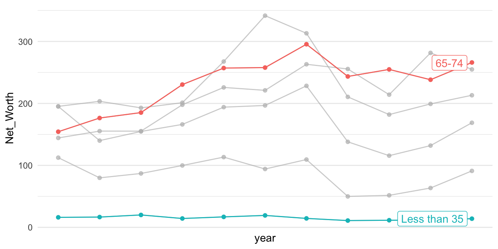

# Coordinate

本章節談論的是視覺化圖表的座標軸，本章節所涵蓋的概念可參考*Claus O. Wilke*所著之[Fundamentals of Data Visualization](https://clauswilke.com/dataviz/coordinate-systems-axes.html)的Chap3 Coordination & Axis與Chapter 8 [Visualizing distributions: Empirical cumulative distribution functions and q-q plots](https://clauswilke.com/dataviz/ecdf-qq.html)。

## 座標軸為資料排序

學術論文若要呈現一群數據的分佈時，最常用的是密度（分佈）函數、累積分佈函數，最常視覺化的方法是密度分佈圖（`geom_density()`）或直方圖（`geom_histogram()`)。然而，對新聞等強調「說故事」的文體而言，說故事的技巧往往不是「**那一群**資源多或資源少的對象」，而經常要直指「**那個對象**」，要能夠看得見所敘述的對象在圖中的位置。此時，用密度分佈來呈現的話，只能看出，該對象在分佈的某個位置；但可以改用將資料對象根據某個數據來排序後，繪製折現圖的方式來表現。例如，若要繪製一個班級的成績分佈，通常X軸是分數（組），Y軸是獲得該分數（組）的人數；但其實可以將個體依照分數來做排序，Y軸不是某個分數（組）的個數，而是每個排序後的個體，而且以排序後的序號（Ranking）來表示。用折線圖繪製後，一樣可以看出分數的分佈，但卻能夠直接標記敘事中的某個對象是Y軸中得哪個點。

### 


-   See [What's Going On in This Graph? \| Vaccination by Country](https://www.nytimes.com/2022/01/06/learning/whats-going-on-in-this-graph-jan-12-2022.html) from[What Data Shows About Vaccine Supply and Demand in the Most Vulnerable Places - The New York Times (nytimes.com)](https://www.nytimes.com/interactive/2021/12/09/world/vaccine-inequity-supply.html)

    The original chart is animated along the timeline.[What Data Shows About Vaccine Supply and Demand in the Most Vulnerable Places - The New York Times (nytimes.com)](https://www.nytimes.com/interactive/2021/12/09/world/vaccine-inequity-supply.html)


## 用Log-scale放大長尾頭部


```r
raw <- read_csv("data/opendata107Y020.csv", show_col_types = FALSE)  %>% 
    slice(-1) %>% 
    type_convert()

toplot <- raw %>%
    select(site_id, village, edu_age_15up_total) %>%
    arrange(desc(edu_age_15up_total)) %>%
    mutate(index = row_number()) %>%
    mutate(label = ifelse(index <= 5 | index > n()-5, paste0(site_id, village), ""))

library(ggrepel)
p2 <- toplot %>% ggplot() + aes(index, edu_age_15up_total) + 
    geom_point(alpha=0.5, color="royalblue") + 
    geom_text_repel(aes(label = label), point.padding = .4, color = "black",
                  min.segment.length = 0, family = "Heiti TC Light") + 
    theme(axis.text.x=element_blank()) + 
    scale_y_log10(breaks = c(0, 1, 10, 100, 1000, 10000)) + 
    theme_minimal()
p1 <- toplot %>% ggplot() + aes(index, edu_age_15up_total) + 
    geom_point(alpha=0.5, color="royalblue") + 
    theme(axis.text.x=element_blank()) + 
    theme_minimal()

cowplot::plot_grid(
  p2, NULL, p1,
  labels = c("a", "", "b"), nrow = 1, rel_widths = c(1, 0.1, 1)
)
```


## Square-root scale

Chap3 Coordination & Axis [Fundamentals of Data Visualization (clauswilke.com)](https://clauswilke.com/dataviz/coordinate-systems-axes.html)


前面是視覺化了各村里大於十五歲以上人口的人口數分佈，採用對數尺度（log-scale）可以觀察到比較小的村里。那有什麼是適合用平方根尺度（sqrt-scale）的呢？是土地嗎？密度嗎？還是人口數？是村里等級嗎？鄉鎮市區等級嗎？還是縣市等級？


```r
town <- read_csv("data/tw_population_opendata110N010.csv") %>%
    slice(-1, -(370:375)) %>%
    type_convert()

town %>%
    arrange(desc(area)) %>%
    mutate(index = row_number()) %>%
    ggplot() + aes(index, area) %>%
    geom_col(fill="skyblue") +
    scale_y_sqrt() + 
    theme_minimal()
```

<div class="figure" style="text-align: center">

<p class="caption">(\#fig:Fig03-8-TW-Population-Density-1)(ref:population-area)</p>
</div>

```r
county <- town %>%
    mutate(county = str_sub(site_id, 1, 3)) %>%
    group_by(county) %>%
    summarize(
        area = sum(area), 
        people_total = sum(people_total)
    ) %>%
    ungroup()

p1 <- county %>%
    arrange(desc(people_total)) %>%
    mutate(index = row_number()) %>%
    ggplot() + aes(index, people_total) %>%
    geom_col(fill="lightgrey") +
    # scale_y_sqrt() +
    theme_minimal()

p2 <- county %>%
    arrange(desc(people_total)) %>%
    mutate(index = row_number()) %>%
    ggplot() + aes(index, people_total) %>%
    geom_col(fill="khaki") +
    scale_y_sqrt(breaks=c(0, 250000, 500000, 1000000, 2000000, 4000000)) +
    theme_minimal()

cowplot::plot_grid(
  p1, p2,
  labels = c("a", "b"), 
  nrow = 1
)
```

<div class="figure" style="text-align: center">

<p class="caption">(\#fig:Fig03-8-TW-Population-Density-2)(ref:population-area)</p>
</div>


```r
library(tidyverse)
library(gghighlight)
```

## 座標軸從數值到增加值

### Net Worth by Age Group (WGOITG of NYTIMES)

::: notes
**LEARNING NOTES**

Median for Inequality
:::

這個教學案例來自紐約時報的「What's going on in this gragh」系列資料視覺化教學之[Teach About Inequality With These 28 New York Times Graphs - The New York Times (nytimes.com)](https://www.nytimes.com/2021/05/11/learning/lesson-plans/teach-about-inequality-with-these-28-new-york-times-graphs.html) 。該圖表呈現在不同年代、不同年齡層的人所擁有的淨資產（包含土地、存款、投資等減去債務）。該圖表的結果指出，在不同年代的老年人是越來越有錢，但年輕人卻越來越窮（該曲線為減去1989年

[](https://www.nytimes.com/2021/05/11/learning/lesson-plans/teach-about-inequality-with-these-28-new-york-times-graphs.html)

### Read and sort data

Sorted by `arrange()` function.


```r
p1 <- read_csv("data/interactive_bulletin_charts_agecl_median.csv") %>%
    select(year, Category, Net_Worth) %>%
    group_by(Category) %>%
    arrange(year) %>%
    ungroup()
p1 %>% filter(year <= 1992) %>% knitr::kable()
```


| year|Category     | Net_Worth|
|----:|:------------|---------:|
| 1989|Less than 35 |  16.17019|
| 1989|35-44        | 112.47530|
| 1989|45-54        | 195.11630|
| 1989|55-64        | 195.25554|
| 1989|65-74        | 154.34277|
| 1989|75 or older  | 144.29855|
| 1992|Less than 35 |  16.60780|
| 1992|35-44        |  79.91050|
| 1992|45-54        | 139.97745|
| 1992|55-64        | 203.44104|
| 1992|65-74        | 176.44667|
| 1992|75 or older  | 155.35173|


```r
p1 %>% ggplot() + aes(year, Net_Worth, color = Category) + 
    geom_line() + 
    geom_point() + 
    gghighlight(Category %in% c("65-74", "Less than 35")) + 
    theme_minimal() + 
    scale_x_continuous(breaks = NULL) + 
    theme(panel.background = element_rect(fill = "white",
                                colour = "white",
                                size = 0.5, linetype = "solid"))
```


```r
p2 <- read_csv("data/interactive_bulletin_charts_agecl_median.csv") %>%
    select(year, Category, NW = Net_Worth)  %>%
    group_by(Category) %>%
    arrange(year) %>%
    mutate(increase = (NW-first(NW))/first(NW)) %>%
    ungroup()
p2 %>% filter(year <= 1992) %>% knitr::kable()
```


| year|Category     |        NW|   increase|
|----:|:------------|---------:|----------:|
| 1989|Less than 35 |  16.17019|  0.0000000|
| 1989|35-44        | 112.47530|  0.0000000|
| 1989|45-54        | 195.11630|  0.0000000|
| 1989|55-64        | 195.25554|  0.0000000|
| 1989|65-74        | 154.34277|  0.0000000|
| 1989|75 or older  | 144.29855|  0.0000000|
| 1992|Less than 35 |  16.60780|  0.0270627|
| 1992|35-44        |  79.91050| -0.2895285|
| 1992|45-54        | 139.97745| -0.2825948|
| 1992|55-64        | 203.44104|  0.0419220|
| 1992|65-74        | 176.44667|  0.1432131|
| 1992|75 or older  | 155.35173|  0.0765994|

美國35歲以下的年輕人的中位淨資產比起年長的美國人來說，一開始平均貧窮得多。從「Less than 35」這條線看來，現在的年輕世代比起2004年的年輕世代所擁有的淨資產低了40%。相比之下，65歲以上的美國人現在的淨資產，相較於2004年增加了9%。隨著時代變化，可想像會有一群人的淨資產越來越多，只是現在從這個圖表看來，年輕人所擁有的淨資產相較於過去是越來越低的，多半流入了成年人和老年人手中。


```r
p2 %>% ggplot() + aes(year, increase, color = Category) + 
    geom_line() + 
    geom_point() + 
    gghighlight(Category %in% c("65-74", "Less than 35")) + 
    theme_minimal() + 
    scale_y_continuous(labels=scales::parse_format()) + 
    scale_x_continuous(breaks = NULL) + 
    theme(panel.background = element_rect(fill = "white",
                                colour = "white",
                                size = 0.5, linetype = "solid"))
```



## 等比例座標軸

### UNICEF-Optimistic (WGOITH)

<https://www.nytimes.com/2021/11/17/upshot/global-survey-optimism.html> <https://changingchildhood.unicef.org/about>


```r
plot.opt <- read_csv("data/unicef-changing-childhood-data.csv") %>% 
    select(country = WP5, age = WP22140, bw = WP22092) %>%
    mutate(country = ordered(country, 
                             levels=c(1, 3, 4, 10, 11, 12, 
                                      13, 14, 17, 29, 31, 
                                      33, 35, 36, 60, 61, 
                                      77, 79, 81, 87, 165), 
                             labels=c("USA", "Morocco", "Lebanon", 
                                      "Indonesia", "Bangladesh", 
                                      "UK", "France", "Germany",
                                      "Spain", "Japan", "India", 
                                      "Brazil", "Nigeria", "Kenya", 
                                      "Ethiopia", "Mali", "Ukraine",
                                      "Cameroon", "Zimbabwe",
                                      "Argentina", "Peru"))) %>%
    count(country, age, bw) %>%
    group_by(country, age) %>%
    mutate(perc = n/sum(n)) %>% 
    ungroup() %>%
    filter(bw == 1) %>%
    select(country, age, perc) %>%
    spread(age, perc) %>%
    rename(`15-24y` = `1`, `40+y` = `2`)

plot.opt %>% head(10) %>% knitr::kable()
```


|country    |    15-24y|      40+y|
|:----------|---------:|---------:|
|USA        | 0.6679842| 0.4611465|
|Morocco    | 0.4365079| 0.4735812|
|Lebanon    | 0.5467197| 0.4435798|
|Indonesia  | 0.7920605| 0.8027344|
|Bangladesh | 0.4624506| 0.4319527|
|UK         | 0.5040000| 0.4140000|
|France     | 0.3900000| 0.2640000|
|Germany    | 0.5900000| 0.3860000|
|Spain      | 0.5160000| 0.3340000|
|Japan      | 0.6367265| 0.2586873|


```r
plot.opt %>%
    ggplot() + aes(`40+y`, `15-24y`, label = country) + 
    geom_point(color = "skyblue", size = 2) + 
    xlim(0, 1) + ylim(0,1) + 
    geom_text(hjust = -0.1, vjust = -0.5) + 
    geom_abline(intercept = 0, slop = 1, 
                color="lightgrey", alpha=0.5, linetype="dashed") + 
    theme_minimal() + 
    theme(aspect.ratio=1)
```


