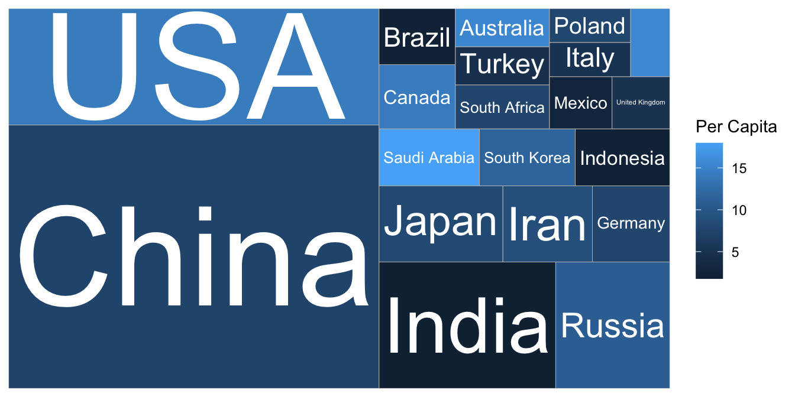
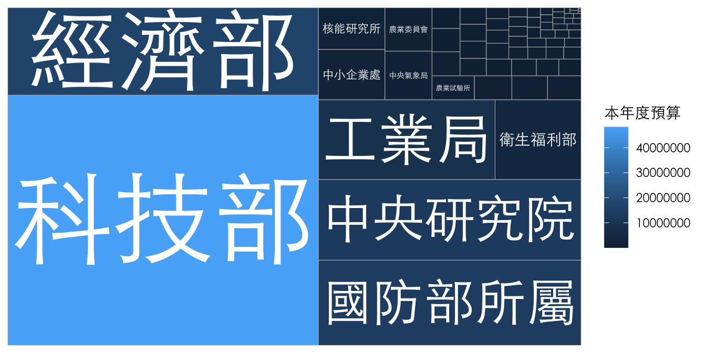
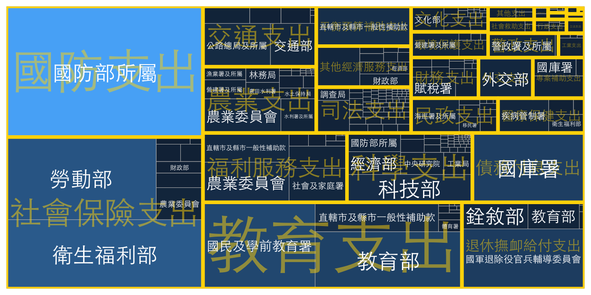

# PROPORTION

## Pie Chart

## Dodged Bar Chart

## Treemap: Nested Proportion

Treemap是一種資料視覺化工具，用於呈現層級式結構的數據。它通常使用矩形或正方形區域來表示不同的數據單元，並將它們分層排列以形成層次樹狀結構。Treemap的特點包括：

-   易於理解：Treemap以直觀的方式呈現數據，讓使用者能夠輕鬆地了解各個數據單元之間的比例關係。
-   節省空間：Treemap使用矩形或正方形區域排列數據，能夠更有效地利用空間，呈現更多的數據。
-   可互動性：Treemap通常支持互動式操作，使用者可以通過縮放、懸停等方式，進一步了解數據。

Treemap適用於以下情況：

-   層級式數據：Treemap適用於層級式數據，例如組織架構、檔案系統等。
-   大量數據：Treemap能夠有效地呈現大量數據，並在縮放時保持清晰度。
-   比例關係：Treemap適用於呈現不同數據單元之間的比例關係，例如市場份額、支出等。

### NYT: Carbon by countries {#carbon}

本案例取自紐時所報導之[Who Has The Most Historical Responsibility for Climate Change? - The New York Times (nytimes.com)](https://www.nytimes.com/interactive/2021/11/12/climate/cop26-emissions-compensation.html?campaign_id=29&emc=edit_up_20211112&instance_id=45236&nl=the-upshot&regi_id=52022771&segment_id=74222&te=1&user_id=7cc6d9cd8f523e256ae41958ee8a9cb5)。該新聞報導了聯合國氣候峰會在格拉斯哥舉行期間的一個重要議題：世界上最富裕的國家，即那些對全球暖化負責任的不成比例的國家，應如何賠償因全球氣溫上升所造成的貧困國家的損失。報導指出，現今全球人口中，包括美國、加拿大、日本以及西歐大部分國家在內的富裕國家僅佔12％，但是在過去的170年中，這些國家卻負責了50％的溫室氣體排放。貧困國家要求富裕國家提供更多資金以應對全球暖化所帶來的風險。在峰會上，來自最不發達國家聯盟的Sonam P. Wangdi指出，他的祖國不丹對全球暖化的責任較小，因為該國目前吸收的二氧化碳比汽車和房屋排放的少。然而，不丹仍然面臨著由氣溫上升所帶來的嚴重風險，喜馬拉雅山脈融化的冰川已經導致了洪水和泥石流，摧毀了村莊。報導指出，最不發達國家需要更多的資金和支持，以應對全球暖化所帶來的影響。

本案例的Treemap以面積顯示了各國的碳排放所佔比例，並用顏色視覺化各國的人均GDP。Per Capita是拉丁語，通常用來表示某種統計數據與人口數量之間的關係。它是指將某一特定數量的總量除以人口數目，以得出每個人所擁有的平均數量。例如，國家的人均GDP（Gross Domestic Product，國內生產總值）是指該國的總GDP除以該國的人口數，以反映一個人在該國經濟中所創造的平均貢獻。Per Capita常用於比較不同國家或地區之間的平均水平，以及分析人均收入、人均支出、人均消費等數據。


```r
totreemap <- read_csv("data/GCB2021v34_MtCO2_flat.csv") %>% 
    drop_na(`Total`) %>%
    filter(!Country %in% c("Global", "International Transport")) %>%
    filter(Year==2020) %>%
    arrange(desc(`Total`)) %>%
    mutate(perc = Total/sum(Total)) %>%
    slice(1:20)
library(treemapify)
totreemap %>%
    ggplot() + aes(area = perc, fill=`Per Capita`, label=Country) +
    geom_treemap() + 
    geom_treemap_text(color="white", 
                      place="centre", 
                      grow=TRUE
                      )
```



### TW: Taiwan Annual Expenditure {#twbudget}

上述案例未能突顯出Treemap能夠呈現階層式資料的特色。因此本案例將使用台灣中央預算，階層化地顯示不同機構層級（大類、一級部會）等的預算佔比。例如衛福部、財政部與勞動部的預算均屬於社會福利支出。

這段程式碼中，使用了 **`zoo`** 套件中的 **`na.locf()`** 函數。此函數用於將 **`raw`** 資料框中的 **`款`** 欄位的缺失值 (NA) 以最近已知的值 (向前填補) 進行填補。


```r
library(zoo)

# raw <- readxl::read_excel("data/111B歲出政事別預算總表.xls")
raw <- readxl::read_excel("data/111B歲出政事別預算表.xls", skip=3, col_names = F) 
names(raw) <- c("款", "科", "目", "節", "機構", "本年度預算", "上年度預算", "上年度決算", "預算差")
# raw$款 <- na.locf(raw$款)

cleand <- raw %>%
  filter(!is.na(款) | !is.na(科)) %>%
  slice(-(1:2)) %>%
  select(-目, -節) %>%
  mutate(org = purrr::map(機構, function(x){str_split(x, "\n")[[1]][2]})) %>%
  mutate(款 = ifelse(!is.na(款), unlist(org), unlist(款))) %>%
  mutate(款 = zoo::na.locf(款)) %>%
  filter(!is.na(科)) %>%
  select(-科) %>% type_convert()  %>%
  mutate(上年度預算 = as.numeric(上年度預算), 
              上年度決算 = as.integer(上年度決算),
              預算差 = as.numeric(預算差)) %>%
  replace_na(list(上年度預算 = 0, 上年度決算 = 0)) %>%
  mutate(預算差 = 本年度預算 - 上年度預算)
```


```r
cleand %>%
  filter(款 %in% c("科學支出")) %>%
    ggplot() + aes(area = 本年度預算, fill=`本年度預算`, label=org) +
    geom_treemap() + 
    geom_treemap_text(color="white", 
                      place="centre", 
                      grow=TRUE,
                      family = "Heiti TC Light"
                      ) + 
  theme(title = element_text(family = "Heiti TC Light"),
        text = element_text(family = "Heiti TC Light"))
```




```r
library(treemapify)
cleand %>%
  # filter(款 %in% c("科學支出", "教育支出", "國防支出", "司法支出")) %>%
    ggplot() + aes(area = 本年度預算, fill=`本年度預算`, label=org, subgroup = 款) +
    geom_treemap() + 
    geom_treemap_subgroup_border(color="gold") +
    geom_treemap_subgroup_text(place = "centre", grow = T, alpha = 0.5, colour =
                             "gold", min.size = 0,
                             family = "Heiti TC Light") +
    geom_treemap_text(color="white", 
                      place="centre", 
                      grow=F,
                      family = "Heiti TC Light"
                      ) + 
  theme(title = element_text(family = "Heiti TC Light"),
        text = element_text(family = "Heiti TC Light"),
        legend.position = "none")
```


