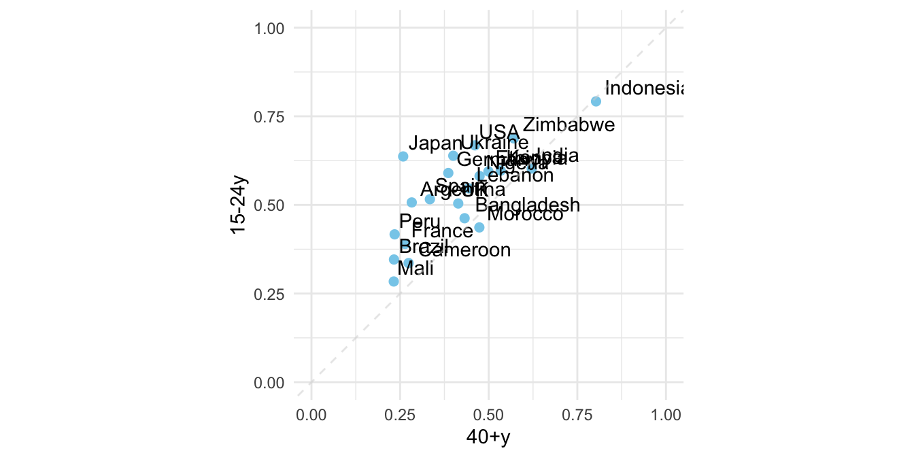

# ASSOCIATION

## 等比例座標軸

### UNICEF-Optimistic (WGOITH)

<https://www.nytimes.com/2021/11/17/upshot/global-survey-optimism.html> <https://changingchildhood.unicef.org/about>


```r
plot.opt <- read_csv("data/unicef-changing-childhood-data.csv") %>% 
    select(country = WP5, age = WP22140, bw = WP22092) %>%
    mutate(country = ordered(country, 
                             levels=c(1, 3, 4, 10, 11, 12, 
                                      13, 14, 17, 29, 31, 
                                      33, 35, 36, 60, 61, 
                                      77, 79, 81, 87, 165), 
                             labels=c("USA", "Morocco", "Lebanon", 
                                      "Indonesia", "Bangladesh", 
                                      "UK", "France", "Germany",
                                      "Spain", "Japan", "India", 
                                      "Brazil", "Nigeria", "Kenya", 
                                      "Ethiopia", "Mali", "Ukraine",
                                      "Cameroon", "Zimbabwe",
                                      "Argentina", "Peru"))) %>%
    count(country, age, bw) %>%
    group_by(country, age) %>%
    mutate(perc = n/sum(n)) %>% 
    ungroup() %>%
    filter(bw == 1) %>%
    select(country, age, perc) %>%
    spread(age, perc) %>%
    rename(`15-24y` = `1`, `40+y` = `2`)

plot.opt %>% head(10) %>% knitr::kable()
```


|country    |    15-24y|      40+y|
|:----------|---------:|---------:|
|USA        | 0.6679842| 0.4611465|
|Morocco    | 0.4365079| 0.4735812|
|Lebanon    | 0.5467197| 0.4435798|
|Indonesia  | 0.7920605| 0.8027344|
|Bangladesh | 0.4624506| 0.4319527|
|UK         | 0.5040000| 0.4140000|
|France     | 0.3900000| 0.2640000|
|Germany    | 0.5900000| 0.3860000|
|Spain      | 0.5160000| 0.3340000|
|Japan      | 0.6367265| 0.2586873|


```r
plot.opt %>%
    ggplot() + aes(`40+y`, `15-24y`, label = country) + 
    geom_point(color = "skyblue", size = 2) + 
    xlim(0, 1) + ylim(0,1) + 
    geom_text(hjust = -0.1, vjust = -0.5) + 
    geom_abline(intercept = 0, slop = 1, 
                color="lightgrey", alpha=0.5, linetype="dashed") + 
    theme_minimal() + 
    theme(aspect.ratio=1)
```


