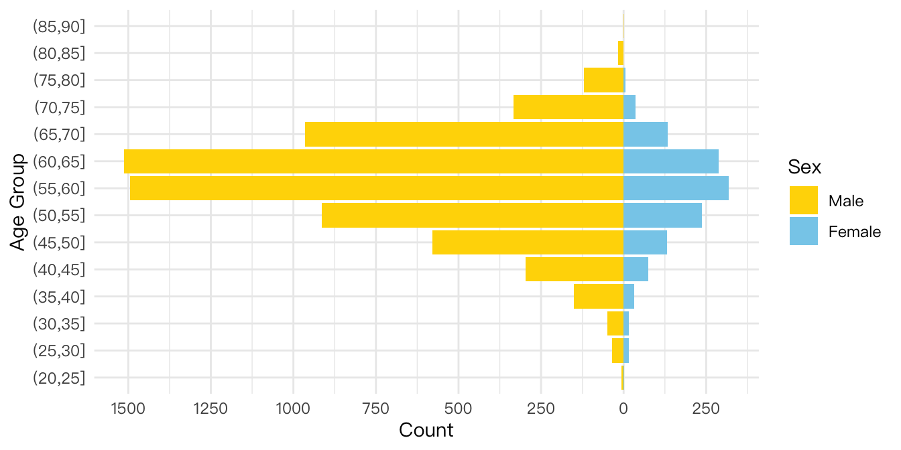
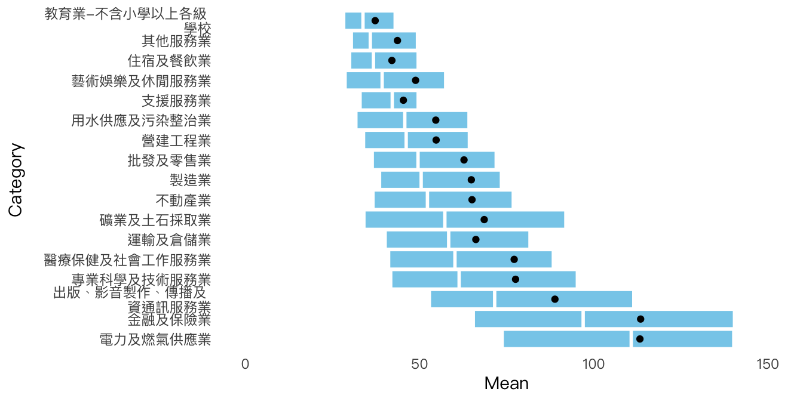

# DISTRIBUTION: Histogram & Density

Most of contet in the chapter comes from the book Claus o. Wilke's "Foundamentals of Data Visualization"


```r
vilmaster <- readr::read_csv("data/tw_vil2018_elccand.csv") %>%
  drop_na(當選註記)
```

## Density plot


```r
p1 <- vilmaster %>%
  ggplot()  + aes(年齡) + 
  geom_density() + th

p2 <- vilmaster %>%
  ggplot()  + aes(年齡, fill=factor(性別)) + 
  geom_density(alpha=0.5) + th + 
  scale_fill_manual(
    limits=c('1', '2'),           # original chart group
    values=c("gold", "skyblue"),  # map to color
    name="性別",                  # legend title
    breaks=c(1, 2),               # original legend group labels
    labels=c("Male","Female"),    # map to new labels
    na.value = "lightgrey"        # color for other groups
    )

cowplot::plot_grid(
  p1, p2,
  labels = c("(a) Overall", "(b) Group by gender"),
  nrow = 1, rel_widths = c(1, 1)
)
```


### Density with different bandwidth


```r
library(ggridges) # for geom_density_line()
p.b05 <- vilmaster %>% ggplot()  + aes(年齡) + 
  geom_density_line(fill='gold', bw=0.5, kernel='gaussian') + th

p.b1 <- vilmaster %>% ggplot()  + aes(年齡) + 
  geom_density_line(fill='gold', bw=1, kernel='gaussian') + th

p.b5 <- vilmaster %>% ggplot()  + aes(年齡) + 
  geom_density_line(fill='gold', bw=5, kernel='gaussian') + th

p.rect <- vilmaster %>% ggplot()  + aes(年齡) + 
  geom_density_line(fill='gold', bw=8, kernel='rectangular') + th

cowplot::plot_grid( p.b05, p.b1, p.b5, p.rect,
  labels = c("(a) bw=.5", "(b) bw=1", "(c) bw=2", "(b) rect"),
  nrow = 2, rel_widths = c(1, 1)
)
```


## Histogram

### Histogram with different number of bins


```r
p10 <- vilmaster %>%
  ggplot()  + aes(年齡) + 
  geom_histogram(bins=10, fill='royalblue') + th

p20 <- vilmaster %>%
  ggplot()  + aes(年齡) + 
  geom_histogram(bins=20, fill='royalblue') + th

p30 <- vilmaster %>%
  ggplot()  + aes(年齡) + 
  geom_histogram(bins=30, fill='royalblue') + th

p40 <- vilmaster %>%
  ggplot()  + aes(年齡) + 
  geom_histogram(bins=40, fill='royalblue') + th

cowplot::plot_grid(
  p10, p20, p30, p40,
  labels = c("(a) bins=10", "(b) bins=20", "(c) bins=30", "(b) bins=40"),
  nrow = 2, rel_widths = c(1, 1)
)
```


### Density vs histogram


```r
pd <- vilmaster %>%
  ggplot()  + aes(年齡, fill=factor(性別)) + 
  geom_density(alpha=0.5) + th + 
  scale_fill_manual(
    values=c("1"='gold', '2'="skyblue"),
    labels=c('1'="Male",'2'="Female"),
    name='Sex'
    )

ph <- vilmaster %>%
  ggplot()  + aes(年齡, fill=factor(性別)) + 
  geom_histogram(bins=20, position="dodge") + th + 
  scale_fill_manual(values=c("1"='gold', '2'="skyblue ")) + 
  theme(legend.position="none")

cowplot::plot_grid(
  pd, ph,
  labels = c("(a) geom_density()", "(b) geom_histogram()"),
  nrow = 1, rel_widths = c(6, 4)
)
```


### Positions of bar chart


```r
p.hist.dodge <- vilmaster %>%
  ggplot()  + aes(年齡, fill=factor(性別)) + 
  geom_histogram(bins=20, position="dodge") + th + 
  scale_fill_manual(
    values=c("1"='gold', '2'="skyblue "),
    labels=c('1'="Male",'2'="Female"),
    name='Sex'
  )

p.hist.stack <- vilmaster %>%
  ggplot()  + aes(年齡, fill=factor(性別)) + 
  geom_histogram(bins=20, position="stack") + th +
  scale_fill_manual(values=c("1"='gold', '2'="skyblue ")) + 
  theme(legend.position="none")

cowplot::plot_grid(
  p.hist.dodge, p.hist.stack,
  labels = c("(a) position:dodge", "(b) position:stack"),
  nrow = 1, rel_widths = c(6, 4)
)
```


### Display two groups histogram by facet_wrap()


```r
vilmaster %>%
  ggplot()  + aes(年齡, fill=factor(性別)) + 
  geom_histogram(bins=20, position="dodge") + th + 
  scale_fill_manual(
    values=c("1"='gold', '2'="skyblue "),
    labels=c('1'="Male",'2'="Female"),
    name='Sex'
  ) + 
  facet_wrap(.~性別, nrow=1)
```


## Pyramid Plot

### Modify geom_col() to pyramid plot


```r
vilmaster %>%
  group_by(性別) %>%
  mutate(age_group = cut(年齡, 0:20*5+.01)) %>%
  count(age_group) %>%
  ungroup() %>%
  ggplot()  + aes(x=age_group, 
                  y=ifelse(性別=='1', -1, 1)*n,
                  fill=factor(性別)) + 
  geom_col() + 
  scale_y_continuous(name = "Count", breaks = 250*(-6:2), labels = c("1500", "1250", "1000", "750", "500", "250", "0", "250", "500")) + 
  coord_flip() + 
  scale_fill_manual(
    values=c("1"='gold', '2'="skyblue "),
    labels=c('1'="Male",'2'="Female"),
    name='Sex'
  ) + th + labs(y="Count", x="Age Group")
```



## Box plot: Muitiple Distrubution

### TW-Salary (boxplot)

Inspired by [Six Myths About Choosing a College Major - The New York Times (nytimes.com)](https://www.nytimes.com/2017/11/03/education/edlife/choosing-a-college-major.html) and [What's Going On in This Graph? \| Jan. 9, 2018 - The New York Times (nytimes.com)](https://www.nytimes.com/2018/01/04/learning/whats-going-on-in-this-graph-jan-9-2018.html)


```r
library(readxl)
raw <- read_excel("data/tw_salary109.xlsx", sheet=1, trim_ws = T)
raw
```


|Category                                 |   Q1| Median|    Q3|  Mean|
|:----------------------------------------|----:|------:|-----:|-----:|
|　男                                     | 39.0|   53.2|  82.3|  70.7|
|　女                                     | 35.1|   46.8|  67.6|  58.6|
|　未滿25歲                               | 28.1|   35.8|  45.1|  37.7|
|　25-29歲                                | 36.6|   47.8|  61.7|  53.0|
|　30-39歲                                | 39.2|   53.3|  77.0|  64.1|
|　40-49歲                                | 39.9|   56.9|  91.8|  74.8|
|　50-64歲                                | 37.8|   53.3|  88.4|  75.5|
|　65歲以上                               | 30.6|   40.9|  63.1|  62.6|
|　國中及以下                             | 32.7|   40.5|  52.0|  45.4|
|　高中（職）                             | 34.5|   44.7|  59.8|  51.9|
|　大專                                   | 38.6|   53.7|  80.2|  67.0|
|　研究所                                 | 60.9|   96.0| 139.3| 116.4|
|　礦業及土石採取業                       | 34.2|   57.2|  91.7|  68.5|
|　製造業                                 | 38.7|   50.4|  73.2|  64.8|
|　電力及燃氣供應業                       | 73.9|  110.7| 139.9| 113.2|
|　用水供應及污染整治業                   | 31.9|   45.7|  63.9|  54.6|
|　營建工程業                             | 34.1|   46.1|  64.0|  54.7|
|　批發及零售業                           | 36.6|   49.5|  71.7|  62.7|
|　運輸及倉儲業                           | 40.3|   58.3|  81.4|  66.1|
|　住宿及餐飲業                           | 30.1|   36.7|  49.3|  42.0|
|　出版﹑影音製作﹑傳播及
　　資通訊服務業 | 53.0|   71.5| 111.2|  88.8|
|　金融及保險業                           | 65.6|   96.9| 140.1| 113.4|
|　不動產業                               | 36.8|   52.2|  76.6|  65.0|
|　專業科學及技術服務業                   | 41.9|   61.3|  95.0|  77.5|
|　支援服務業                             | 33.1|   42.1|  49.3|  45.3|
|　教育業-不含小學以上各級
　　學校        | 28.4|   33.7|  42.7|  37.2|
|　醫療保健及社會工作服務業               | 41.3|   60.1|  88.1|  77.1|
|　藝術娛樂及休閒服務業                   | 28.8|   39.2|  57.2|  48.8|
|　其他服務業                             | 30.6|   35.8|  49.1|  43.6|


```r
raw %>%
    slice(-(1:12)) %>%
    mutate(Category = reorder(Category, desc(Median))) %>%
    ggplot() + aes(y = Category, 
                   xlower=Q1, xmiddle=Median, xupper=Q3, xmin=0, xmax=150) +
    geom_boxplot(stat = "identity", color="white", fill="skyblue") +
    geom_point(aes(x = Mean)) + 
    th + 
    theme(panel.grid.minor = element_blank(), 
          panel.grid.major = element_blank())
```



### TW-Income (boxplot)


```r
library(gghighlight)
toplot <- read_csv("data/tw_income_107.csv", ) %>%
    filter(!`村里` %in% c("合計", "其他", "福住里")) %>%
    filter(鄉鎮市區 %in% c("信義區")) %>%
    mutate(村里 = reorder(村里, desc(中位數)))

toplot %>% 
    mutate(group = if_else((平均數>第三分位數), "highlight", "none")) %>%
    ggplot() + aes(y = 村里, 
                   xlower=第一分位數, xmiddle=中位數, xupper=第三分位數, 
                   xmin= min(第一分位數), xmax=max(第三分位數), fill=group) +
    geom_boxplot(stat = "identity", color="white") +
    scale_fill_manual(values = c("highlight"="orangered", "none"="skyblue")) + guides(fill=FALSE) + 
    geom_point(aes(x = 平均數)) + 
    xlab("年所得（單位：千元）") + 
    th + 
    theme(panel.grid.minor = element_blank(), 
          panel.grid.major = element_blank())
```


