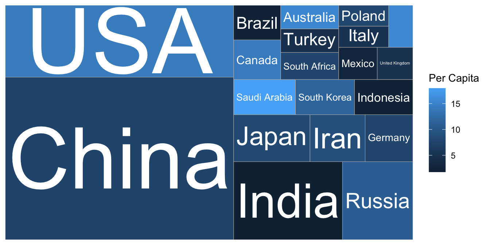
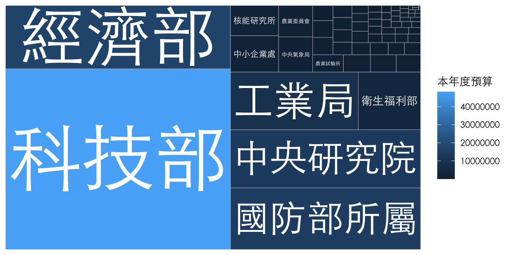
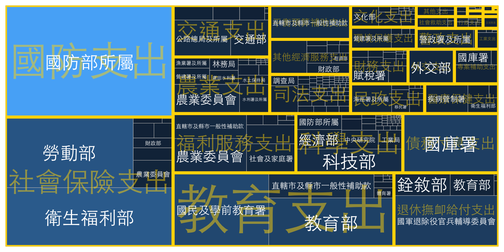

# PROPORTION

## Pie Chart

## Dodged Bar Chart

## Treemap: Nested Proportion

### Global Carbon Projects (WGOITH-NYTIMES)

[Who Has The Most Historical Responsibility for Climate Change? - The New York Times (nytimes.com)](https://www.nytimes.com/interactive/2021/11/12/climate/cop26-emissions-compensation.html?campaign_id=29&emc=edit_up_20211112&instance_id=45236&nl=the-upshot&regi_id=52022771&segment_id=74222&te=1&user_id=7cc6d9cd8f523e256ae41958ee8a9cb5)


```r
totreemap <- read_csv("data/GCB2021v34_MtCO2_flat.csv") %>% 
    drop_na(`Total`) %>%
    filter(!Country %in% c("Global", "International Transport")) %>%
    filter(Year==2020) %>%
    arrange(desc(`Total`)) %>%
    mutate(perc = Total/sum(Total)) %>%
    slice(1:20)
library(treemapify)
totreemap %>%
    ggplot() + aes(area = perc, fill=`Per Capita`, label=Country) +
    geom_treemap() + 
    geom_treemap_text(color="white", 
                      place="centre", 
                      grow=TRUE
                      )
```



### TW Budget


```r
library(zoo)
# raw <- readxl::read_excel("data/111B歲出政事別預算總表.xls")
raw <- readxl::read_excel("data/111B歲出政事別預算表.xls", skip=3, col_names = F) 
names(raw) <- c("款", "科", "目", "節", "機構", "本年度預算", "上年度預算", "上年度決算", "預算差")
# raw$款 <- na.locf(raw$款)

cleand <- raw %>%
  filter(!is.na(款) | !is.na(科)) %>%
  slice(-(1:2)) %>%
  select(-目, -節) %>%
  mutate(org = purrr::map(機構, function(x){str_split(x, "\n")[[1]][2]})) %>%
  mutate(款 = ifelse(!is.na(款), unlist(org), unlist(款))) %>%
  mutate(款 = zoo::na.locf(款)) %>%
  filter(!is.na(科)) %>%
  select(-科) %>% type_convert()  %>%
  mutate(上年度預算 = as.numeric(上年度預算), 
              上年度決算 = as.integer(上年度決算),
              預算差 = as.numeric(預算差)) %>%
  replace_na(list(上年度預算 = 0, 上年度決算 = 0)) %>%
  mutate(預算差 = 本年度預算 - 上年度預算)
```


```r
cleand %>%
  filter(款 %in% c("科學支出")) %>%
    ggplot() + aes(area = 本年度預算, fill=`本年度預算`, label=org) +
    geom_treemap() + 
    geom_treemap_text(color="white", 
                      place="centre", 
                      grow=TRUE,
                      family = "Heiti TC Light"
                      ) + 
  theme(title = element_text(family = "Heiti TC Light"),
        text = element_text(family = "Heiti TC Light"))
```




```r
library(treemapify)
cleand %>%
  # filter(款 %in% c("科學支出", "教育支出", "國防支出", "司法支出")) %>%
    ggplot() + aes(area = 本年度預算, fill=`本年度預算`, label=org, subgroup = 款) +
    geom_treemap() + 
    geom_treemap_subgroup_border(color="gold") +
    geom_treemap_subgroup_text(place = "centre", grow = T, alpha = 0.5, colour =
                             "gold", min.size = 0,
                             family = "Heiti TC Light") +
    geom_treemap_text(color="white", 
                      place="centre", 
                      grow=F,
                      family = "Heiti TC Light"
                      ) + 
  theme(title = element_text(family = "Heiti TC Light"),
        text = element_text(family = "Heiti TC Light"),
        legend.position = "none")
```


