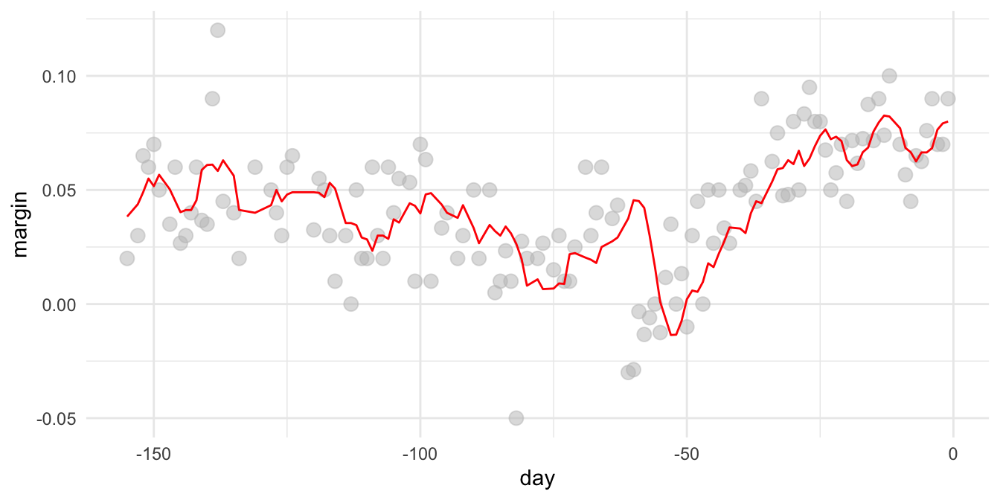

# TIME & TRENDS

## Highlighting: Unemployed Population

This example is referenced from Datacamp's [Introduction to data visualization with ggplot2](https://www.datacamp.com/courses/introduction-to-data-visualization-with-ggplot2)。

### The econimics data

這是一個包含美國經濟時間序列資料的資料集，資料來源為<https://fred.stlouisfed.org/>。`economics`是以「寬」表格方式儲存，而`economics_long` 資料框則以「長」表格方式儲存。每一列之`date`為資料收集的月份。

-   `pce`：個人消費支出，以十億美元為單位，資料來源為 <https://fred.stlouisfed.org/series/PCE>
-   `pop`：總人口數，以千人為單位，資料來源為 <https://fred.stlouisfed.org/series/POP>
-   `psavert`：個人儲蓄率，資料來源為 <https://fred.stlouisfed.org/series/PSAVERT/>
-   `uempmed`：失業中位數持續時間，以週為單位，資料來源為 <https://fred.stlouisfed.org/series/UEMPMED>
-   `unemploy`：失業人數，以千人為單位，資料來源為 <https://fred.stlouisfed.org/series/UNEMPLOY>


```r
economics %>% head()
```

```{.output}
## # A tibble: 6 × 6
##   date         pce    pop psavert uempmed unemploy
##   <date>     <dbl>  <dbl>   <dbl>   <dbl>    <dbl>
## 1 1967-07-01  507. 198712    12.6     4.5     2944
## 2 1967-08-01  510. 198911    12.6     4.7     2945
## 3 1967-09-01  516. 199113    11.9     4.6     2958
## 4 1967-10-01  512. 199311    12.9     4.9     3143
## 5 1967-11-01  517. 199498    12.8     4.7     3066
## 6 1967-12-01  525. 199657    11.8     4.8     3018
```

### Setting marking area


```r
recess <- data.frame(
  begin = c("1969-12-01","1973-11-01","1980-01-01","1981-07-01","1990-07-01","2001-03-01", "2007-12-01"), 
  end = c("1970-11-01","1975-03-01","1980-07-01","1982-11-01","1991-03-01","2001-11-01", "2009-07-30"),
  event = c("Fiscal & Monetary\ntightening", "1973 Oil crisis", "Double dip I","Double dip II", "Oil price shock", "Dot-com bubble", "Sub-prime\nmortgage crisis"),
  y =  c(.01415981, 0.02067402, 0.02951190,  0.03419201,  0.02767339, 0.02159662, 0.02520715)
  )

library(lubridate)
recess <- recess %>%
  mutate(begin = ymd(begin), 
         end = ymd(end))

economics %>% 
  ggplot() + 
  aes(x = date, y = unemploy/pop) + 
  ggtitle(c("The percentage of unemployed Americans \n increases sharply during recessions")) +
  geom_line() +
  geom_rect(data = recess, 
            aes(xmin = begin, xmax = end, ymin = -Inf, ymax = +Inf, fill = "Recession"), 
            inherit.aes = FALSE, alpha = 0.2) +
  geom_label(data = recess, aes(x = end, y = y, label=event), size = 3) + 
  scale_fill_manual(name = "", values="red", label="Recessions")
```


## Smoothing: Unemployed

-   Smooth by [bin smoothing](http://rafalab.dfci.harvard.edu/dsbook/smoothing.html#bin-smoothing)


```r
fit <- with(economics,
            ksmooth(date, unemploy, kernel = "box", bandwidth=210))

economics %>%
  mutate(smooth = fit$y) %>%
  ggplot() + aes(date, unemploy) + 
  geom_point(alpha = 5, color = "skyblue") + 
  geom_line(aes(date, smooth), color="red") + theme_minimal()
```


### Polls_2008

Second Example comes from [Rafael's online book](http://rafalab.dfci.harvard.edu/dsbook/smoothing.html)


```r
library(dslabs)
span <- 7 
polls_2008
```

```{.output}
## # A tibble: 131 × 2
##      day margin
##    <dbl>  <dbl>
##  1  -155 0.0200
##  2  -153 0.0300
##  3  -152 0.065 
##  4  -151 0.06  
##  5  -150 0.07  
##  6  -149 0.05  
##  7  -147 0.035 
##  8  -146 0.06  
##  9  -145 0.0267
## 10  -144 0.0300
## # … with 121 more rows
```

```r
fit <- with(polls_2008, 
            ksmooth(day, margin, kernel = "box", bandwidth = span))

polls_2008 %>% 
    mutate(smooth = fit$y) %>%
    ggplot(aes(day, margin)) +
    geom_point(size = 3, alpha = .5, color = "grey") + 
    geom_line(aes(day, smooth), color="red") + theme_minimal()
```


