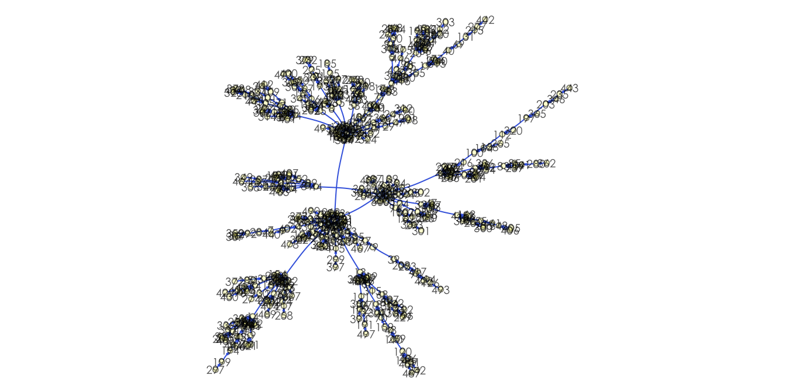
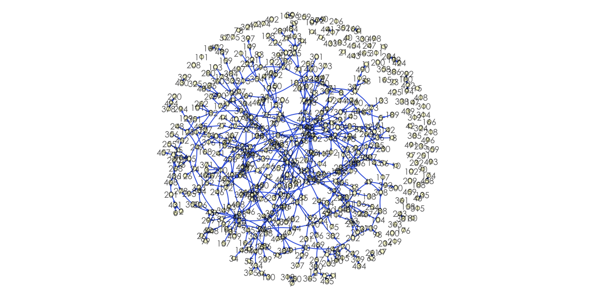
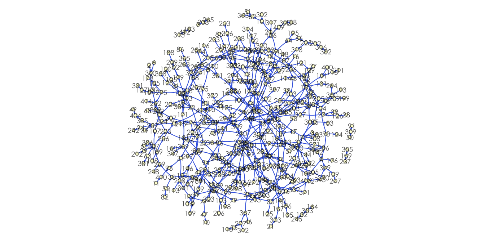
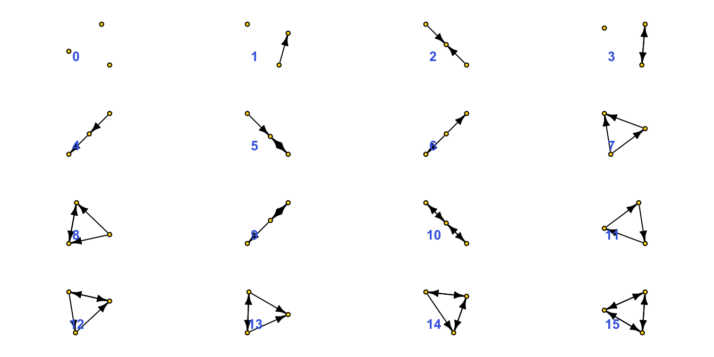

# NETWORK VIS

網絡視覺化其實已經有非常好的[簡介和指南](https://kateto.net/network-visualization)。但在此補充一些常用的網絡視覺化參數


```r
library(igraph)
```

## Generating networks

### Random network


```r
g <- barabasi.game(500, directed = T)
message("\n(V, E, Reciprocity, nComponent)\n", 
        length(V(g)), "\t", 
        length(E(g)), "\t",
        sprintf("%.3f\t", reciprocity(g)),
        count_components(g, mode = "weak")
        )
```


```r
l <- layout.fruchterman.reingold(g)
# l <- layout_with_kk(g)
# l <- layout_in_circle(g)

par(mar = c(0,0,0,0) + 0.1)
plot(g, 
     layout = l,
     vertex.color = rgb(1, 1, 0, 0.2),
     # vertex.color = factor(V(g)$blocked),
     vertex.size = 3,
     # vertex.size  = sqrt(V(g)$degree)*3,
     vertex.frame.color= rgb(0, 0, 0, 0.5),
     # vertex.label = V(g)$display,
     # vertex.label = str_sub(V(g)$name, 1, 10),
     vertex.label.cex = 0.6,
     vertex.label.color = rgb(0, 0, 0, 0.7),
     vertex.label.family = 'Heiti TC Light',
     edge.curved = 0.1,
     edge.arrow.size = 0.1, 
     # edge.width = sqrt(E(g)$weight),
     # edge.color = E(g)$year,
     # edge.color = E(g)$weight,
     edge.color = "#4169E1",
     # edge.color = E(g)$color,
     # edge.label = E(g)$weight,
     # edge.label = E(g)$year,
     edge.label.cex = 0.4,
     edge.label.color = rgb(1, 0, 0)
     )
```



### Random network


```r
rg <- sample_gnm(length(V(g)), length(E(g)), directed=T)
message("\n(V, E, Reciprocity, nComponent)\n", 
        length(V(rg)), "\t", 
        length(E(rg)), "\t",
        sprintf("%.3f\t", reciprocity(rg)),
        count_components(rg, mode = "weak")
        )
```


```r
l <- layout.fruchterman.reingold(rg)

par(mar = c(0,0,0,0) + 0.1)
plot(rg, 
     layout = l,
     vertex.color = rgb(1, 1, 0, 0.2),
     vertex.size = 3,
     vertex.frame.color= rgb(0, 0, 0, 0.5),
     vertex.label.cex = 0.6,
     vertex.label.color = rgb(0, 0, 0, 0.7),
     vertex.label.family = 'Heiti TC Light',
     edge.curved = 0.1,
     edge.arrow.size = 0.1, 
     edge.color = "#4169E1",
     edge.label.cex = 0.4,
     edge.label.color = rgb(1, 0, 0)
     )
```



## Retrieve Top3 Components


```r
components <- igraph::clusters(rg, mode="weak")
biggest_cluster_id <- which.max(components$csize)
# which.max(components$csize)
# components$csize
# biggest_cluster_id
top3_break <- sort(unique(components$csize), decreasing = T)[3]
biggest_cluster_id <- which(components$csize >=  top3_break)
vert_ids <- V(rg)[components$membership %in% biggest_cluster_id]
rg <- igraph::induced_subgraph(rg, vert_ids)


message("\n(V, E, Reciprocity, nComponent)\n", 
        length(V(rg)), "\t", 
        length(E(rg)), "\t",
        sprintf("%.3f", reciprocity(rg))
        )
```

### Visualize again


```r
l <- layout.fruchterman.reingold(rg)

par(mar = c(0,0,0,0) + 0.1)
plot(rg, 
     layout = l,
     vertex.color = rgb(1, 1, 0, 0.2),
     vertex.size = 3,
     vertex.frame.color= rgb(0, 0, 0, 0.5),
     vertex.label.cex = 0.6,
     vertex.label.color = rgb(0, 0, 0, 0.7),
     vertex.label.family = 'Heiti TC Light',
     edge.curved = 0.1,
     edge.arrow.size = 0.1, 
     edge.color = "#4169E1",
     edge.label.cex = 0.4,
     edge.label.color = rgb(1, 0, 0)
     )
```



## Motif visualization and analysis

### Motif type


```r
library(igraph)
par(mfrow=c(4,4), mai= rep(0.2, 4))

for(i in 0:15){
    g1 <- graph_from_isomorphism_class(3, i)
    plot(g1,
         vertex.color = "gold",
         vertex.size = 20,
        # vertex.size = (V(g)$nTweets)^(1/3)+1,
        vertex.frame.color= "black",
        vertex.label = NA,
        edge.color = "black",
        edge.arrow.size = 0.5)
    title(i, line=-3, adj=0.4 ,col.main="royalblue")
}
```



### Motif analysis

#### Generate network


```r
res <- motifs(g, 3)
res
```

```{.output}
##  [1]   NA   NA 2241   NA  466    0    0    0    0    0    0    0    0    0    0
## [16]    0
```

```r
writeLines(as.character(res), sep = "\t")
```

```{.output}
## NA	NA	2241	NA	466	0	0	0	0	0	0	0	0	0	0	0	
```

### Generate motives


```r
barabas_motif <- function(e){
    g <- barabasi.game(e, directed = T)
    vec <- motifs(g, 3) %>% replace_na(0)
    for(i in 1:99){
        g <- barabasi.game(e, directed = T)
        tmp <- motifs(g, 3) %>% replace_na(0)
        vec <- vec + tmp
    }
    vec <- vec / 100
    writeLines(as.character(vec), sep = "\t")

}

random_net_motif <- function(v, e){
    g <- sample_gnm(v, e, directed=T)
    vec <- motifs(g, 3)  %>% replace_na(0)
    for(i in 1:99){
        g <- sample_gnm(v, e, directed=T)
        tmp <- motifs(g, 3) %>% replace_na(0)
        vec <- vec + tmp
    }
    vec <- vec / 100
    writeLines(as.character(vec), sep = "\t")
}
```


```r
random_net_motif(length(V(g)), length(E(g)))
```

```{.output}
## 0	0	247.61	0	494.5	1.06	247.1	0.94	0	1.04	0	0.39	0	0	0	0	
```

```r
barabas_motif(length(E(g)))
```

```{.output}
## 0	0	2550.99	0	460.27	0	0	0	0	0	0	0	0	0	0	0	
```

