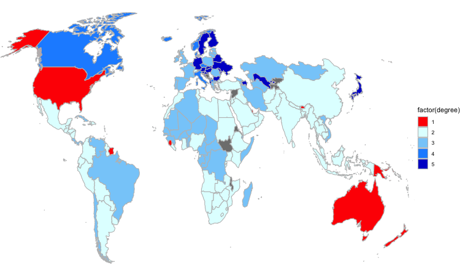

## 產製圖表動畫

https://gist.github.com/rafapereirabr/0d68f7ccfc3af1680c4c8353cf9ab345


R也有套工具可以產製圖表動畫，概念上就是沿著一條資料維度，把多張圖給疊在一起變成一個gif動畫。本例子即是把產假之薪的範例沿著時間軸做動畫。每個時間點都是當年各國產假支薪給付程度的地圖，但由於有19年的資料，所以可以把年代當成動畫的時間軸。

以下是清理資料的步驟，會彙整出國名、國家代碼（ISO3）、年、和給付等級四個變項。預期利用國名、國家代碼和給付等級就可以畫出每年的圖。然後將年作為動畫的時間軸，便可產生地圖動畫。


```r
pml <- read_excel("data/WORLD-MACHE_Gender_6.8.15.xls", "Sheet1", col_names=T) %>%
	select(country, iso3, contains("matleave"), -contains("wrr")) %>%
	gather("year", "degree", 3:21) %>%
	replace_na(list(degree=0)) %>%
	mutate(year2=as.POSIXct(strptime(year, "matleave_%y"))) %>%
	mutate(year3 = strftime(year2, "%Y")) %>%
    select(country, ISO3=iso3, year=year3, degree)
```


### 地圖下載與轉換投影方法

此為下載地圖並處理地圖成為可以用`geom_polygom()`繪圖的多邊形資料點。


```r
library(rworldmap)
wmap <- getMap(resolution="low")
wmap <- spTransform(wmap, CRS("+proj=robin")) # reproject
wmap <- fortify(wmap)
wmap %>%
    filter(!duplicated(id)) %>% head(10)
```

```{.output}
##          long      lat order  hole piece                   id
## 1  -6558139.1  1331766     1 FALSE     1                Aruba
## 2   6607120.5  3981588     1 FALSE     1          Afghanistan
## 3   1338236.2  -628452     1 FALSE     1               Angola
## 4  -5863722.7  1948852     1 FALSE     1             Anguilla
## 5   1723246.7  4546404     1 FALSE     1              Albania
## 6   1503172.1  6370384     1 FALSE     1                Aland
## 7    146562.7  4541753     1 FALSE     1              Andorra
## 8   5157180.1  2742768     1 FALSE     1 United Arab Emirates
## 9  -6080937.4 -2363597     1 FALSE     1            Argentina
## 10  3901101.2  4403251     1 FALSE     1              Armenia
##                     group
## 1                 Aruba.1
## 2           Afghanistan.1
## 3                Angola.1
## 4              Anguilla.1
## 5               Albania.1
## 6                 Aland.1
## 7               Andorra.1
## 8  United Arab Emirates.1
## 9             Argentina.1
## 10              Armenia.1
```


```r
pml_map <- wmap %>%
    left_join(pml, by=c("id"="country")) %>%
    filter(!is.na(ISO3)) %>%
    mutate(year = as.integer(year))

# devtools::install_github("thomasp85/transformr")

pml_map %>%
    select(id) %>%
    filter(!duplicated(.)) %>% head(10)
```

```{.output}
##                      id
## 1           Afghanistan
## 2                Angola
## 3               Albania
## 4               Andorra
## 5  United Arab Emirates
## 6             Argentina
## 7               Armenia
## 8   Antigua and Barbuda
## 9             Australia
## 10              Austria
```

### 靜態繪圖測試


```r
pml_map %>%
    filter(year==1995) %>%
    ggplot() + 
    aes(x = long, y = lat, 
                     group=group, fill=factor(degree)) + 
    geom_polygon(color="grey") +
    theme_void() + 
    scale_fill_manual(values=c("1"="red",
                               "2"="LightCyan",
                               "3"="lightskyblue",
                               "4"="DodgerBlue",
                               "5"="MediumBlue")) + 
    coord_cartesian(xlim = c(-11807982, 14807978))
```


在採用gganimate繪圖時，僅需要多加一個動畫繪圖函式`+ transition_time(year)`即可，其他繪圖部分並無修改。最後才用`animate()`函式把這整個繪圖指令轉製為動畫，包含指定`fps`（frame per second）和長寬等參數。


```r
library(gganimate)
pml.ani <- pml_map %>%
    ggplot() + 
    aes(x = long, y = lat, 
        group=group, fill=factor(degree)) + 
    geom_polygon(color="grey") +
    theme_void() + 
    scale_fill_manual(values=c("1"="red",
                               "2"="LightCyan",
                               "3"="lightskyblue",
                               "4"="DodgerBlue",
                               "5"="MediumBlue")) + 
    coord_cartesian(xlim = c(-11807982, 14807978)) + 
    transition_time(year)
# + 
#     ease_aes("linear") +
#     enter_fade() +
#     exit_fade()

animate(pml.ani, fps = 10, end_pause = 30, width = 750, height = 450, renderer = gifski_renderer())
```


```r
anim_save("jour5014/pml2.gif", animation = last_animation())
```


```r

```


