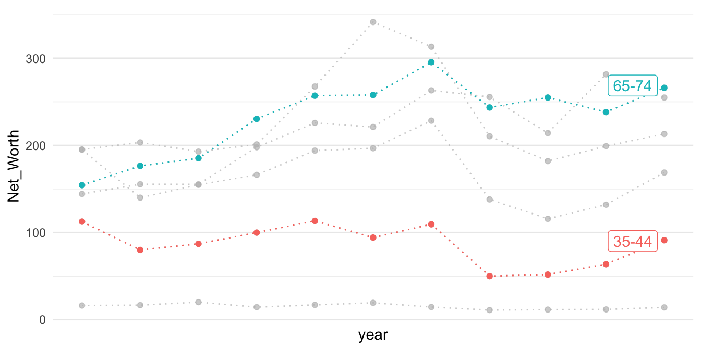
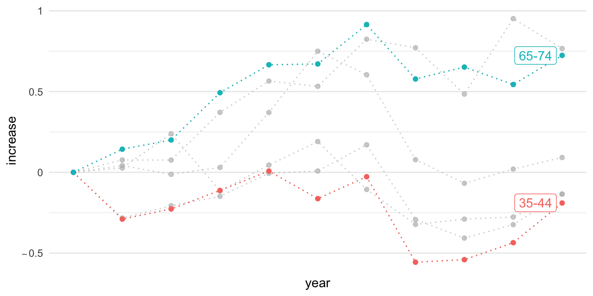

# Inequality: Net Worth by Age Group

::: notes
**LEARNING NOTES**

座標軸從數值到增加值
:::

這個教學案例來自紐約時報的「What's going on in this gragh」系列資料視覺化教學之[Teach About Inequality With These 28 New York Times Graphs - The New York Times (nytimes.com)](https://www.nytimes.com/2021/05/11/learning/lesson-plans/teach-about-inequality-with-these-28-new-york-times-graphs.html) 。該圖表呈現在不同年代、不同年齡層的人所擁有的淨資產（包含土地、存款、投資等減去債務）。該圖表的結果指出，在不同年代的老年人是越來越有錢，但年輕人卻越來越窮（該曲線為減去1989年

淨資產（Net worth）是一個財務術語，指的是一個人或機構的總資產減去總負債後剩餘的價值。換言之，Net worth是一個人或機構在財務上的價值或實力。如果一個人或機構的總資產超過了總負債，那麼其net worth為正值，反之則為負值。在個人財務上，Net worth通常用來評估一個人的財務健康狀況。一個人的Net worth越高，通常代表其擁有更多的財富和投資，並能夠更好地應對突發事件和生活變數。因此，許多投資者和財務顧問都會建議人們注重提高自己的net worth。

[](https://www.nytimes.com/2021/05/11/learning/lesson-plans/teach-about-inequality-with-these-28-new-york-times-graphs.html)

Sorted by `arrange()` function.


```r
p1 <- read_csv("data/interactive_bulletin_charts_agecl_median.csv") %>%
    select(year, Category, Net_Worth) %>%
    group_by(Category) %>%
    arrange(year) %>%
    ungroup()
p1 %>% filter(year <= 1992) %>% knitr::kable()
```


| year|Category     | Net_Worth|
|----:|:------------|---------:|
| 1989|Less than 35 |  16.17019|
| 1989|35-44        | 112.47530|
| 1989|45-54        | 195.11630|
| 1989|55-64        | 195.25554|
| 1989|65-74        | 154.34277|
| 1989|75 or older  | 144.29855|
| 1992|Less than 35 |  16.60780|
| 1992|35-44        |  79.91050|
| 1992|45-54        | 139.97745|
| 1992|55-64        | 203.44104|
| 1992|65-74        | 176.44667|
| 1992|75 or older  | 155.35173|


```r
library(gghighlight)
p1 %>% ggplot() + aes(year, Net_Worth, color = Category) + 
    geom_line(linetype="dotted") + 
    geom_point() + 
    gghighlight(Category %in% c("65-74", "35-44")) + 
    theme_minimal() + 
    scale_x_continuous(breaks = NULL) + 
    theme(panel.background = element_rect(fill = "white",
                                colour = "white",
                                size = 0.5, linetype = "solid"))
```




```r
p2 <- read_csv("data/interactive_bulletin_charts_agecl_median.csv") %>%
    select(year, Category, NW = Net_Worth)  %>%
    group_by(Category) %>%
    arrange(year) %>%
    mutate(increase = (NW-first(NW))/first(NW)) %>%
    ungroup()
p2 %>% filter(year <= 1992) %>% knitr::kable()
```


| year|Category     |        NW|   increase|
|----:|:------------|---------:|----------:|
| 1989|Less than 35 |  16.17019|  0.0000000|
| 1989|35-44        | 112.47530|  0.0000000|
| 1989|45-54        | 195.11630|  0.0000000|
| 1989|55-64        | 195.25554|  0.0000000|
| 1989|65-74        | 154.34277|  0.0000000|
| 1989|75 or older  | 144.29855|  0.0000000|
| 1992|Less than 35 |  16.60780|  0.0270627|
| 1992|35-44        |  79.91050| -0.2895285|
| 1992|45-54        | 139.97745| -0.2825948|
| 1992|55-64        | 203.44104|  0.0419220|
| 1992|65-74        | 176.44667|  0.1432131|
| 1992|75 or older  | 155.35173|  0.0765994|


```r
p2 %>% ggplot() + aes(year, increase, color = Category) + 
    geom_line(linetype="dotted") + 
    geom_point() + 
    gghighlight(Category %in% c("65-74", "35-44")) + 
    theme_minimal() + 
    scale_y_continuous(labels=scales::parse_format()) + 
    scale_x_continuous(breaks = NULL) + 
    theme(panel.background = element_rect(fill = "white",
                                colour = "white",
                                size = 0.5, linetype = "solid"))
```


