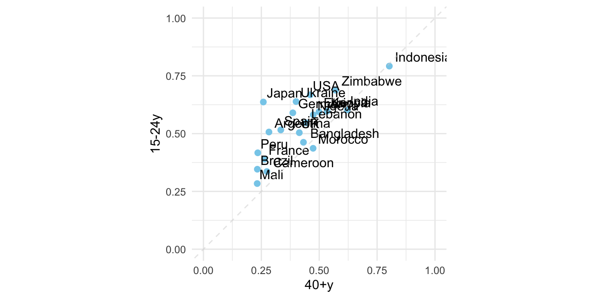

# Optimism Survey by Countries

這個練習為紐約時報的一則報導「[Where Are Young People Most Optimistic? In Poorer Nations. - The New York Times (nytimes.com)](https://www.nytimes.com/2021/11/17/upshot/global-survey-optimism.html%20https://changingchildhood.unicef.org/about)」。該報導乃根據一項涵蓋 21 個國家的大型調查，這項調查比較了不同國家和年齡層（年輕人對成年人）對於下一代的生活是否會比現在更好的看法。該調查還比較了不同國家（富裕與貧窮）和年齡層（年輕人對成年人）對於當今兒童在基本方面的狀況，以及對於社會和環境問題的看法。此外，調查還比較了不同國家和年齡層對於現代科技對年輕人生活的影響看法，以及對於焦慮和壓力等方面的看法。

聯合國兒童基金會與 Gallup 共同進行了這項調查，該調查共有 21,000 名受訪者，分為兩個年齡組別------15 至 24 歲和 40 歲以上，並包括來自世界各地的代表性樣本。年輕組表示，當今兒童在教育、醫療保健和身體安全等基本方面都比他們的父母更好。在中位數國家中，有 57％ 的年輕人表示，隨著每一代的到來，世界正在變得越來越美好，而這一比例在老年人中僅有 39％。然而，在富裕國家，56％ 的年輕人和 64％ 的老年人表示，當今兒童在經濟方面將比他們的父母更加困難------這種觀點與近年來許多人的經濟現實相符。

視覺化的重點是等比例之座標軸的運用


```r
plot.opt <- read_csv("data/unicef-changing-childhood-data.csv") %>% 
    select(country = WP5, age = WP22140, bw = WP22092) %>%
    mutate(country = ordered(country, 
                             levels=c(1, 3, 4, 10, 11, 12, 
                                      13, 14, 17, 29, 31, 
                                      33, 35, 36, 60, 61, 
                                      77, 79, 81, 87, 165), 
                             labels=c("USA", "Morocco", "Lebanon", 
                                      "Indonesia", "Bangladesh", 
                                      "UK", "France", "Germany",
                                      "Spain", "Japan", "India", 
                                      "Brazil", "Nigeria", "Kenya", 
                                      "Ethiopia", "Mali", "Ukraine",
                                      "Cameroon", "Zimbabwe",
                                      "Argentina", "Peru"))) %>%
    count(country, age, bw) %>%
    group_by(country, age) %>%
    mutate(perc = n/sum(n)) %>% 
    ungroup() %>%
    filter(bw == 1) %>%
    select(country, age, perc) %>%
    spread(age, perc) %>%
    rename(`15-24y` = `1`, `40+y` = `2`)

plot.opt %>% head(10) %>% knitr::kable()
```


|country    |    15-24y|      40+y|
|:----------|---------:|---------:|
|USA        | 0.6679842| 0.4611465|
|Morocco    | 0.4365079| 0.4735812|
|Lebanon    | 0.5467197| 0.4435798|
|Indonesia  | 0.7920605| 0.8027344|
|Bangladesh | 0.4624506| 0.4319527|
|UK         | 0.5040000| 0.4140000|
|France     | 0.3900000| 0.2640000|
|Germany    | 0.5900000| 0.3860000|
|Spain      | 0.5160000| 0.3340000|
|Japan      | 0.6367265| 0.2586873|


```r
plot.opt %>%
    ggplot() + aes(`40+y`, `15-24y`, label = country) + 
    geom_point(color = "skyblue", size = 2) + 
    xlim(0, 1) + ylim(0,1) + 
    geom_text(hjust = -0.1, vjust = -0.5) + 
    geom_abline(intercept = 0, slop = 1, 
                color="lightgrey", alpha=0.5, linetype="dashed") + 
    theme_minimal() + 
    theme(aspect.ratio=1)
```


