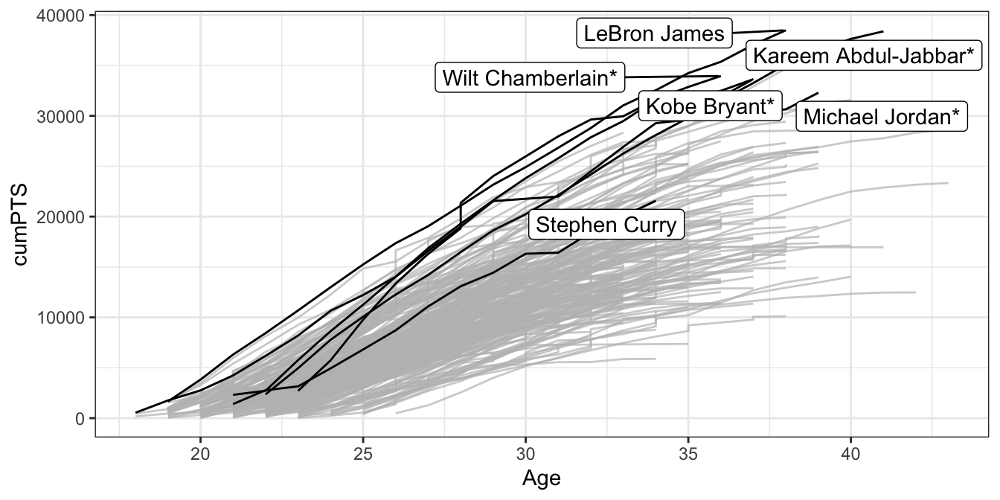
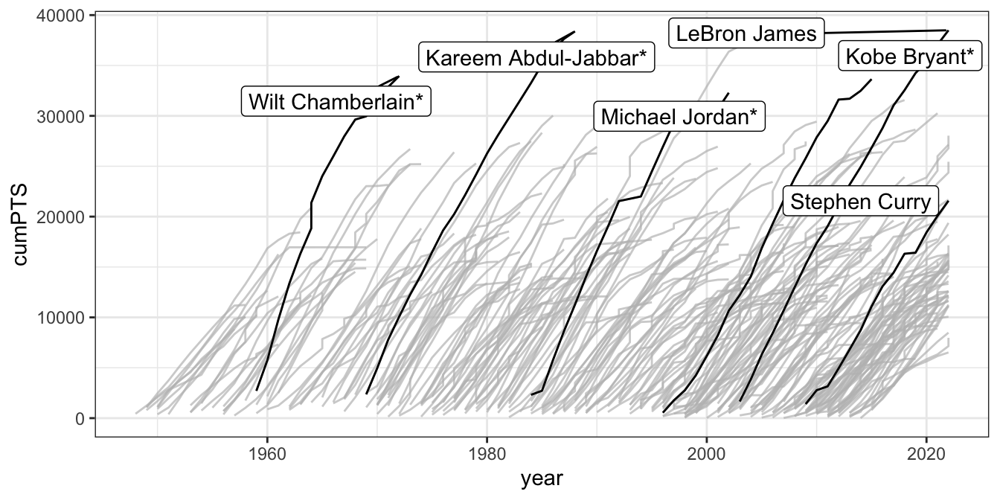
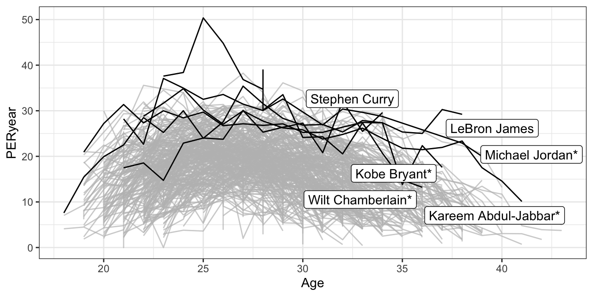
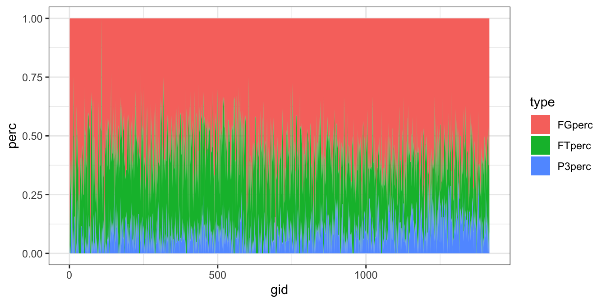
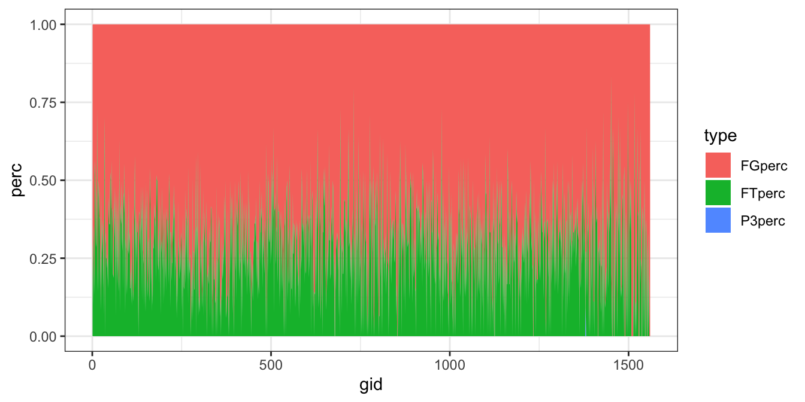

# LeBron James

這篇新聞「[How LeBron James Scored a Record-Breaking 38,390 Points - The New York Times (nytimes.com)](https://www.nytimes.com/interactive/2023/02/07/sports/basketball/lebron-james-kareem-abdul-jabbar-points.html)」主要在報導 LeBron James 打破 Kareem Abdul-Jabbar 在 NBA 生涯得分紀錄的消息。Abdul-Jabbar 在 1984 年創下了這項紀錄，當時他還在效力洛杉磯湖人隊和密爾瓦基公鹿隊。他在 1989 年退役，總得分為 38,387 分。而 James 今年 38 歲，卻已經打破了 Abdul-Jabbar 的紀錄，他本季平均每場比賽可以得到 30.2 分，得分總計為 38,390 分。文章提到，Abdul-Jabbar 和 James 的籃球時代有很大的差異，規則、戰術和球場的尺寸都不同，但他們都有耐力、創意和天賦。在得分方式上，James 更多地依賴 3 分球，而 Abdul-Jabbar 則更擅長灌籃或上籃。

可以參看本書的爬蟲章節了解如何爬取NBA的球員紀錄，是相當好的爬蟲練習。


```r
load("data/nba_players.rda")
```

## Line: Age x cumPTS


```r
library(gghighlight)

selected_players <- c("Michael Jordan*", "LeBron James", "Kobe Bryant*",
                      "Wilt Chamberlain*", "Kareem Abdul-Jabbar*", "Stephen Curry")

top250 %>%
    ggplot() + 
    aes(Age, cumPTS, group=Player) +
    geom_line() +
    gghighlight(Player %in% selected_players) +
    theme_bw() + 
    theme(legend.position = "none")
```



## Line: year x cumPTS


```r
top250 %>%
    ggplot() + 
    aes(year, cumPTS, group=Player) +
    geom_line() +
    gghighlight(Player %in% selected_players) +
    theme_bw() + 
    theme(legend.position = "none")
```



## Line: Age x PER_by_year


```r
top250 %>%
    ggplot() + 
    aes(Age, PERyear, group=Player) +
    geom_line() +
    gghighlight(Player %in% selected_players) +
    theme_bw() + 
    theme(legend.position = "none")
```



### Comparing LeBron James and Jabbar


```r
# plink <- "https://www.basketball-reference.com/players/j/jamesle01.html"
plink <- "https://www.basketball-reference.com/players/a/abdulka01.html"
loglinks <- read_html(plink) %>% 
    html_node("#totals") %>%
    html_nodes("tr th a") %>%
    html_attr("href") %>%
    paste0(url.base, .)


logtable <- tibble()

for(link in loglinks){
    table <- read_html(link) %>%
        html_node("#pgl_basic") %>%
        html_table()
    logtable <- bind_rows(logtable, table)
    message(nrow(logtable), link)
}

jabbar.log <- logtable %>%
    select(Rk, G, Date, FG, `3P`, FT, PTS) %>%
    mutate(Rk = as.numeric(Rk),
           FG = as.numeric(FG),
           `3P` = as.numeric(`3P`),
           FT = as.numeric(FT),
           PTS = as.numeric(PTS)) %>%
    filter(!is.na(PTS)) %>%
    replace(is.na(.), 0) %>%
    mutate(try = FG + `3P` + FT) %>%
    mutate(FGperc = FG/try, 
           P3perc = `3P`/try,
           FTperc = FT/try) %>%
    mutate(gid = row_number())
```

### VIS LJames and jabbar


```r
james.log %>%
    pivot_longer(names_to = "type", 
                 cols = c("FGperc", "P3perc", "FTperc"), 
                 values_to = "perc") %>%
    ggplot() + 
    aes(gid, perc, fill = type) +
    geom_area() + 
    theme_bw()
```



```r
jabbar.log %>%
    pivot_longer(names_to = "type", 
                 cols = c("FGperc", "P3perc", "FTperc"), 
                 values_to = "perc") %>%
    ggplot() + 
    aes(gid, perc, fill = type) +
    geom_area() + 
    theme_bw()
```



### 3-points to 2-point


```r
top250 %>%
    group_by(Player) %>%
    summarize(FGsum = sum(FG),
              FTsum = sum(FT),
              P3sum = sum(`3P`)) %>%
    ungroup() %>%
    replace(is.na(.), 0) %>%
    mutate(trials = FGsum + FTsum + P3sum) %>%
    mutate(FGperc = FGsum/trials,
           FTperc = FTsum/trials,
           P3perc = P3sum/trials) %>%
    ggplot() + 
    aes(FGperc, P3perc) + 
    geom_point() + 
    geom_text(aes(label = Player), hjust = -0.1) + 
    gghighlight(Player %in% selected_players) + 
    theme_bw() + 
    theme(aspect.ratio = 2/3)
```


