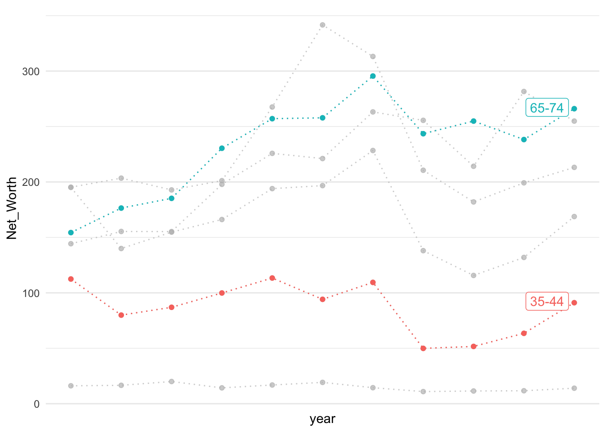
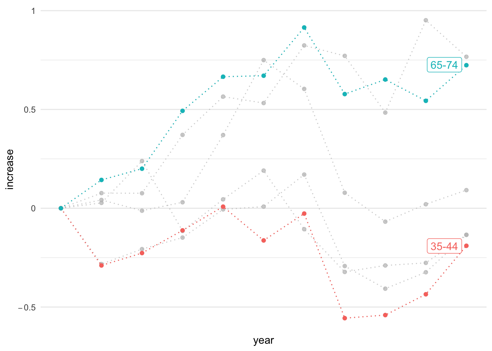
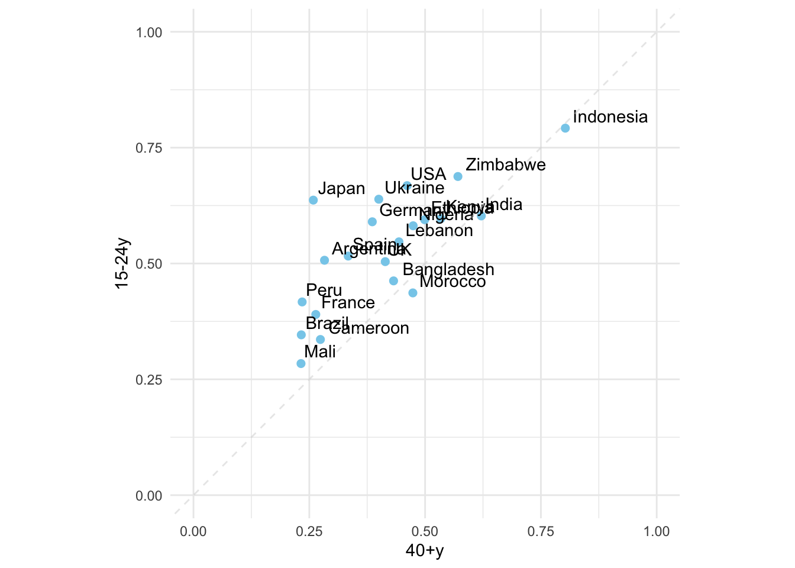
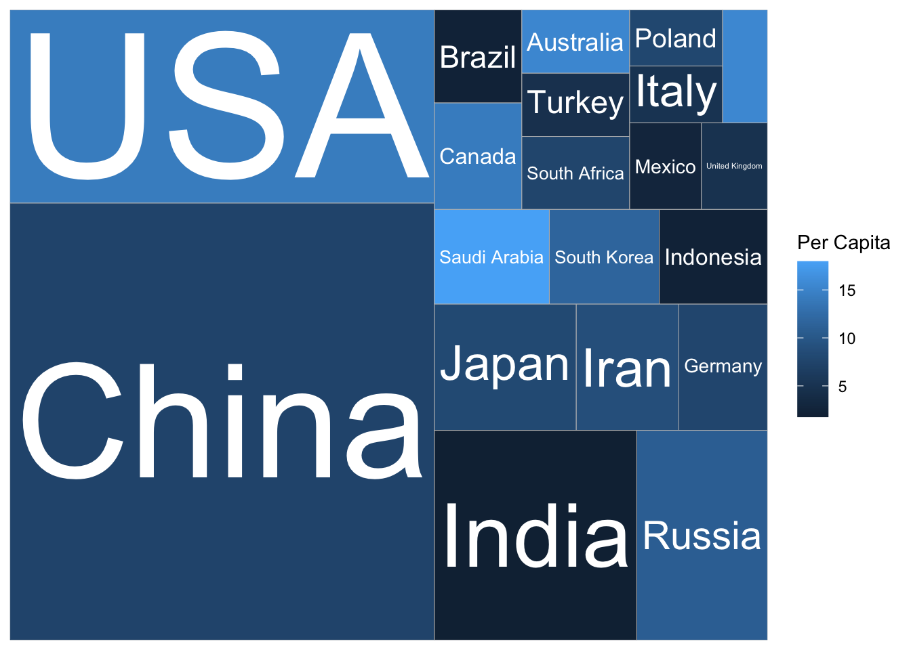
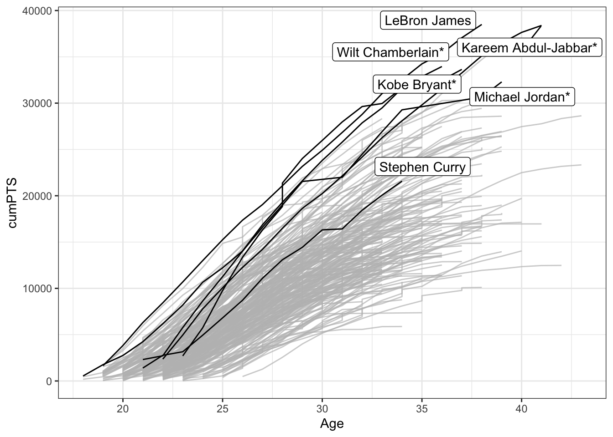
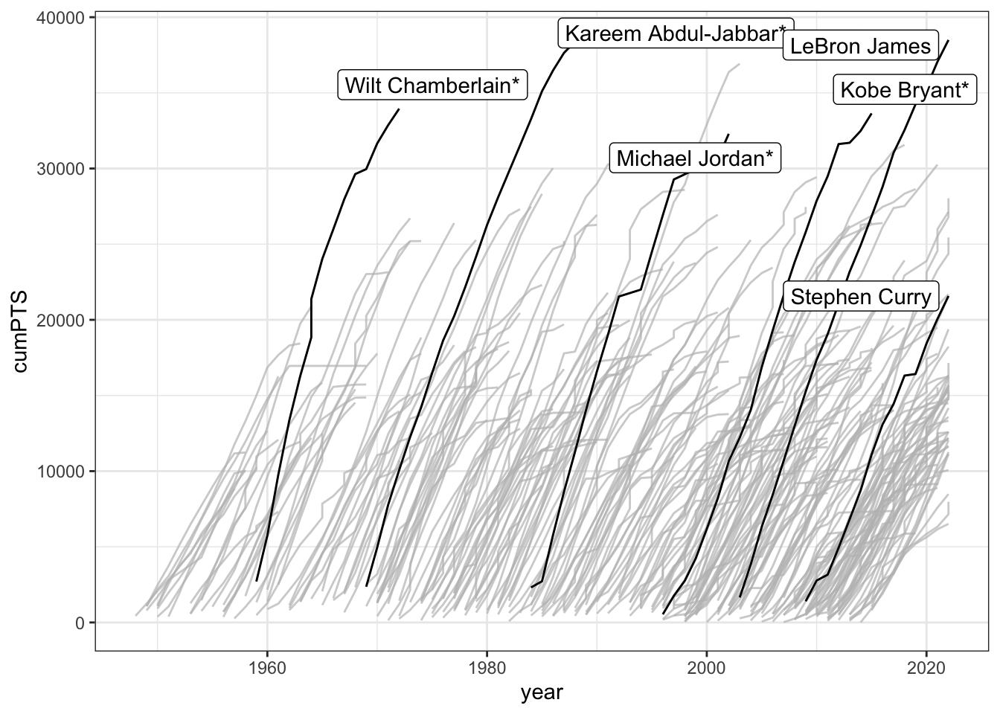
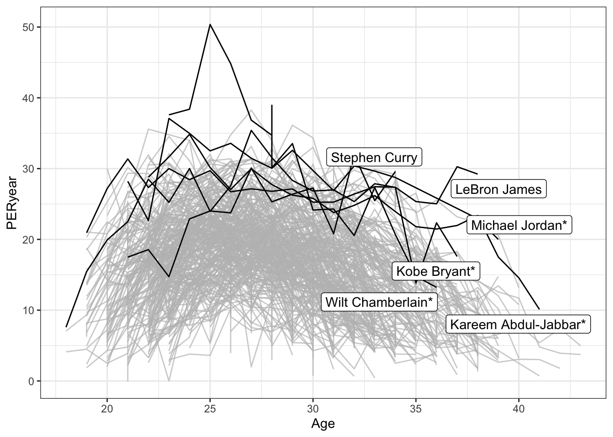
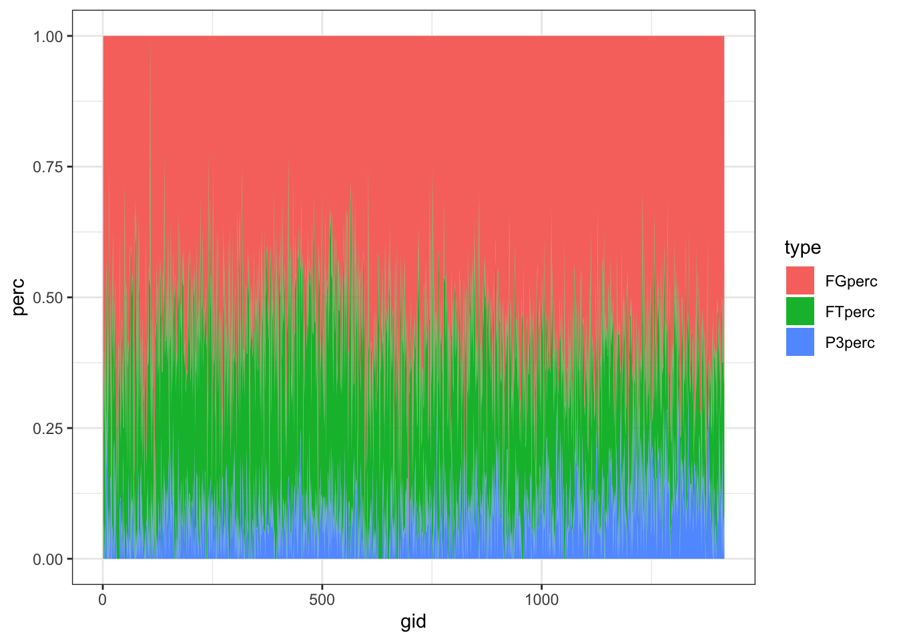
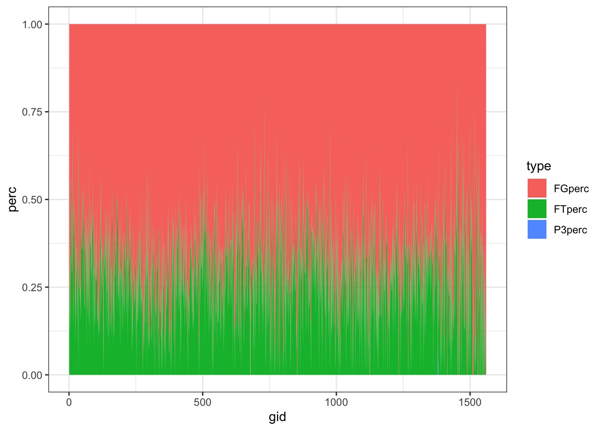
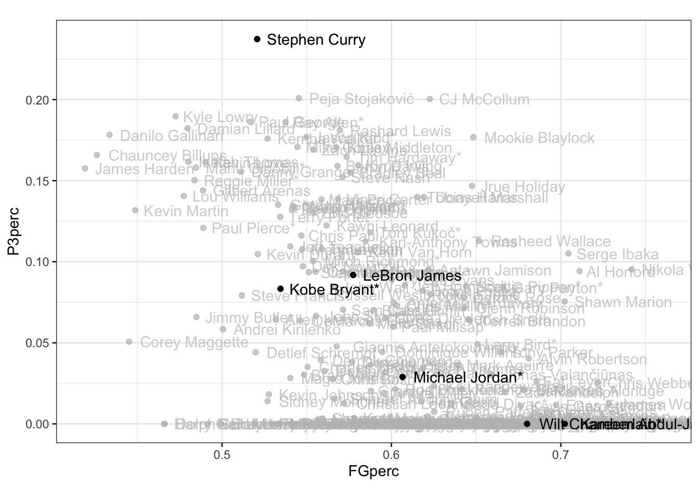

# WGOITG of NyTimes {#wgoitg}


紐約時報提供的what's going on in the graph 系列教學旨在幫助讀者更好地理解和解讀圖表，特別是在時事和政治等敏感領域中的圖表。這些教學以實際的新聞圖表為例，介紹了如何分析和評估圖表的質量、有效性和可靠性，並提供了一些技巧和策略，幫助讀者從圖表中獲取準確和全面的資訊。

具體來說，what's going on in the graph系列教學的目的包括以下幾點：

-   提高讀者對圖表的識讀能力和分析能力，讓讀者能夠更加自信和準確地理解和評估圖表。
-   幫助讀者識別和處理常見的資訊偏差和誤導，如選擇性展示數據、扭曲比例、誤導標籤等。
-   強調圖表應該為讀者服務，而不是為了強調某個立場或觀點而有意歪曲事實。
-   提供了一些有效的技巧和策略，如注意圖表的標題、軸標籤和單位、比較數據的趨勢和範圍、理解圖表的背景和上下文等。


```r
library(tidyverse)
library(gghighlight)
```

## Population Increase

紐時這篇報導「[When Did the Anthropocene Start? Scientists Closer to Saying When. - The New York Times (nytimes.com)](https://www.nytimes.com/2022/12/17/climate/anthropocene-age-geology.html)」討論了人類活動對地球所產生的深遠影響，並探討人類是否已經進入了一個新的地質時期，被稱為「人新世」。報導指出，人類的經濟活動、能源消耗和人口增長是人新世的主要因素，並且這些因素已經在地球上留下了不可磨滅的痕跡。報導也提到，地質學家已經發現了人新世的證據，包括核爆炸中的鈽同位素、肥料中的氮和發電廠的灰燼等。然而，報導也問道，人新世是否真的已經開始，以及它的開始點是否應該是農業革命、工業革命、核彈（77年前）或其他發展。


However, Package *tabulizer* cannot be installed in the current version of R.


```r
library(tidyverse)
library(tabulizer)
# Extract the table

tables <- extract_tables('data/world_population_change.pdf', pages = 1)

# Extract the first element of the variable
df <- as.data.frame(tables[[1]])

df %>%
   select(1, 2) %>%
   slice(-c(1:4)) %>%
   rename(years_to_2020 = V1, population = V2)
   # select(years_to_2020 = v1, population = v2)
   # mutate(years_to_2020 = v1, population = v2)

toplot <- df %>%
   mutate(years_to_2020 = map(years_to_2020, ~(str_remove(., ",")))) %>%
   mutate(years_to_2020 = as.numeric(years_to_2020),
           population = as.numeric(population))

toplot %>%
    ggplot() + 
    aes(x=years_to_2020, y=population) + 
    # aes(x=-log10(years_to_2020), y=log10(population)) + 
    # geom_col()
    geom_point() + 
    scale_x_log10() + scale_y_log10() + 
    scale_x_reverse() + 
    theme_bw()
```

## Inequality: Net Worth by Age Group

::: notes
**LEARNING NOTES**

座標軸從數值到增加值
:::

這個教學案例來自紐約時報的「What's going on in this gragh」系列資料視覺化教學之[Teach About Inequality With These 28 New York Times Graphs - The New York Times (nytimes.com)](https://www.nytimes.com/2021/05/11/learning/lesson-plans/teach-about-inequality-with-these-28-new-york-times-graphs.html) 。該圖表呈現在不同年代、不同年齡層的人所擁有的淨資產（包含土地、存款、投資等減去債務）。該圖表的結果指出，在不同年代的老年人是越來越有錢，但年輕人卻越來越窮（該曲線為減去1989年

淨資產（Net worth）是一個財務術語，指的是一個人或機構的總資產減去總負債後剩餘的價值。換言之，Net worth是一個人或機構在財務上的價值或實力。如果一個人或機構的總資產超過了總負債，那麼其net worth為正值，反之則為負值。在個人財務上，Net worth通常用來評估一個人的財務健康狀況。一個人的Net worth越高，通常代表其擁有更多的財富和投資，並能夠更好地應對突發事件和生活變數。因此，許多投資者和財務顧問都會建議人們注重提高自己的net worth。

[](https://www.nytimes.com/2021/05/11/learning/lesson-plans/teach-about-inequality-with-these-28-new-york-times-graphs.html)

Sorted by `arrange()` function.


```r
p1 <- read_csv("data/interactive_bulletin_charts_agecl_median.csv") %>%
    select(year, Category, Net_Worth) %>%
    group_by(Category) %>%
    arrange(year) %>%
    ungroup()
p1 %>% filter(year <= 1992) %>% knitr::kable()
```


| year|Category     | Net_Worth|
|----:|:------------|---------:|
| 1989|Less than 35 |  16.17019|
| 1989|35-44        | 112.47530|
| 1989|45-54        | 195.11630|
| 1989|55-64        | 195.25554|
| 1989|65-74        | 154.34277|
| 1989|75 or older  | 144.29855|
| 1992|Less than 35 |  16.60780|
| 1992|35-44        |  79.91050|
| 1992|45-54        | 139.97745|
| 1992|55-64        | 203.44104|
| 1992|65-74        | 176.44667|
| 1992|75 or older  | 155.35173|


```r
library(gghighlight)
p1 %>% ggplot() + aes(year, Net_Worth, color = Category) + 
    geom_line(linetype="dotted") + 
    geom_point() + 
    gghighlight(Category %in% c("65-74", "35-44")) + 
    theme_minimal() + 
    scale_x_continuous(breaks = NULL) + 
    theme(panel.background = element_rect(fill = "white",
                                colour = "white",
                                size = 0.5, linetype = "solid"))
```




```r
p2 <- read_csv("data/interactive_bulletin_charts_agecl_median.csv") %>%
    select(year, Category, NW = Net_Worth)  %>%
    group_by(Category) %>%
    arrange(year) %>%
    mutate(increase = (NW-first(NW))/first(NW)) %>%
    ungroup()
p2 %>% filter(year <= 1992) %>% knitr::kable()
```


| year|Category     |        NW|   increase|
|----:|:------------|---------:|----------:|
| 1989|Less than 35 |  16.17019|  0.0000000|
| 1989|35-44        | 112.47530|  0.0000000|
| 1989|45-54        | 195.11630|  0.0000000|
| 1989|55-64        | 195.25554|  0.0000000|
| 1989|65-74        | 154.34277|  0.0000000|
| 1989|75 or older  | 144.29855|  0.0000000|
| 1992|Less than 35 |  16.60780|  0.0270627|
| 1992|35-44        |  79.91050| -0.2895285|
| 1992|45-54        | 139.97745| -0.2825948|
| 1992|55-64        | 203.44104|  0.0419220|
| 1992|65-74        | 176.44667|  0.1432131|
| 1992|75 or older  | 155.35173|  0.0765994|


```r
p2 %>% ggplot() + aes(year, increase, color = Category) + 
    geom_line(linetype="dotted") + 
    geom_point() + 
    gghighlight(Category %in% c("65-74", "35-44")) + 
    theme_minimal() + 
    scale_y_continuous(labels=scales::parse_format()) + 
    scale_x_continuous(breaks = NULL) + 
    theme(panel.background = element_rect(fill = "white",
                                colour = "white",
                                size = 0.5, linetype = "solid"))
```



## Global Survey Optimism

這個練習為紐約時報的一則報導「[Where Are Young People Most Optimistic? In Poorer Nations. - The New York Times (nytimes.com)](https://www.nytimes.com/2021/11/17/upshot/global-survey-optimism.html%20https://changingchildhood.unicef.org/about)」。該報導乃根據一項涵蓋 21 個國家的大型調查，這項調查比較了不同國家和年齡層（年輕人對成年人）對於下一代的生活是否會比現在更好的看法。該調查還比較了不同國家（富裕與貧窮）和年齡層（年輕人對成年人）對於當今兒童在基本方面的狀況，以及對於社會和環境問題的看法。此外，調查還比較了不同國家和年齡層對於現代科技對年輕人生活的影響看法，以及對於焦慮和壓力等方面的看法。

聯合國兒童基金會與 Gallup 共同進行了這項調查，該調查共有 21,000 名受訪者，分為兩個年齡組別------15 至 24 歲和 40 歲以上，並包括來自世界各地的代表性樣本。年輕組表示，當今兒童在教育、醫療保健和身體安全等基本方面都比他們的父母更好。在中位數國家中，有 57％ 的年輕人表示，隨著每一代的到來，世界正在變得越來越美好，而這一比例在老年人中僅有 39％。然而，在富裕國家，56％ 的年輕人和 64％ 的老年人表示，當今兒童在經濟方面將比他們的父母更加困難------這種觀點與近年來許多人的經濟現實相符。

視覺化的重點是等比例之座標軸的運用


```r
plot.opt <- read_csv("data/unicef-changing-childhood-data.csv") %>% 
    select(country = WP5, age = WP22140, bw = WP22092) %>%
    mutate(country = ordered(country, 
                             levels=c(1, 3, 4, 10, 11, 12, 
                                      13, 14, 17, 29, 31, 
                                      33, 35, 36, 60, 61, 
                                      77, 79, 81, 87, 165), 
                             labels=c("USA", "Morocco", "Lebanon", 
                                      "Indonesia", "Bangladesh", 
                                      "UK", "France", "Germany",
                                      "Spain", "Japan", "India", 
                                      "Brazil", "Nigeria", "Kenya", 
                                      "Ethiopia", "Mali", "Ukraine",
                                      "Cameroon", "Zimbabwe",
                                      "Argentina", "Peru"))) %>%
    count(country, age, bw) %>%
    group_by(country, age) %>%
    mutate(perc = n/sum(n)) %>% 
    ungroup() %>%
    filter(bw == 1) %>%
    select(country, age, perc) %>%
    spread(age, perc) %>%
    rename(`15-24y` = `1`, `40+y` = `2`)

plot.opt %>% head(10) %>% knitr::kable()
```


|country    |    15-24y|      40+y|
|:----------|---------:|---------:|
|USA        | 0.6679842| 0.4611465|
|Morocco    | 0.4365079| 0.4735812|
|Lebanon    | 0.5467197| 0.4435798|
|Indonesia  | 0.7920605| 0.8027344|
|Bangladesh | 0.4624506| 0.4319527|
|UK         | 0.5040000| 0.4140000|
|France     | 0.3900000| 0.2640000|
|Germany    | 0.5900000| 0.3860000|
|Spain      | 0.5160000| 0.3340000|
|Japan      | 0.6367265| 0.2586873|


```r
plot.opt %>%
    ggplot() + aes(`40+y`, `15-24y`, label = country) + 
    geom_point(color = "skyblue", size = 2) + 
    xlim(0, 1) + ylim(0,1) + 
    geom_text(hjust = -0.1, vjust = -0.5) + 
    geom_abline(intercept = 0, slop = 1, 
                color="lightgrey", alpha=0.5, linetype="dashed") + 
    theme_minimal() + 
    theme(aspect.ratio=1)
```



## Global Carbon Projects

本節所採用的案例來自紐約時報的「[Who Has The Most Historical Responsibility for Climate Change? - The New York Times (nytimes.com)](https://www.nytimes.com/interactive/2021/11/12/climate/cop26-emissions-compensation.html?campaign_id=29&emc=edit_up_20211112&instance_id=45236&nl=the-upshot&regi_id=52022771&segment_id=74222&te=1&user_id=7cc6d9cd8f523e256ae41958ee8a9cb5)」。該報導指出，在聯合國氣候峰會上，最大的爭議之一是富國應該如何賠償負責全球變暖的突出排放國所造成的損害，以及以何種方式進行賠償。全球23個富裕的發達國家負責了一半的歷史二氧化碳排放量，而其他150多個國家負責了另一半。貧窮的、脆弱的國家要求富裕國家提供更多的資金來幫助其適應氣候變化所帶來的風險，例如海堤或早期洪水和乾旱的預警系統。對於這個問題，稱為"損失與損害"，富國歷來都反對建立一個特定的資金來進行賠償，擔心這可能會開啟賠償請求的洪水門。目前，只有蘇格蘭政府願意提供具體的金額，承諾為氣候災難的受害者提供270萬美元的賠償。

這個案例所採用的視覺化圖表為Treemap。二氧化碳排放是導致氣溫上升和其他氣候變化的主要貢獻因素之一。但是，哪些國家排放最多的碳？這些圖表清晰地顯示了23個最富有的國家（按地理和政治區域分組），佔排放量的50％，以及負責另外50％的150多個國家的排放量。


```r
totreemap <- read_csv("data/GCB2021v34_MtCO2_flat.csv") %>% 
    drop_na(`Total`) %>%
    filter(!Country %in% c("Global", "International Transport")) %>%
    filter(Year==2020) %>%
    arrange(desc(`Total`)) %>%
    mutate(perc = Total/sum(Total)) %>%
    slice(1:20)
library(treemapify)
totreemap %>%
    ggplot() + aes(area = perc, fill=`Per Capita`, label=Country) +
    geom_treemap() + 
    geom_treemap_text(color="white", 
                      place="centre", 
                      grow=TRUE
                      )
```



## LeBron James

這篇新聞「[How LeBron James Scored a Record-Breaking 38,390 Points - The New York Times (nytimes.com)](https://www.nytimes.com/interactive/2023/02/07/sports/basketball/lebron-james-kareem-abdul-jabbar-points.html)」主要在報導 LeBron James 打破 Kareem Abdul-Jabbar 在 NBA 生涯得分紀錄的消息。Abdul-Jabbar 在 1984 年創下了這項紀錄，當時他還在效力洛杉磯湖人隊和密爾瓦基公鹿隊。他在 1989 年退役，總得分為 38,387 分。而 James 今年 38 歲，卻已經打破了 Abdul-Jabbar 的紀錄，他本季平均每場比賽可以得到 30.2 分，得分總計為 38,390 分。文章提到，Abdul-Jabbar 和 James 的籃球時代有很大的差異，規則、戰術和球場的尺寸都不同，但他們都有耐力、創意和天賦。在得分方式上，James 更多地依賴 3 分球，而 Abdul-Jabbar 則更擅長灌籃或上籃。

可以參看本書的爬蟲章節了解如何爬取NBA的球員紀錄，是相當好的爬蟲練習。


```r
load("data/nba_players.rda")
```

### Line: Age x cumPTS


```r
library(gghighlight)

selected_players <- c("Michael Jordan*", "LeBron James", "Kobe Bryant*",
                      "Wilt Chamberlain*", "Kareem Abdul-Jabbar*", "Stephen Curry")

top250 %>%
    ggplot() + 
    aes(Age, cumPTS, group=Player) +
    geom_line() +
    gghighlight(Player %in% selected_players) +
    theme_bw() + 
    theme(legend.position = "none")
```



### Line: year x cumPTS


```r
top250 %>%
    ggplot() + 
    aes(year, cumPTS, group=Player) +
    geom_line() +
    gghighlight(Player %in% selected_players) +
    theme_bw() + 
    theme(legend.position = "none")
```



### Line: Age x PER_by_year


```r
top250 %>%
    ggplot() + 
    aes(Age, PERyear, group=Player) +
    geom_line() +
    gghighlight(Player %in% selected_players) +
    theme_bw() + 
    theme(legend.position = "none")
```



### Comparing LeBron James and Jabbar


```r
# plink <- "https://www.basketball-reference.com/players/j/jamesle01.html"
plink <- "https://www.basketball-reference.com/players/a/abdulka01.html"
loglinks <- read_html(plink) %>% 
    html_node("#totals") %>%
    html_nodes("tr th a") %>%
    html_attr("href") %>%
    paste0(url.base, .)


logtable <- tibble()

for(link in loglinks){
    table <- read_html(link) %>%
        html_node("#pgl_basic") %>%
        html_table()
    logtable <- bind_rows(logtable, table)
    message(nrow(logtable), link)
}

jabbar.log <- logtable %>%
    select(Rk, G, Date, FG, `3P`, FT, PTS) %>%
    mutate(Rk = as.numeric(Rk),
           FG = as.numeric(FG),
           `3P` = as.numeric(`3P`),
           FT = as.numeric(FT),
           PTS = as.numeric(PTS)) %>%
    filter(!is.na(PTS)) %>%
    replace(is.na(.), 0) %>%
    mutate(try = FG + `3P` + FT) %>%
    mutate(FGperc = FG/try, 
           P3perc = `3P`/try,
           FTperc = FT/try) %>%
    mutate(gid = row_number())
```

### VIS LJames and jabbar


```r
james.log %>%
    pivot_longer(names_to = "type", 
                 cols = c("FGperc", "P3perc", "FTperc"), 
                 values_to = "perc") %>%
    ggplot() + 
    aes(gid, perc, fill = type) +
    geom_area() + 
    theme_bw()
```



```r
jabbar.log %>%
    pivot_longer(names_to = "type", 
                 cols = c("FGperc", "P3perc", "FTperc"), 
                 values_to = "perc") %>%
    ggplot() + 
    aes(gid, perc, fill = type) +
    geom_area() + 
    theme_bw()
```



### 3-points to 2-point


```r
top250 %>%
    group_by(Player) %>%
    summarize(FGsum = sum(FG),
              FTsum = sum(FT),
              P3sum = sum(`3P`)) %>%
    ungroup() %>%
    replace(is.na(.), 0) %>%
    mutate(trials = FGsum + FTsum + P3sum) %>%
    mutate(FGperc = FGsum/trials,
           FTperc = FTsum/trials,
           P3perc = P3sum/trials) %>%
    ggplot() + 
    aes(FGperc, P3perc) + 
    geom_point() + 
    geom_text(aes(label = Player), hjust = -0.1) + 
    gghighlight(Player %in% selected_players) + 
    theme_bw() + 
    theme(aspect.ratio = 2/3)
```


