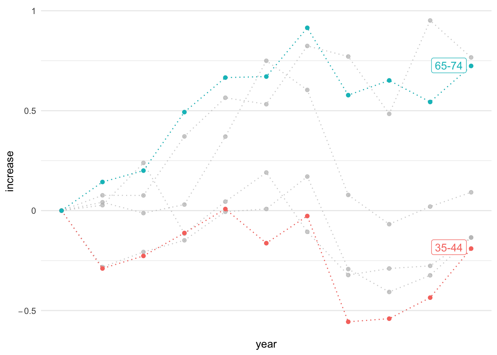
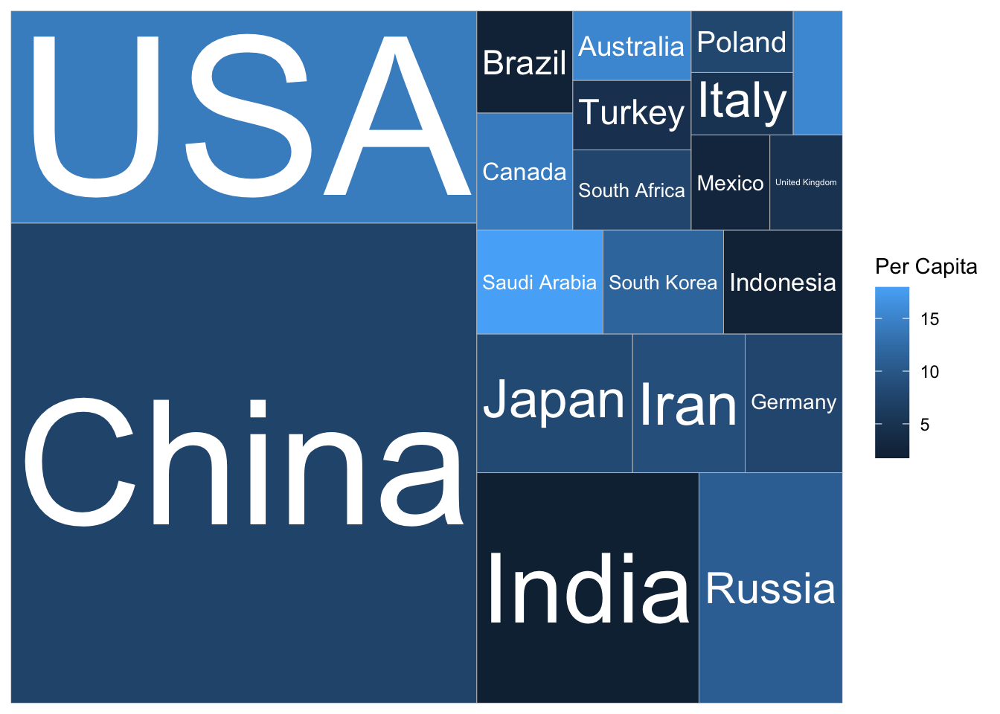

# WGOITG of NyTimes {#wgoitg}


```r
library(tidyverse)
library(gghighlight)
```

## Inequality: Net Worth by Age Group

::: notes
**LEARNING NOTES**

座標軸從數值到增加值
:::

這個教學案例來自紐約時報的「What's going on in this gragh」系列資料視覺化教學之[Teach About Inequality With These 28 New York Times Graphs - The New York Times (nytimes.com)](https://www.nytimes.com/2021/05/11/learning/lesson-plans/teach-about-inequality-with-these-28-new-york-times-graphs.html) 。該圖表呈現在不同年代、不同年齡層的人所擁有的淨資產（包含土地、存款、投資等減去債務）。該圖表的結果指出，在不同年代的老年人是越來越有錢，但年輕人卻越來越窮（該曲線為減去1989年

[](https://www.nytimes.com/2021/05/11/learning/lesson-plans/teach-about-inequality-with-these-28-new-york-times-graphs.html)

Sorted by `arrange()` function.


```r
p1 <- read_csv("data/interactive_bulletin_charts_agecl_median.csv") %>%
    select(year, Category, Net_Worth) %>%
    group_by(Category) %>%
    arrange(year) %>%
    ungroup()
p1 %>% filter(year <= 1992) %>% knitr::kable()
```


| year|Category     | Net_Worth|
|----:|:------------|---------:|
| 1989|Less than 35 |  16.17019|
| 1989|35-44        | 112.47530|
| 1989|45-54        | 195.11630|
| 1989|55-64        | 195.25554|
| 1989|65-74        | 154.34277|
| 1989|75 or older  | 144.29855|
| 1992|Less than 35 |  16.60780|
| 1992|35-44        |  79.91050|
| 1992|45-54        | 139.97745|
| 1992|55-64        | 203.44104|
| 1992|65-74        | 176.44667|
| 1992|75 or older  | 155.35173|


```r
library(gghighlight)
p1 %>% ggplot() + aes(year, Net_Worth, color = Category) + 
    geom_line(linetype="dotted") + 
    geom_point() + 
    gghighlight(Category %in% c("65-74", "35-44")) + 
    theme_minimal() + 
    scale_x_continuous(breaks = NULL) + 
    theme(panel.background = element_rect(fill = "white",
                                colour = "white",
                                size = 0.5, linetype = "solid"))
```


```r
p2 <- read_csv("data/interactive_bulletin_charts_agecl_median.csv") %>%
    select(year, Category, NW = Net_Worth)  %>%
    group_by(Category) %>%
    arrange(year) %>%
    mutate(increase = (NW-first(NW))/first(NW)) %>%
    ungroup()
p2 %>% filter(year <= 1992) %>% knitr::kable()
```


| year|Category     |        NW|   increase|
|----:|:------------|---------:|----------:|
| 1989|Less than 35 |  16.17019|  0.0000000|
| 1989|35-44        | 112.47530|  0.0000000|
| 1989|45-54        | 195.11630|  0.0000000|
| 1989|55-64        | 195.25554|  0.0000000|
| 1989|65-74        | 154.34277|  0.0000000|
| 1989|75 or older  | 144.29855|  0.0000000|
| 1992|Less than 35 |  16.60780|  0.0270627|
| 1992|35-44        |  79.91050| -0.2895285|
| 1992|45-54        | 139.97745| -0.2825948|
| 1992|55-64        | 203.44104|  0.0419220|
| 1992|65-74        | 176.44667|  0.1432131|
| 1992|75 or older  | 155.35173|  0.0765994|


```r
p2 %>% ggplot() + aes(year, increase, color = Category) + 
    geom_line(linetype="dotted") + 
    geom_point() + 
    gghighlight(Category %in% c("65-74", "35-44")) + 
    theme_minimal() + 
    scale_y_continuous(labels=scales::parse_format()) + 
    scale_x_continuous(breaks = NULL) + 
    theme(panel.background = element_rect(fill = "white",
                                colour = "white",
                                size = 0.5, linetype = "solid"))
```



## UNICEF-Global Survey Optimism

-   運用等比例之座標軸
-   <https://www.nytimes.com/2021/11/17/upshot/global-survey-optimism.html> <https://changingchildhood.unicef.org/about>


```r
plot.opt <- read_csv("data/unicef-changing-childhood-data.csv") %>% 
    select(country = WP5, age = WP22140, bw = WP22092) %>%
    mutate(country = ordered(country, 
                             levels=c(1, 3, 4, 10, 11, 12, 
                                      13, 14, 17, 29, 31, 
                                      33, 35, 36, 60, 61, 
                                      77, 79, 81, 87, 165), 
                             labels=c("USA", "Morocco", "Lebanon", 
                                      "Indonesia", "Bangladesh", 
                                      "UK", "France", "Germany",
                                      "Spain", "Japan", "India", 
                                      "Brazil", "Nigeria", "Kenya", 
                                      "Ethiopia", "Mali", "Ukraine",
                                      "Cameroon", "Zimbabwe",
                                      "Argentina", "Peru"))) %>%
    count(country, age, bw) %>%
    group_by(country, age) %>%
    mutate(perc = n/sum(n)) %>% 
    ungroup() %>%
    filter(bw == 1) %>%
    select(country, age, perc) %>%
    spread(age, perc) %>%
    rename(`15-24y` = `1`, `40+y` = `2`)

plot.opt %>% head(10) %>% knitr::kable()
```


|country    |    15-24y|      40+y|
|:----------|---------:|---------:|
|USA        | 0.6679842| 0.4611465|
|Morocco    | 0.4365079| 0.4735812|
|Lebanon    | 0.5467197| 0.4435798|
|Indonesia  | 0.7920605| 0.8027344|
|Bangladesh | 0.4624506| 0.4319527|
|UK         | 0.5040000| 0.4140000|
|France     | 0.3900000| 0.2640000|
|Germany    | 0.5900000| 0.3860000|
|Spain      | 0.5160000| 0.3340000|
|Japan      | 0.6367265| 0.2586873|


```r
plot.opt %>%
    ggplot() + aes(`40+y`, `15-24y`, label = country) + 
    geom_point(color = "skyblue", size = 2) + 
    xlim(0, 1) + ylim(0,1) + 
    geom_text(hjust = -0.1, vjust = -0.5) + 
    geom_abline(intercept = 0, slop = 1, 
                color="lightgrey", alpha=0.5, linetype="dashed") + 
    theme_minimal() + 
    theme(aspect.ratio=1)
```


## Global Carbon Projects

[Who Has The Most Historical Responsibility for Climate Change? - The New York Times (nytimes.com)](https://www.nytimes.com/interactive/2021/11/12/climate/cop26-emissions-compensation.html?campaign_id=29&emc=edit_up_20211112&instance_id=45236&nl=the-upshot&regi_id=52022771&segment_id=74222&te=1&user_id=7cc6d9cd8f523e256ae41958ee8a9cb5)


```r
totreemap <- read_csv("data/GCB2021v34_MtCO2_flat.csv") %>% 
    drop_na(`Total`) %>%
    filter(!Country %in% c("Global", "International Transport")) %>%
    filter(Year==2020) %>%
    arrange(desc(`Total`)) %>%
    mutate(perc = Total/sum(Total)) %>%
    slice(1:20)
library(treemapify)
totreemap %>%
    ggplot() + aes(area = perc, fill=`Per Capita`, label=Country) +
    geom_treemap() + 
    geom_treemap_text(color="white", 
                      place="centre", 
                      grow=TRUE
                      )
```


