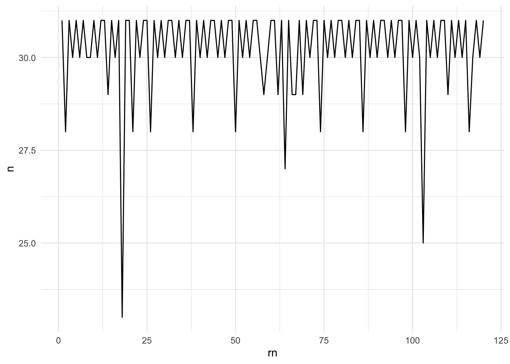
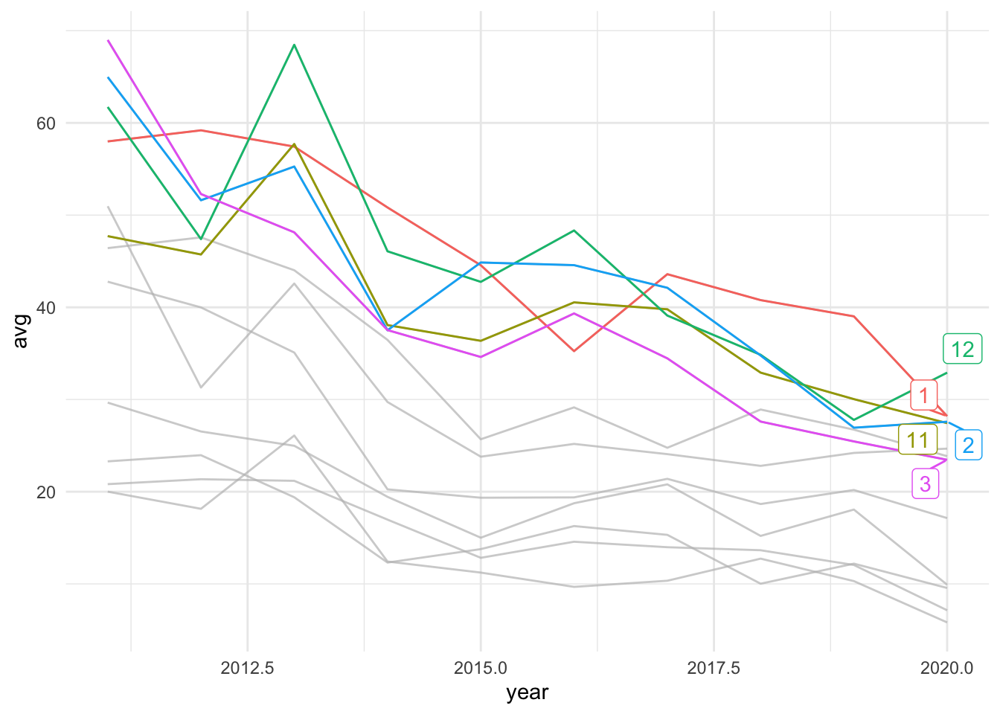
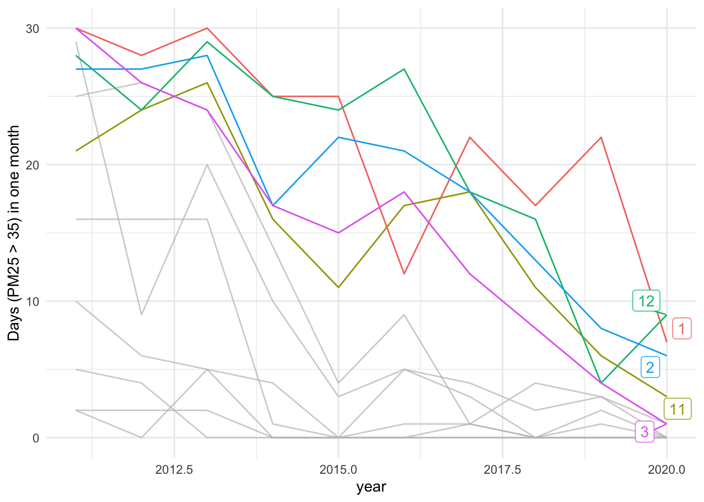
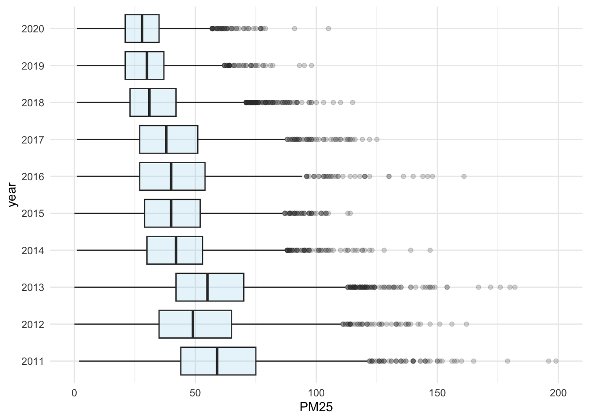

# Case Studies (Taiwan) {#taiwan}

## TW AQI Visual Studies


```r
library(tidyverse)
```

```
## ── Attaching core tidyverse packages ──────────────────────── tidyverse 2.0.0 ──
## ✔ dplyr     1.1.0     ✔ readr     2.1.4
## ✔ forcats   1.0.0     ✔ stringr   1.5.0
## ✔ ggplot2   3.4.1     ✔ tibble    3.1.8
## ✔ lubridate 1.9.2     ✔ tidyr     1.3.0
## ✔ purrr     1.0.1     
## ── Conflicts ────────────────────────────────────────── tidyverse_conflicts() ──
## ✖ dplyr::filter() masks stats::filter()
## ✖ dplyr::lag()    masks stats::lag()
## ℹ Use the ]8;;http://conflicted.r-lib.org/conflicted package]8;; to force all conflicts to become errors
```

```r
library(readxl)
# options(stringsAsFactors = F)
```


### eda-load-data-from-github


```r
# aqi_data <- read_rds("https://github.com/p4css/R4CSS/raw/master/data/AQI_Chaozhou.rds")
aqi_data <- read_rds("data/AQI_Chaozhou.rds")
```

### Trending: Central tendency


```r
toplot <- aqi_data %>%
    arrange(日期)%>%
    filter(測項=="PM2.5") %>%
    gather("hour", "PM25", 4:28) %>% 
    mutate(PM25 = as.numeric(PM25)) %>%
    drop_na() %>%
    group_by(日期) %>%
    summarize(avg = mean(PM25)) %>% 
    ungroup() %>%
    mutate(year = lubridate::year(日期), 
           month = lubridate::month(日期)) %>%
    group_by(year, month) %>% 
    summarize(avg = mean(avg)) %>%
    ungroup()
```

```
## Warning: There was 1 warning in `mutate()`.
## ℹ In argument: `PM25 = as.numeric(PM25)`.
## Caused by warning:
## ! NAs introduced by coercion
```

```
## `summarise()` has grouped output by 'year'. You can override using the
## `.groups` argument.
```

Counting data by month and plotting to ensure the degree of data loss.


```r
aqi_data %>%
    filter(測項=="PM2.5") %>%
    arrange(日期)%>%
    gather("hour", "PM25", 4:28) %>% 
    mutate(PM25 = as.numeric(PM25)) %>%
    drop_na() %>%
    group_by(日期) %>%
    summarize(avg = mean(PM25)) %>% 
    ungroup() %>%
    arrange(日期) %>%
    mutate(year = lubridate::year(日期), 
           month = lubridate::month(日期)) %>%
    count(year, month) %>%
    mutate(rn = row_number()) %>%
    ggplot() + aes(rn, n) + 
    geom_line() + theme_minimal()
```

```
## Warning: There was 1 warning in `mutate()`.
## ℹ In argument: `PM25 = as.numeric(PM25)`.
## Caused by warning:
## ! NAs introduced by coercion
```



-   [科普小學堂-空氣中的懸浮粒子](https://fphsa.org.tw/eh/%E7%A7%91%E6%99%AE%E5%B0%8F%E5%AD%B8%E5%A0%82%EF%BD%9C%E7%A9%BA%E6%B0%A3%E4%B8%AD%E7%9A%84%E5%8D%B1%E5%AE%B3%EF%BC%8D%E7%B4%B0%E6%87%B8%E6%B5%AE%E5%BE%AE%E7%B2%92pm2-5/?gclid=Cj0KCQjw_4-SBhCgARIsAAlegrXyT47_JTqzwuZ93EiEaerVLEwwIR03XgBkMVIvQKFvLQ9GNeMQh9kaAh3vEALw_wcB)
-   [台灣PM2.5三大面向：空汙現況多嚴重？要怪中國還是怪自己？ - 第 1 頁 - The News Lens 關鍵評論網](https://www.thenewslens.com/article/115229)


```r
library(gghighlight)
toplot %>%
    mutate(month = as.character(month)) %>%
    group_by(month) %>%
    arrange(year) %>%
    # mutate(diff = avg -first(avg),
    #        month = as.character(month)) %>%
    # ungroup() %>%
    ggplot() + aes(year, avg, color = month) + 
    geom_line() + 
    # geom_point() + 
    gghighlight(month %in% c("11", "12", "1", "2", "3")) + 
    theme_minimal()
```

```
## Warning: Tried to calculate with group_by(), but the calculation failed.
## Falling back to ungrouped filter operation...
```

```
## label_key: month
```



### Trending: Extreme value


```r
toplot2 <- aqi_data %>%
    arrange(日期)%>%
    filter(測項=="PM2.5") %>%
    gather("hour", "PM25", 4:28) %>%
    mutate(PM25 = as.numeric(PM25)) %>%
    drop_na() %>%
    group_by(日期) %>%
    summarize(avg = sum(PM25)/24) %>% 
    ungroup() %>%
    mutate(year = lubridate::year(日期), month = lubridate::month(日期)) %>%
    group_by(year, month) %>%
    summarize(purple = sum(avg>150),
              red = sum(avg>54),
              orange = sum(avg>35)) %>%
    ungroup()
```

```
## Warning: There was 1 warning in `mutate()`.
## ℹ In argument: `PM25 = as.numeric(PM25)`.
## Caused by warning:
## ! NAs introduced by coercion
```

```
## `summarise()` has grouped output by 'year'. You can override using the
## `.groups` argument.
```

```r
toplot2 %>%
    mutate(month = as.character(month)) %>%
    group_by(month) %>%
    arrange(year) %>%
    ggplot() + aes(year, orange, color = month) + 
    geom_line() + 
    # geom_point() + 
    gghighlight(month %in% c("11", "12", "1", "2", "3")) + 
    ylab("Days (PM25 > 35) in one month") + 
    theme_minimal()
```

```
## Warning: Tried to calculate with group_by(), but the calculation failed.
## Falling back to ungrouped filter operation...
```

```
## label_key: month
```




```r
toplot3 <- aqi_data %>%
    arrange(日期)%>%
    filter(測項=="PM2.5") %>%
    gather("hour", "PM25", 4:28) %>%
    mutate(PM25 = as.numeric(PM25)) %>%
    drop_na() %>%
    mutate(year = lubridate::year(日期), month = lubridate::month(日期)) %>%
    filter(month %in% c(11, 12, 1, 2, 3))
```

```
## Warning: There was 1 warning in `mutate()`.
## ℹ In argument: `PM25 = as.numeric(PM25)`.
## Caused by warning:
## ! NAs introduced by coercion
```


```r
toplot3 %>%
    mutate(year = as.character(year)) %>%
    ggplot() + aes(y=year, x=PM25)  + 
    geom_boxplot(fill="skyblue", alpha=0.2) + 
    xlim(0, 200) + 
    theme_minimal()
```


